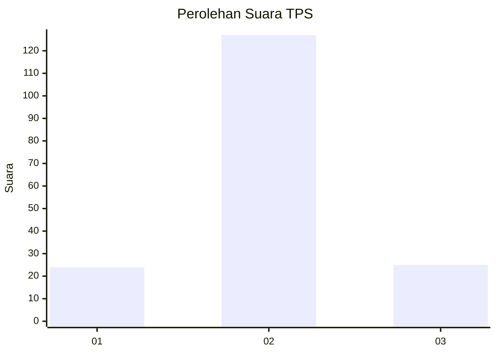
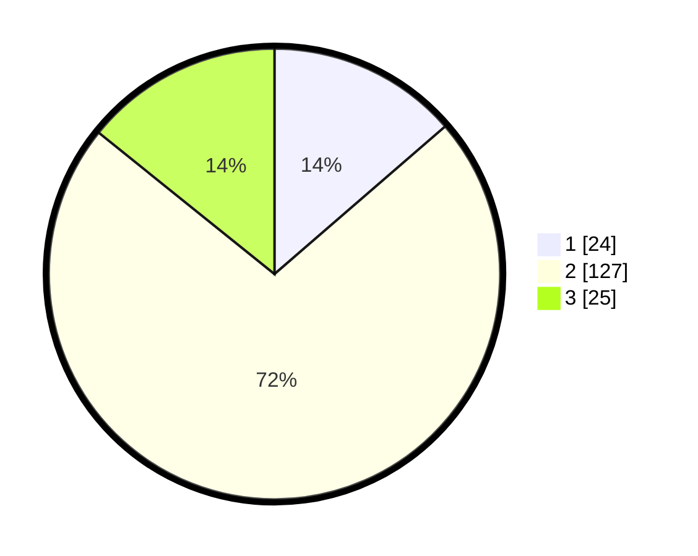

# Hasil

## Grafik

## Tabel

| No. | Nama Paslon    | Suara | Suara (raw) | Persentase |
|:--- |:-------------- | -----:| -----------:| ----------:|
| 1   | ANIES MUHAIMIN | 24    | [24][p-1]   | 13,64      |
| 2   | PRABOWO GIBRAN | 127   | [127][p-2]  | 72,16      |
| 3   | GANJAR MAHFUD  | 25    | [25][p-3]   | 14,20      |

[p-1]: https://github.com/gigit-pemilu/pemilu-2024/blob/main/pilpres/hitung-suara/sub/35-jawa-timur/sub/10-banyuwangi/sub/18-wongsorejo/sub/2007-bajulmati/sub/013-tps/sub/paslon-1.txt
[p-2]: https://github.com/gigit-pemilu/pemilu-2024/blob/main/pilpres/hitung-suara/sub/35-jawa-timur/sub/10-banyuwangi/sub/18-wongsorejo/sub/2007-bajulmati/sub/013-tps/sub/paslon-2.txt
[p-3]: https://github.com/gigit-pemilu/pemilu-2024/blob/main/pilpres/hitung-suara/sub/35-jawa-timur/sub/10-banyuwangi/sub/18-wongsorejo/sub/2007-bajulmati/sub/013-tps/sub/paslon-3.txt

## Foto C Plano

https://sirekap-obj-formc.kpu.go.id/012d/pemilu/ppwp/35/10/18/20/07/3510182007013-20240215-100635--1edb8e79-80ec-47b0-92bc-b90fc5311351.jpg

https://sirekap-obj-formc.kpu.go.id/012d/pemilu/ppwp/35/10/18/20/07/3510182007013-20240215-101048--b0f55b51-b875-45f0-8cce-7e7c1207087d.jpg

https://sirekap-obj-formc.kpu.go.id/012d/pemilu/ppwp/35/10/18/20/07/3510182007013-20240215-101255--bc190e45-376f-4ff9-9bfc-9a01c0ccf3bc.jpg

## Metadata

| Key        | Value               |
| ---------- | ------------------- |
| Time Stamp | 2024-02-25 16:00:00 |

