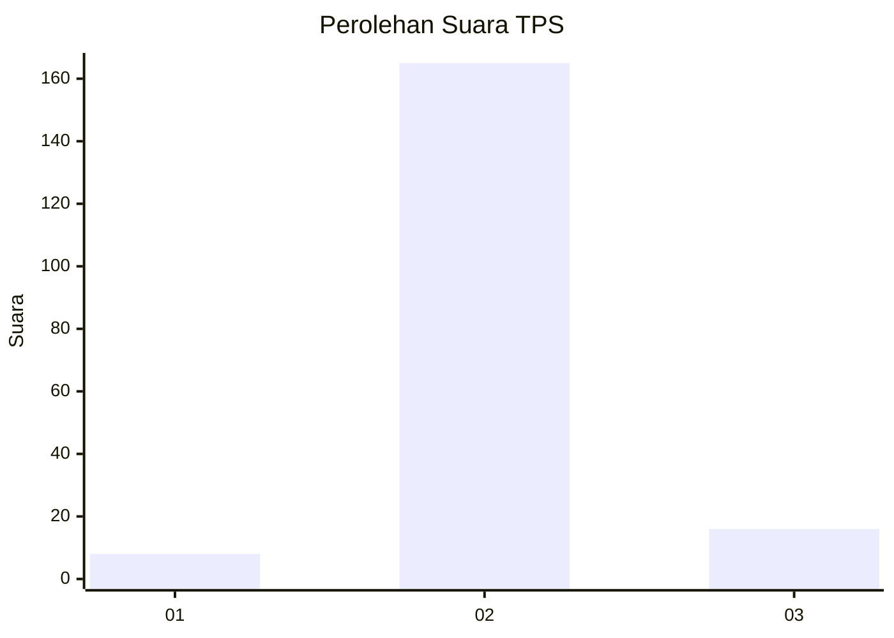
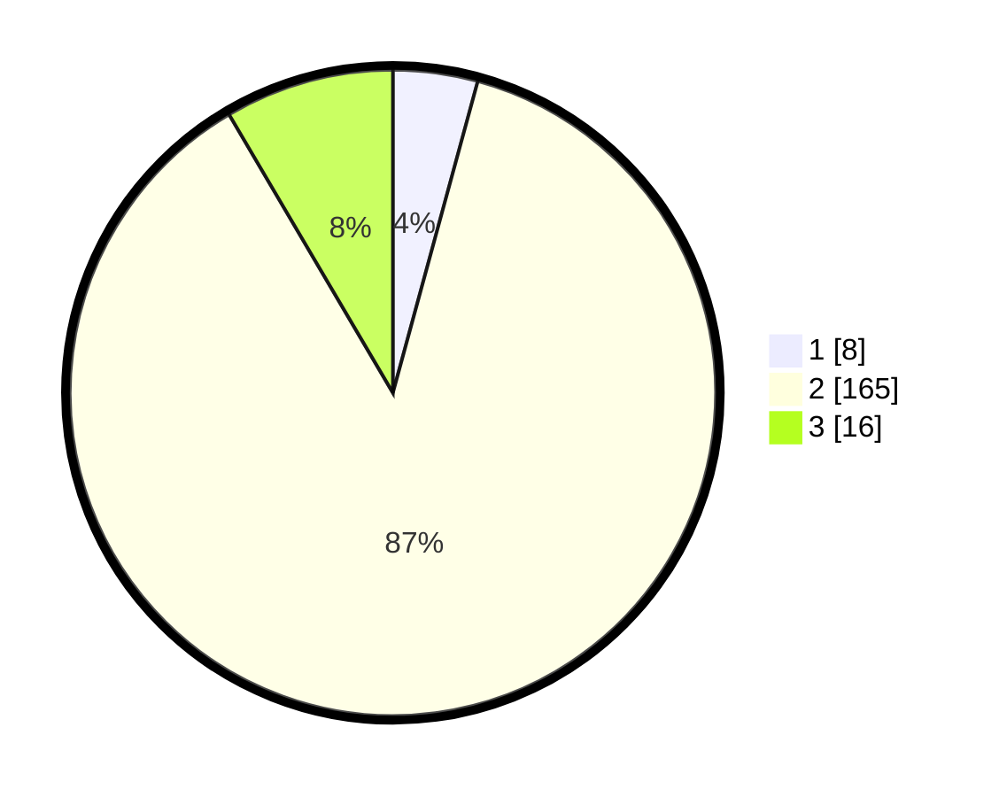

# Hasil

## Grafik

## Tabel

| No. | Nama Paslon    | Suara | Suara (raw) | Persentase |
|:--- |:-------------- | -----:| -----------:| ----------:|
| 1   | ANIES MUHAIMIN | 8     | [8][p-1]    | 4,23       |
| 2   | PRABOWO GIBRAN | 165   | [165][p-2]  | 87,30      |
| 3   | GANJAR MAHFUD  | 16    | [16][p-3]   | 8,47       |

[p-1]: https://github.com/gigit-pemilu/pemilu-2024/blob/main/pilpres/hitung-suara/sub/35-jawa-timur/sub/10-banyuwangi/sub/18-wongsorejo/sub/2007-bajulmati/sub/024-tps/sub/paslon-1.txt
[p-2]: https://github.com/gigit-pemilu/pemilu-2024/blob/main/pilpres/hitung-suara/sub/35-jawa-timur/sub/10-banyuwangi/sub/18-wongsorejo/sub/2007-bajulmati/sub/024-tps/sub/paslon-2.txt
[p-3]: https://github.com/gigit-pemilu/pemilu-2024/blob/main/pilpres/hitung-suara/sub/35-jawa-timur/sub/10-banyuwangi/sub/18-wongsorejo/sub/2007-bajulmati/sub/024-tps/sub/paslon-3.txt

## Foto C Plano

https://sirekap-obj-formc.kpu.go.id/b158/pemilu/ppwp/35/10/18/20/07/3510182007024-20240214-221552--9e32282e-e799-4404-9445-73f4a1160188.jpg

https://sirekap-obj-formc.kpu.go.id/b158/pemilu/ppwp/35/10/18/20/07/3510182007024-20240214-221351--1b0da9e8-0d81-42bb-b012-b842f09c1a50.jpg

https://sirekap-obj-formc.kpu.go.id/b158/pemilu/ppwp/35/10/18/20/07/3510182007024-20240215-013430--719cb727-c798-4135-86c5-fd9000f814ec.jpg

## Metadata

| Key        | Value               |
| ---------- | ------------------- |
| Time Stamp | 2024-02-24 22:31:28 |

