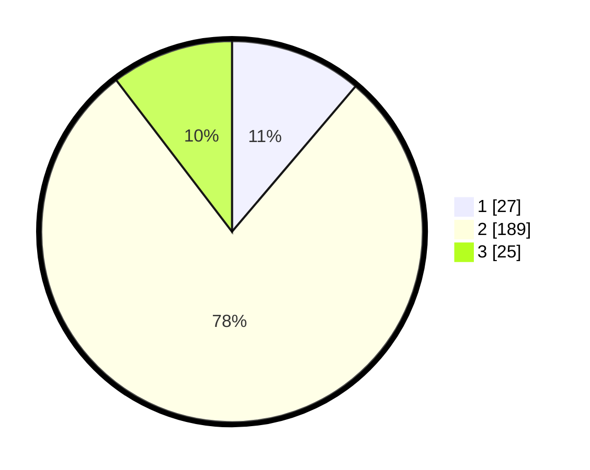

# Hasil

## Grafik

## Tabel

| No. | Nama Paslon    | Suara | Suara (raw) | Persentase |
|:--- |:-------------- | -----:| -----------:| ----------:|
| 1   | ANIES MUHAIMIN | 27    | [27][p-1]   | 11,20      |
| 2   | PRABOWO GIBRAN | 189   | [189][p-2]  | 78,42      |
| 3   | GANJAR MAHFUD  | 25    | [25][p-3]   | 10,37      |

[p-1]: https://github.com/gigit-pemilu/pemilu-2024/blob/main/pilpres/hitung-suara/sub/35-jawa-timur/sub/10-banyuwangi/sub/18-wongsorejo/sub/2008-watukebo/sub/010-tps/sub/paslon-1.txt
[p-2]: https://github.com/gigit-pemilu/pemilu-2024/blob/main/pilpres/hitung-suara/sub/35-jawa-timur/sub/10-banyuwangi/sub/18-wongsorejo/sub/2008-watukebo/sub/010-tps/sub/paslon-2.txt
[p-3]: https://github.com/gigit-pemilu/pemilu-2024/blob/main/pilpres/hitung-suara/sub/35-jawa-timur/sub/10-banyuwangi/sub/18-wongsorejo/sub/2008-watukebo/sub/010-tps/sub/paslon-3.txt

## Foto C Plano

https://sirekap-obj-formc.kpu.go.id/9124/pemilu/ppwp/35/10/18/20/08/3510182008010-20240215-125320--30c36f65-4318-471f-bc96-f6ee0ac3893d.jpg

https://sirekap-obj-formc.kpu.go.id/9124/pemilu/ppwp/35/10/18/20/08/3510182008010-20240215-125439--ebc96e3f-2b9f-4ca2-9e4b-c6ef4d71c97d.jpg

https://sirekap-obj-formc.kpu.go.id/9124/pemilu/ppwp/35/10/18/20/08/3510182008010-20240215-130757--8a3f96a2-e0f9-4e2c-b36f-9096655df58b.jpg

## Metadata

| Key        | Value               |
| ---------- | ------------------- |
| Time Stamp | 2024-02-24 22:31:28 |

