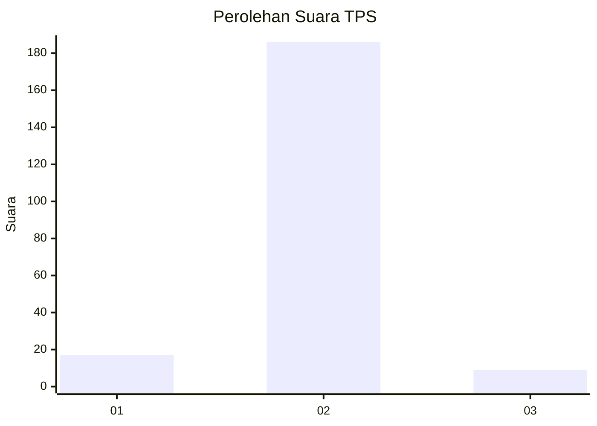
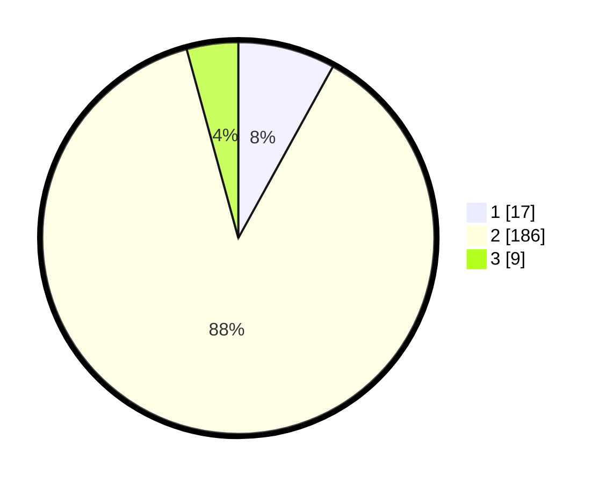

# Hasil

## Grafik

## Tabel

| No. | Nama Paslon    | Suara | Suara (raw) | Persentase |
|:--- |:-------------- | -----:| -----------:| ----------:|
| 1   | ANIES MUHAIMIN | 17    | [17][p-1]   | 8,02       |
| 2   | PRABOWO GIBRAN | 186   | [186][p-2]  | 87,74      |
| 3   | GANJAR MAHFUD  | 9     | [9][p-3]    | 4,25       |

[p-1]: https://github.com/gigit-pemilu/pemilu-2024-35-jawa-timur/blob/main/pilpres/hitung-suara/sub/35-jawa-timur/sub/10-banyuwangi/sub/18-wongsorejo/sub/2008-watukebo/sub/018-tps/sub/paslon-1.txt
[p-2]: https://github.com/gigit-pemilu/pemilu-2024-35-jawa-timur/blob/main/pilpres/hitung-suara/sub/35-jawa-timur/sub/10-banyuwangi/sub/18-wongsorejo/sub/2008-watukebo/sub/018-tps/sub/paslon-2.txt
[p-3]: https://github.com/gigit-pemilu/pemilu-2024-35-jawa-timur/blob/main/pilpres/hitung-suara/sub/35-jawa-timur/sub/10-banyuwangi/sub/18-wongsorejo/sub/2008-watukebo/sub/018-tps/sub/paslon-3.txt

## Foto C Plano

https://sirekap-obj-formc.kpu.go.id/4aa2/pemilu/ppwp/35/10/18/20/08/3510182008018-20240215-153420--4d9423bf-bbec-403c-bfeb-169026461df8.jpg

https://sirekap-obj-formc.kpu.go.id/4aa2/pemilu/ppwp/35/10/18/20/08/3510182008018-20240215-153549--5f7f6f4d-120d-4d26-be06-afb34a301721.jpg

https://sirekap-obj-formc.kpu.go.id/4aa2/pemilu/ppwp/35/10/18/20/08/3510182008018-20240215-153721--ebc66e0c-72e7-49dc-9210-72d3f2408356.jpg

## Metadata

| Key        | Value               |
| ---------- | ------------------- |
| Time Stamp | 2024-02-24 22:31:28 |

