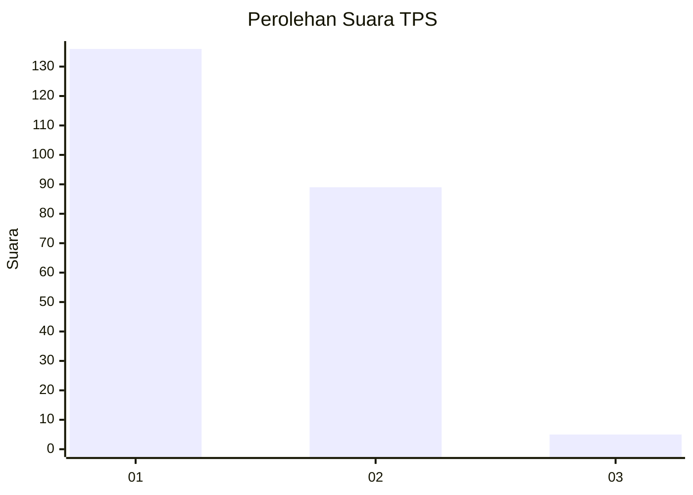
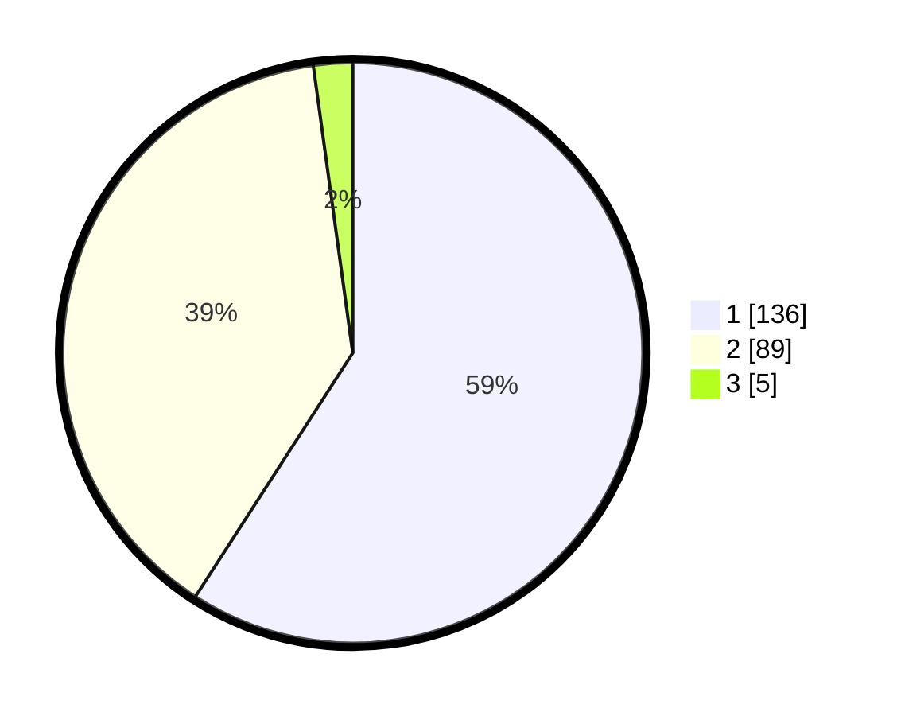

# Hasil

## Grafik

## Tabel

| No. | Nama Paslon    | Suara | Suara (raw) | Persentase |
|:--- |:-------------- | -----:| -----------:| ----------:|
| 1   | ANIES MUHAIMIN | 136   | [136][p-1]  | 59,13      |
| 2   | PRABOWO GIBRAN | 89    | [89][p-2]   | 38,70      |
| 3   | GANJAR MAHFUD  | 5     | [5][p-3]    | 2,17       |

[p-1]: https://github.com/gigit-pemilu/pemilu-2024/blob/main/pilpres/hitung-suara/sub/35-jawa-timur/sub/10-banyuwangi/sub/18-wongsorejo/sub/2010-sidowangi/sub/001-tps/sub/paslon-1.txt
[p-2]: https://github.com/gigit-pemilu/pemilu-2024/blob/main/pilpres/hitung-suara/sub/35-jawa-timur/sub/10-banyuwangi/sub/18-wongsorejo/sub/2010-sidowangi/sub/001-tps/sub/paslon-2.txt
[p-3]: https://github.com/gigit-pemilu/pemilu-2024/blob/main/pilpres/hitung-suara/sub/35-jawa-timur/sub/10-banyuwangi/sub/18-wongsorejo/sub/2010-sidowangi/sub/001-tps/sub/paslon-3.txt

## Foto C Plano

https://sirekap-obj-formc.kpu.go.id/bba7/pemilu/ppwp/35/10/18/20/10/3510182010001-20240214-212816--0a65c22a-dba9-4286-ad85-345d9ed844a3.jpg

https://sirekap-obj-formc.kpu.go.id/bba7/pemilu/ppwp/35/10/18/20/10/3510182010001-20240215-214823--ab8f2a97-ea51-43b5-a387-c5b7f1c7bd89.jpg

https://sirekap-obj-formc.kpu.go.id/bba7/pemilu/ppwp/35/10/18/20/10/3510182010001-20240214-224004--17e82988-f0ec-4db9-ba2b-05eadf15b699.jpg

## Metadata

| Key        | Value               |
| ---------- | ------------------- |
| Time Stamp | 2024-02-24 22:31:28 |

