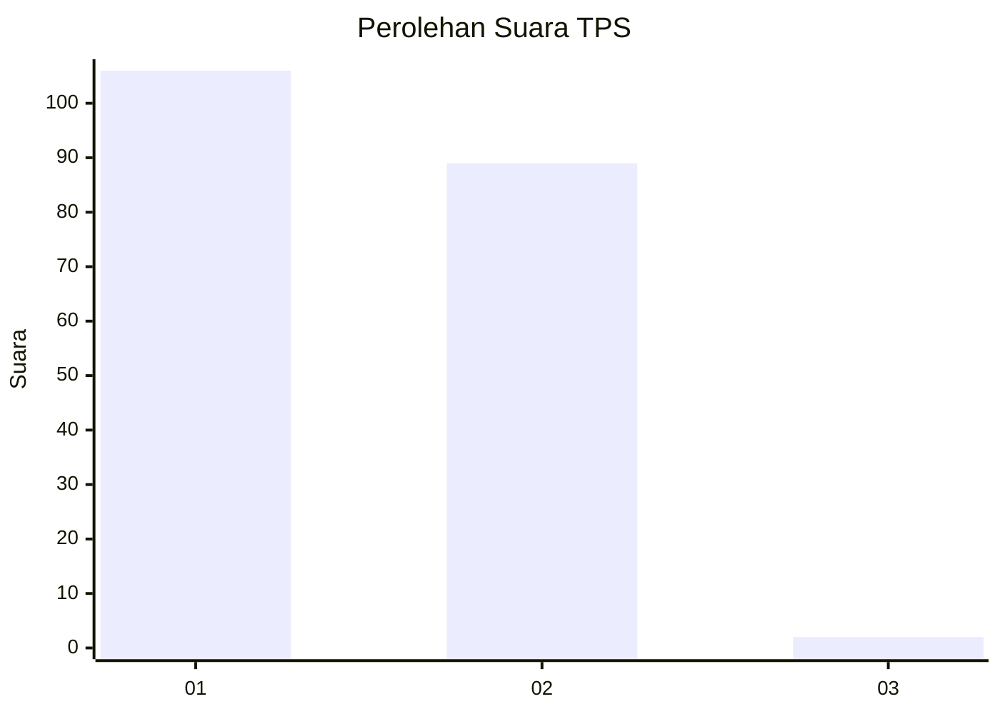
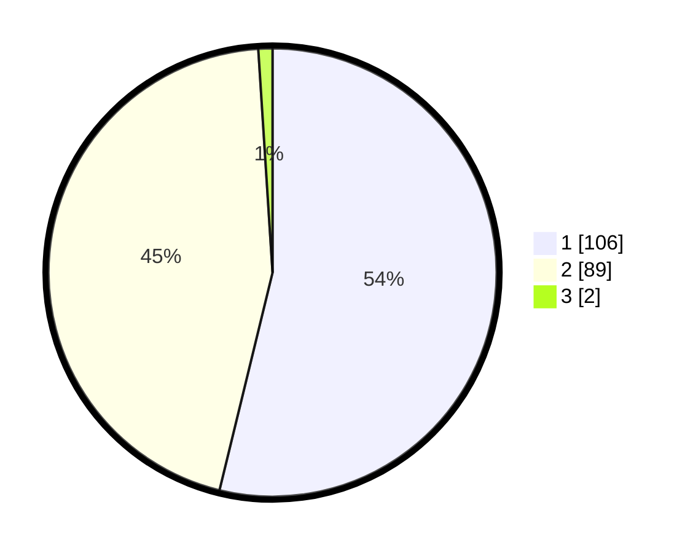

# Hasil

## Grafik

## Tabel

| No. | Nama Paslon    | Suara | Suara (raw) | Persentase |
|:--- |:-------------- | -----:| -----------:| ----------:|
| 1   | ANIES MUHAIMIN | 106   | [106][p-1]  | 53,81      |
| 2   | PRABOWO GIBRAN | 89    | [89][p-2]   | 45,18      |
| 3   | GANJAR MAHFUD  | 2     | [2][p-3]    | 1,02       |

[p-1]: https://github.com/gigit-pemilu/pemilu-2024/blob/main/pilpres/hitung-suara/sub/35-jawa-timur/sub/10-banyuwangi/sub/18-wongsorejo/sub/2010-sidowangi/sub/002-tps/sub/paslon-1.txt
[p-2]: https://github.com/gigit-pemilu/pemilu-2024/blob/main/pilpres/hitung-suara/sub/35-jawa-timur/sub/10-banyuwangi/sub/18-wongsorejo/sub/2010-sidowangi/sub/002-tps/sub/paslon-2.txt
[p-3]: https://github.com/gigit-pemilu/pemilu-2024/blob/main/pilpres/hitung-suara/sub/35-jawa-timur/sub/10-banyuwangi/sub/18-wongsorejo/sub/2010-sidowangi/sub/002-tps/sub/paslon-3.txt

## Foto C Plano

https://sirekap-obj-formc.kpu.go.id/f5a1/pemilu/ppwp/35/10/18/20/10/3510182010002-20240215-045504--9db8364c-dea8-44a8-9cf8-29e066c1ab00.jpg

https://sirekap-obj-formc.kpu.go.id/f5a1/pemilu/ppwp/35/10/18/20/10/3510182010002-20240215-045620--3e5f12d3-8724-4fb3-aa46-87e51caad44a.jpg

https://sirekap-obj-formc.kpu.go.id/f5a1/pemilu/ppwp/35/10/18/20/10/3510182010002-20240215-005943--9800840f-512e-4b42-aba4-e7e1e6ac2f9a.jpg

## Metadata

| Key        | Value               |
| ---------- | ------------------- |
| Time Stamp | 2024-02-15 20:00:44 |

