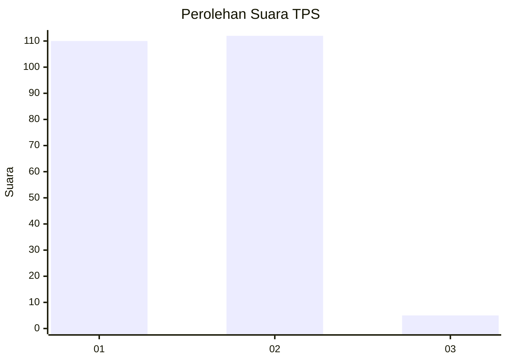
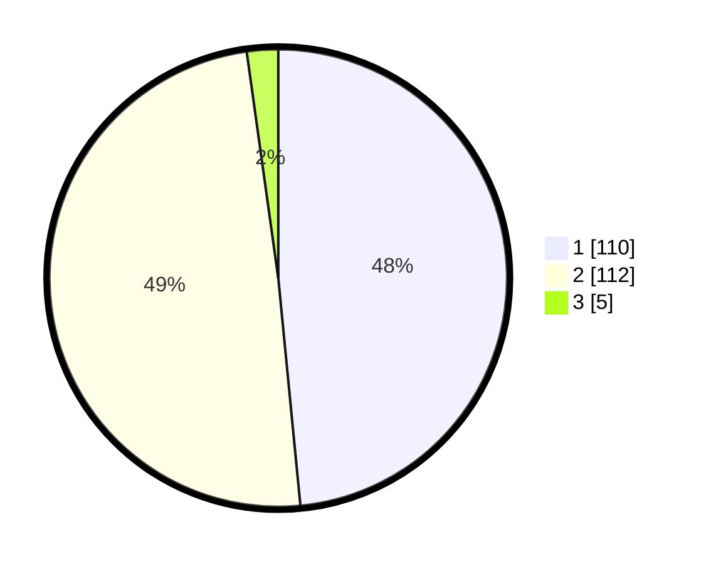

# Hasil

## Grafik

## Tabel

| No. | Nama Paslon    | Suara | Suara (raw) | Persentase |
|:--- |:-------------- | -----:| -----------:| ----------:|
| 1   | ANIES MUHAIMIN | 110   | [110][p-1]  | 48,46      |
| 2   | PRABOWO GIBRAN | 112   | [112][p-2]  | 49,34      |
| 3   | GANJAR MAHFUD  | 5     | [5][p-3]    | 2,20       |

[p-1]: https://github.com/gigit-pemilu/pemilu-2024-35-jawa-timur/blob/main/pilpres/hitung-suara/sub/35-jawa-timur/sub/10-banyuwangi/sub/18-wongsorejo/sub/2010-sidowangi/sub/003-tps/sub/paslon-1.txt
[p-2]: https://github.com/gigit-pemilu/pemilu-2024-35-jawa-timur/blob/main/pilpres/hitung-suara/sub/35-jawa-timur/sub/10-banyuwangi/sub/18-wongsorejo/sub/2010-sidowangi/sub/003-tps/sub/paslon-2.txt
[p-3]: https://github.com/gigit-pemilu/pemilu-2024-35-jawa-timur/blob/main/pilpres/hitung-suara/sub/35-jawa-timur/sub/10-banyuwangi/sub/18-wongsorejo/sub/2010-sidowangi/sub/003-tps/sub/paslon-3.txt

## Foto C Plano

https://sirekap-obj-formc.kpu.go.id/c7f0/pemilu/ppwp/35/10/18/20/10/3510182010003-20240215-030456--ea10727b-634a-466f-819f-98ad968fe105.jpg

https://sirekap-obj-formc.kpu.go.id/c7f0/pemilu/ppwp/35/10/18/20/10/3510182010003-20240214-231837--66f16a46-665f-403c-86ed-5038247674ca.jpg

https://sirekap-obj-formc.kpu.go.id/c7f0/pemilu/ppwp/35/10/18/20/10/3510182010003-20240214-232052--f12e6784-5478-4466-8880-585c330e6883.jpg

## Metadata

| Key        | Value               |
| ---------- | ------------------- |
| Time Stamp | 2024-02-24 22:31:28 |

