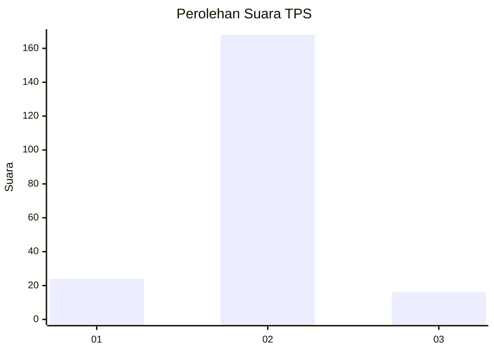
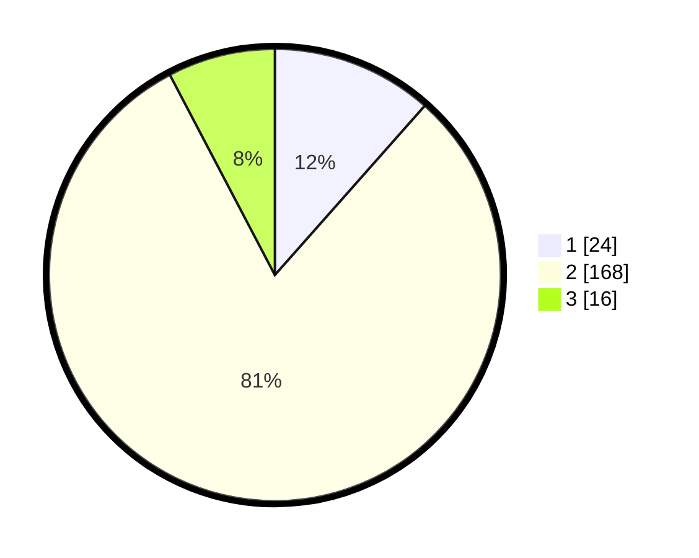

# Hasil

## Grafik

## Tabel

| No. | Nama Paslon    | Suara | Suara (raw) | Persentase |
|:--- |:-------------- | -----:| -----------:| ----------:|
| 1   | ANIES MUHAIMIN | 24    | [24][p-1]   | 11,54      |
| 2   | PRABOWO GIBRAN | 168   | [168][p-2]  | 80,77      |
| 3   | GANJAR MAHFUD  | 16    | [16][p-3]   | 7,69       |

[p-1]: https://github.com/gigit-pemilu/pemilu-2024/blob/main/pilpres/hitung-suara/sub/35-jawa-timur/sub/10-banyuwangi/sub/18-wongsorejo/sub/2011-sumberanyar/sub/003-tps/sub/paslon-1.txt
[p-2]: https://github.com/gigit-pemilu/pemilu-2024/blob/main/pilpres/hitung-suara/sub/35-jawa-timur/sub/10-banyuwangi/sub/18-wongsorejo/sub/2011-sumberanyar/sub/003-tps/sub/paslon-2.txt
[p-3]: https://github.com/gigit-pemilu/pemilu-2024/blob/main/pilpres/hitung-suara/sub/35-jawa-timur/sub/10-banyuwangi/sub/18-wongsorejo/sub/2011-sumberanyar/sub/003-tps/sub/paslon-3.txt

## Foto C Plano

https://sirekap-obj-formc.kpu.go.id/426e/pemilu/ppwp/35/10/18/20/11/3510182011003-20240214-160129--3e2fd9ad-e564-4d7c-a9ba-059ba64638f7.jpg

https://sirekap-obj-formc.kpu.go.id/426e/pemilu/ppwp/35/10/18/20/11/3510182011003-20240214-160119--f6ef496c-7935-4a6f-8a0b-73ec3954a162.jpg

https://sirekap-obj-formc.kpu.go.id/426e/pemilu/ppwp/35/10/18/20/11/3510182011003-20240215-112140--768f630d-6577-42ee-8215-0e7de1955607.jpg

## Metadata

| Key        | Value               |
| ---------- | ------------------- |
| Time Stamp | 2024-02-15 22:40:13 |

