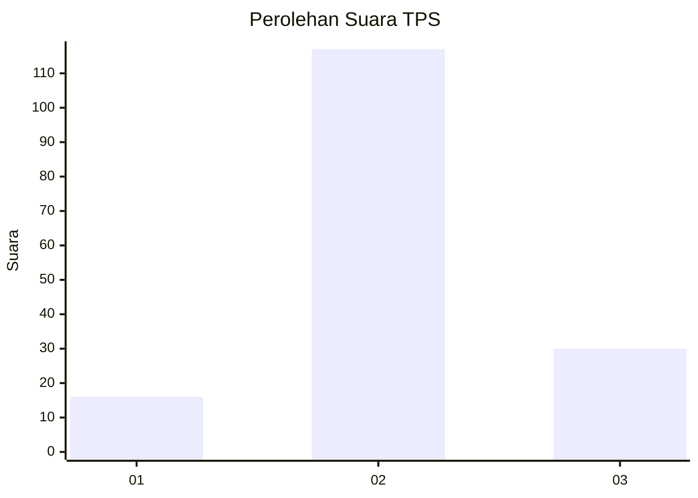
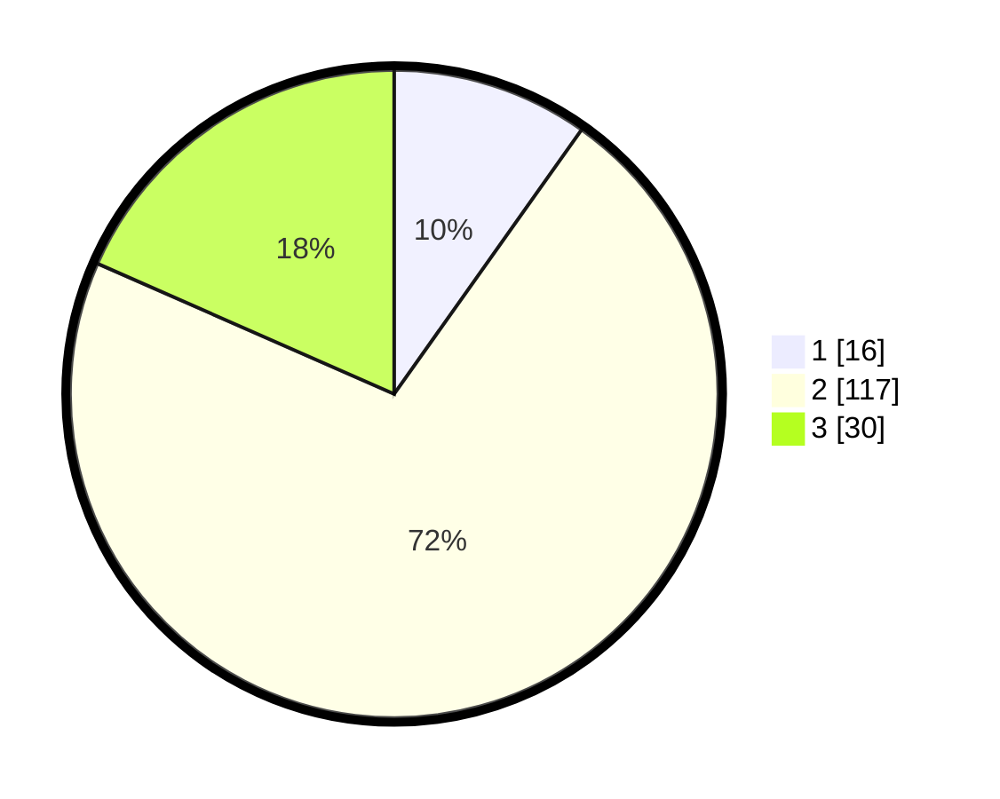

# Hasil

## Grafik

## Tabel

| No. | Nama Paslon    | Suara | Suara (raw) | Persentase |
|:--- |:-------------- | -----:| -----------:| ----------:|
| 1   | ANIES MUHAIMIN | 16    | [16][p-1]   | 9,82       |
| 2   | PRABOWO GIBRAN | 117   | [117][p-2]  | 71,78      |
| 3   | GANJAR MAHFUD  | 30    | [30][p-3]   | 18,40      |

[p-1]: https://github.com/gigit-pemilu/pemilu-2024/blob/main/pilpres/hitung-suara/sub/35-jawa-timur/sub/10-banyuwangi/sub/18-wongsorejo/sub/2012-bimorejo/sub/005-tps/sub/paslon-1.txt
[p-2]: https://github.com/gigit-pemilu/pemilu-2024/blob/main/pilpres/hitung-suara/sub/35-jawa-timur/sub/10-banyuwangi/sub/18-wongsorejo/sub/2012-bimorejo/sub/005-tps/sub/paslon-2.txt
[p-3]: https://github.com/gigit-pemilu/pemilu-2024/blob/main/pilpres/hitung-suara/sub/35-jawa-timur/sub/10-banyuwangi/sub/18-wongsorejo/sub/2012-bimorejo/sub/005-tps/sub/paslon-3.txt

## Foto C Plano

https://sirekap-obj-formc.kpu.go.id/b180/pemilu/ppwp/35/10/18/20/12/3510182012005-20240215-190247--6f618140-b8cc-4922-a2f2-bb32fc76fdd0.jpg

https://sirekap-obj-formc.kpu.go.id/b180/pemilu/ppwp/35/10/18/20/12/3510182012005-20240215-190426--d70c269e-e45f-4b2a-85de-0df3bc9bdff8.jpg

https://sirekap-obj-formc.kpu.go.id/b180/pemilu/ppwp/35/10/18/20/12/3510182012005-20240215-190552--d96106c7-23fe-405c-b680-8a4dbe32aa02.jpg

## Metadata

| Key        | Value               |
| ---------- | ------------------- |
| Time Stamp | 2024-02-24 22:31:28 |

