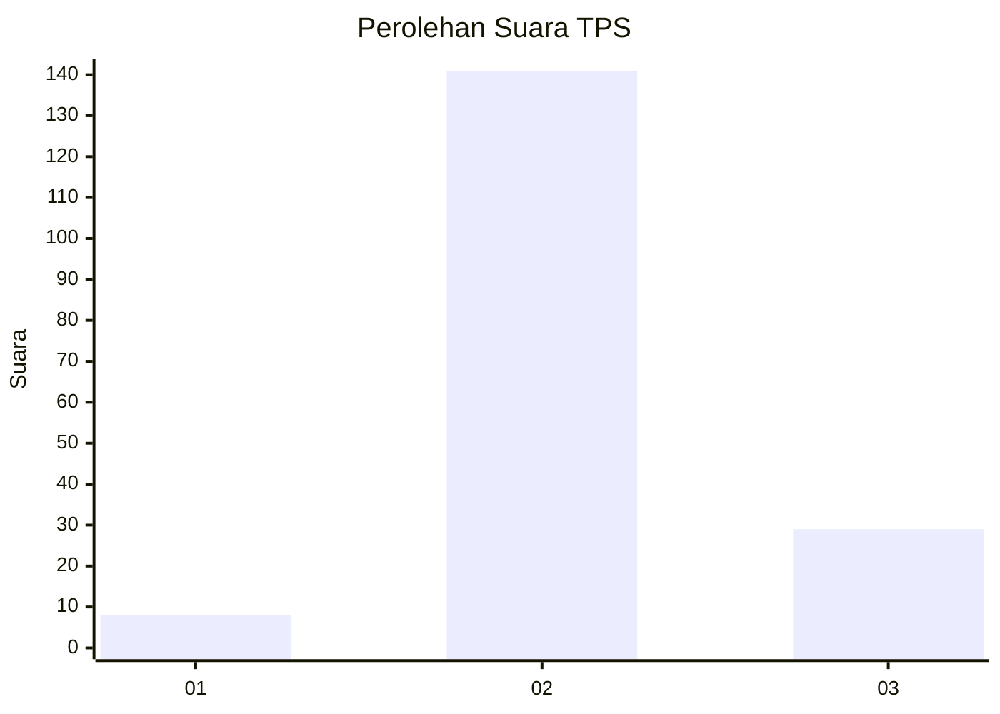
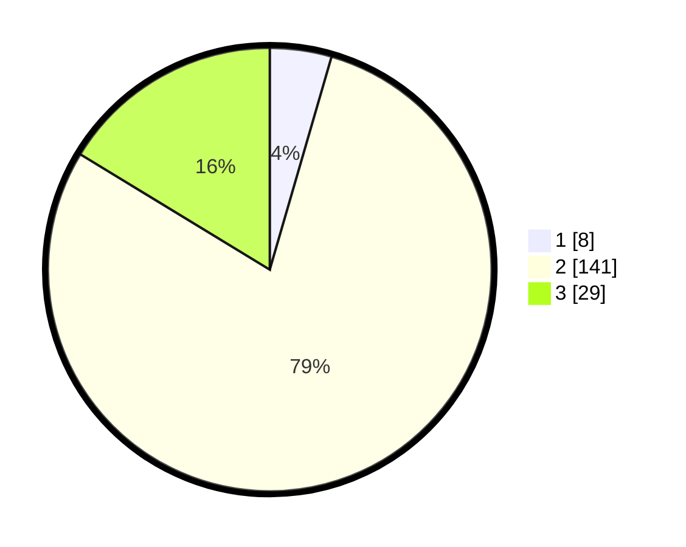

# Hasil

## Grafik

## Tabel

| No. | Nama Paslon    | Suara | Suara (raw) | Persentase |
|:--- |:-------------- | -----:| -----------:| ----------:|
| 1   | ANIES MUHAIMIN | 8     | [8][p-1]    | 4,49       |
| 2   | PRABOWO GIBRAN | 141   | [141][p-2]  | 79,21      |
| 3   | GANJAR MAHFUD  | 29    | [29][p-3]   | 16,29      |

[p-1]: https://github.com/gigit-pemilu/pemilu-2024/blob/main/pilpres/hitung-suara/sub/35-jawa-timur/sub/10-banyuwangi/sub/19-songgon/sub/2006-bayu/sub/001-tps/sub/paslon-1.txt
[p-2]: https://github.com/gigit-pemilu/pemilu-2024/blob/main/pilpres/hitung-suara/sub/35-jawa-timur/sub/10-banyuwangi/sub/19-songgon/sub/2006-bayu/sub/001-tps/sub/paslon-2.txt
[p-3]: https://github.com/gigit-pemilu/pemilu-2024/blob/main/pilpres/hitung-suara/sub/35-jawa-timur/sub/10-banyuwangi/sub/19-songgon/sub/2006-bayu/sub/001-tps/sub/paslon-3.txt

## Foto C Plano

https://sirekap-obj-formc.kpu.go.id/3e51/pemilu/ppwp/35/10/19/20/06/3510192006001-20240219-093926--7df9ea8c-d489-4ad0-b7fa-6cd2f3bde244.jpg

https://sirekap-obj-formc.kpu.go.id/3e51/pemilu/ppwp/35/10/19/20/06/3510192006001-20240219-092607--78e7d521-2424-4df3-a3a3-0b3c9f4938f7.jpg

https://sirekap-obj-formc.kpu.go.id/3e51/pemilu/ppwp/35/10/19/20/06/3510192006001-20240219-093528--9c6dfffd-cedf-46c0-a30b-756f37fec188.jpg

## Metadata

| Key        | Value               |
| ---------- | ------------------- |
| Time Stamp | 2024-02-24 22:31:28 |

