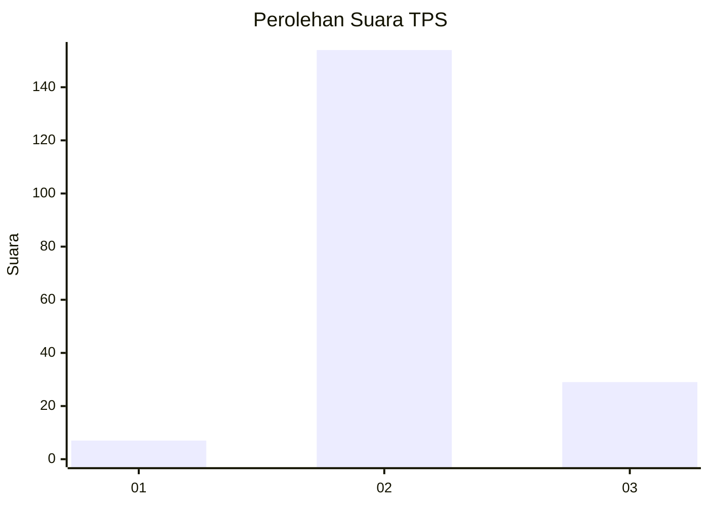
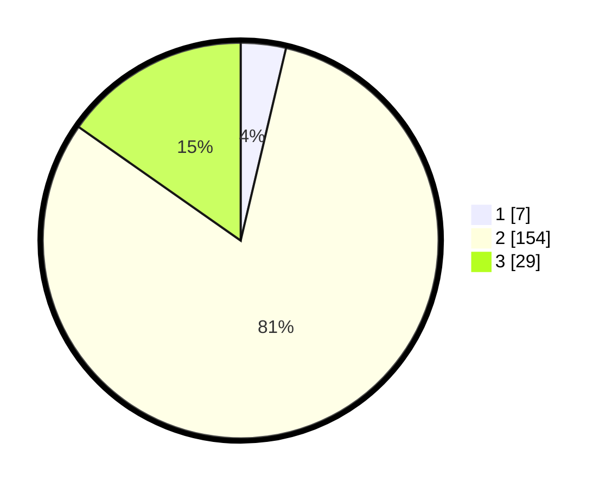

# Hasil

## Grafik

## Tabel

| No. | Nama Paslon    | Suara | Suara (raw) | Persentase |
|:--- |:-------------- | -----:| -----------:| ----------:|
| 1   | ANIES MUHAIMIN | 7     | [7][p-1]    | 3,68       |
| 2   | PRABOWO GIBRAN | 154   | [154][p-2]  | 81,05      |
| 3   | GANJAR MAHFUD  | 29    | [29][p-3]   | 15,26      |

[p-1]: https://github.com/gigit-pemilu/pemilu-2024-35-jawa-timur/blob/main/pilpres/hitung-suara/sub/35-jawa-timur/sub/10-banyuwangi/sub/19-songgon/sub/2006-bayu/sub/002-tps/sub/paslon-1.txt
[p-2]: https://github.com/gigit-pemilu/pemilu-2024-35-jawa-timur/blob/main/pilpres/hitung-suara/sub/35-jawa-timur/sub/10-banyuwangi/sub/19-songgon/sub/2006-bayu/sub/002-tps/sub/paslon-2.txt
[p-3]: https://github.com/gigit-pemilu/pemilu-2024-35-jawa-timur/blob/main/pilpres/hitung-suara/sub/35-jawa-timur/sub/10-banyuwangi/sub/19-songgon/sub/2006-bayu/sub/002-tps/sub/paslon-3.txt

## Foto C Plano

https://sirekap-obj-formc.kpu.go.id/1d6e/pemilu/ppwp/35/10/19/20/06/3510192006002-20240219-120709--9e65bfe9-e44d-4304-b207-91058e734217.jpg

https://sirekap-obj-formc.kpu.go.id/1d6e/pemilu/ppwp/35/10/19/20/06/3510192006002-20240219-115957--835a28f1-e6ac-4f7c-8c13-6b6f47b6cdfc.jpg

https://sirekap-obj-formc.kpu.go.id/1d6e/pemilu/ppwp/35/10/19/20/06/3510192006002-20240219-120057--6c936333-f7d1-436f-9e57-46e4acbbc34f.jpg

## Metadata

| Key        | Value               |
| ---------- | ------------------- |
| Time Stamp | 2024-02-24 22:31:28 |

