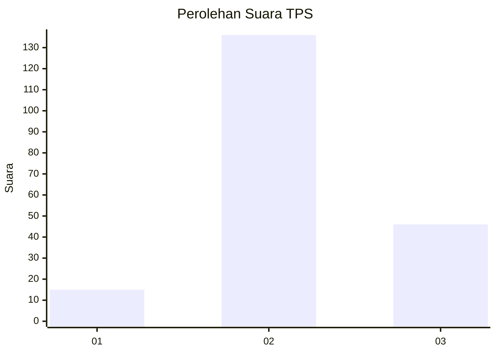
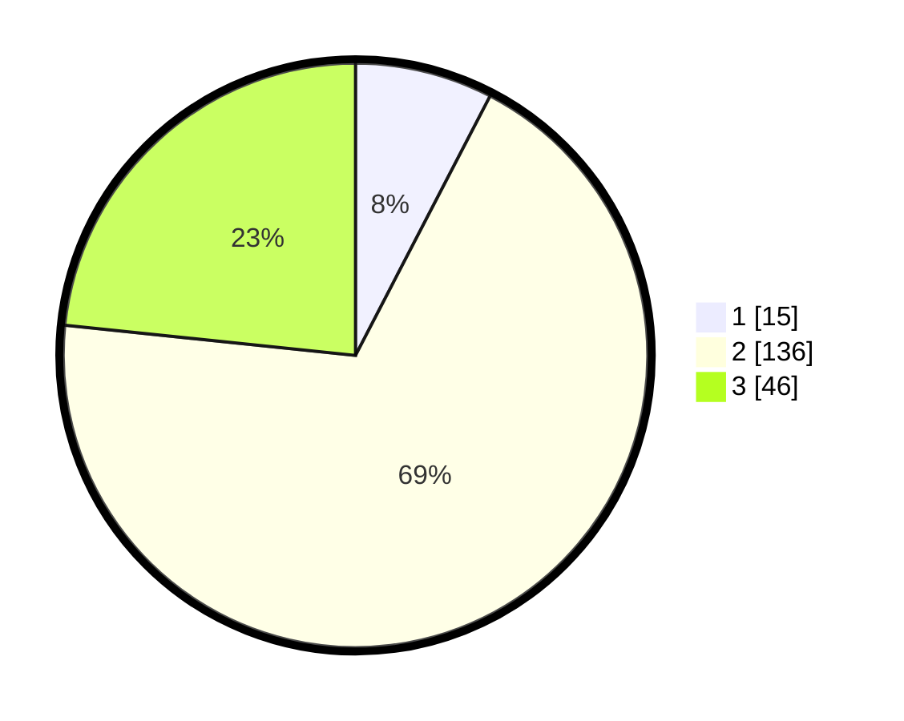

# Hasil

## Grafik

## Tabel

| No. | Nama Paslon    | Suara | Suara (raw) | Persentase |
|:--- |:-------------- | -----:| -----------:| ----------:|
| 1   | ANIES MUHAIMIN | 15    | [15][p-1]   | 7,61       |
| 2   | PRABOWO GIBRAN | 136   | [136][p-2]  | 69,04      |
| 3   | GANJAR MAHFUD  | 46    | [46][p-3]   | 23,35      |

[p-1]: https://github.com/gigit-pemilu/pemilu-2024/blob/main/pilpres/hitung-suara/sub/35-jawa-timur/sub/10-banyuwangi/sub/19-songgon/sub/2006-bayu/sub/009-tps/sub/paslon-1.txt
[p-2]: https://github.com/gigit-pemilu/pemilu-2024/blob/main/pilpres/hitung-suara/sub/35-jawa-timur/sub/10-banyuwangi/sub/19-songgon/sub/2006-bayu/sub/009-tps/sub/paslon-2.txt
[p-3]: https://github.com/gigit-pemilu/pemilu-2024/blob/main/pilpres/hitung-suara/sub/35-jawa-timur/sub/10-banyuwangi/sub/19-songgon/sub/2006-bayu/sub/009-tps/sub/paslon-3.txt

## Foto C Plano

https://sirekap-obj-formc.kpu.go.id/e7ba/pemilu/ppwp/35/10/19/20/06/3510192006009-20240217-115718--06d414a0-8c9f-4ef8-9124-9b0dc7903ce5.jpg

https://sirekap-obj-formc.kpu.go.id/e7ba/pemilu/ppwp/35/10/19/20/06/3510192006009-20240217-115845--70aefeb8-1dc9-45ca-9fb1-acdbf30d5a55.jpg

https://sirekap-obj-formc.kpu.go.id/e7ba/pemilu/ppwp/35/10/19/20/06/3510192006009-20240217-115951--f868bf67-e630-4c92-861e-0d3493986363.jpg

## Metadata

| Key        | Value               |
| ---------- | ------------------- |
| Time Stamp | 2024-02-19 06:16:00 |

## DATA PEMILIH TETAP

Jumlah pemilih dalam DPT: **577**.
 * L: **775**.
 * P: **707**.

## DATA PENGGUNA HAK PILIH

Jumlah pengguna hak pilih dalam DPT: **558**.
 * L: **775**.
 * P: **555**.

Jumlah pengguna hak pilih dalam DPTb: **773**.
 * L: **487**.
 * P: **77**.

Jumlah pengguna hak pilih dalam DPK: **757**.
 * L: **28**.
 * P: **877**.

Jumlah pengguna hak pilih: **741**.
 * L: **777**.
 * P: **570**.

## JUMLAH SUARA SAH DAN TIDAK SAH

JUMLAH SELURUH SUARA SAH: **197**.

JUMLAH SUARA TIDAK SAH: **5**.

JUMLAH SELURUH SUARA SAH DAN SUARA TIDAK SAH: **202**.

