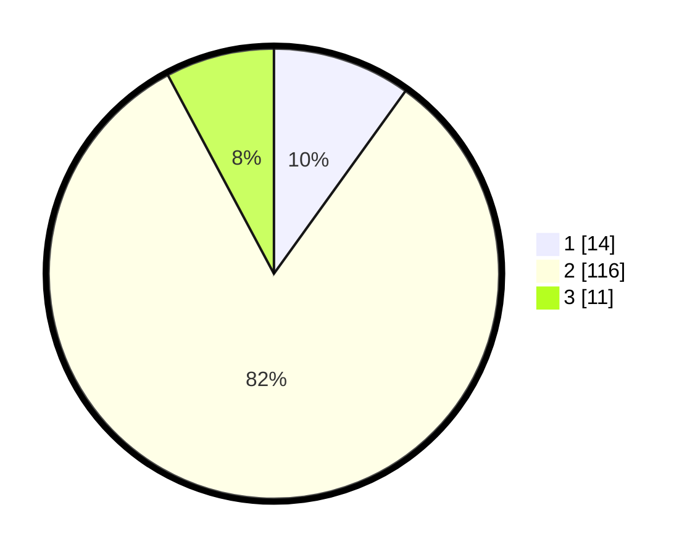

# Hasil

## Grafik

## Tabel

| No. | Nama Paslon    | Suara | Suara (raw) | Persentase |
|:--- |:-------------- | -----:| -----------:| ----------:|
| 1   | ANIES MUHAIMIN | 14    | [14][p-1]   | 9,93       |
| 2   | PRABOWO GIBRAN | 116   | [116][p-2]  | 82,27      |
| 3   | GANJAR MAHFUD  | 11    | [11][p-3]   | 7,80       |

[p-1]: https://github.com/gigit-pemilu/pemilu-2024/blob/main/pilpres/hitung-suara/sub/35-jawa-timur/sub/10-banyuwangi/sub/19-songgon/sub/2007-sumberarum/sub/012-tps/sub/paslon-1.txt
[p-2]: https://github.com/gigit-pemilu/pemilu-2024/blob/main/pilpres/hitung-suara/sub/35-jawa-timur/sub/10-banyuwangi/sub/19-songgon/sub/2007-sumberarum/sub/012-tps/sub/paslon-2.txt
[p-3]: https://github.com/gigit-pemilu/pemilu-2024/blob/main/pilpres/hitung-suara/sub/35-jawa-timur/sub/10-banyuwangi/sub/19-songgon/sub/2007-sumberarum/sub/012-tps/sub/paslon-3.txt

## Foto C Plano

https://sirekap-obj-formc.kpu.go.id/7547/pemilu/ppwp/35/10/19/20/07/3510192007012-20240217-172642--634552fa-828b-4aac-a08d-610e3279c2f0.jpg

https://sirekap-obj-formc.kpu.go.id/7547/pemilu/ppwp/35/10/19/20/07/3510192007012-20240217-172246--83f44984-5d35-40ad-9d60-c0d1ff662e94.jpg

https://sirekap-obj-formc.kpu.go.id/7547/pemilu/ppwp/35/10/19/20/07/3510192007012-20240217-172424--6e3061d1-f381-47c8-b94c-b263f1975001.jpg

## Metadata

| Key        | Value               |
| ---------- | ------------------- |
| Time Stamp | 2024-02-24 22:31:28 |

