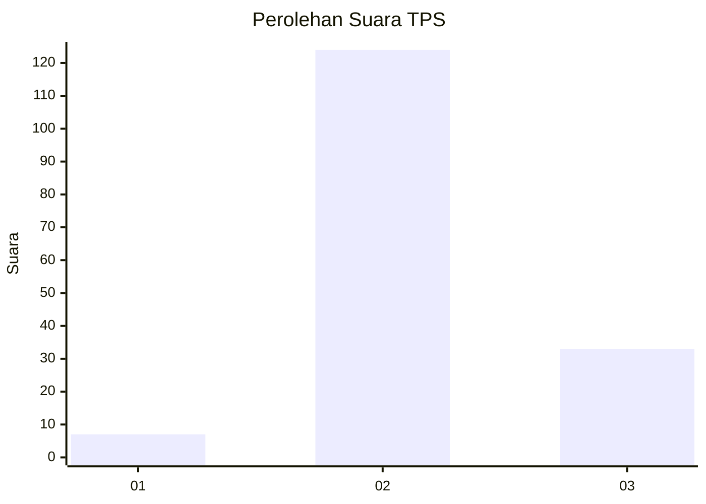

# Hasil

## Grafik

## Tabel

| No. | Nama Paslon    | Suara | Suara (raw) | Persentase |
|:--- |:-------------- | -----:| -----------:| ----------:|
| 1   | ANIES MUHAIMIN | 7     | [7][p-1]    | 4,27       |
| 2   | PRABOWO GIBRAN | 124   | [124][p-2]  | 75,61      |
| 3   | GANJAR MAHFUD  | 33    | [33][p-3]   | 20,12      |

[p-1]: https://github.com/gigit-pemilu/pemilu-2024/blob/main/pilpres/hitung-suara/sub/35-jawa-timur/sub/10-banyuwangi/sub/20-sempu/sub/2004-temuguruh/sub/002-tps/sub/paslon-1.txt
[p-2]: https://github.com/gigit-pemilu/pemilu-2024/blob/main/pilpres/hitung-suara/sub/35-jawa-timur/sub/10-banyuwangi/sub/20-sempu/sub/2004-temuguruh/sub/002-tps/sub/paslon-2.txt
[p-3]: https://github.com/gigit-pemilu/pemilu-2024/blob/main/pilpres/hitung-suara/sub/35-jawa-timur/sub/10-banyuwangi/sub/20-sempu/sub/2004-temuguruh/sub/002-tps/sub/paslon-3.txt

## Foto C Plano

https://sirekap-obj-formc.kpu.go.id/7211/pemilu/ppwp/35/10/20/20/04/3510202004002-20240215-142439--a01d086d-c3b2-4315-a711-6e7cf8463449.jpg

https://sirekap-obj-formc.kpu.go.id/7211/pemilu/ppwp/35/10/20/20/04/3510202004002-20240217-163912--d1175e70-be52-412c-b416-e4cf39594f86.jpg

https://sirekap-obj-formc.kpu.go.id/7211/pemilu/ppwp/35/10/20/20/04/3510202004002-20240217-163911--297fbab6-5364-4e5b-a990-7756452a361d.jpg

## Metadata

| Key        | Value               |
| ---------- | ------------------- |
| Time Stamp | 2024-02-21 14:00:00 |

