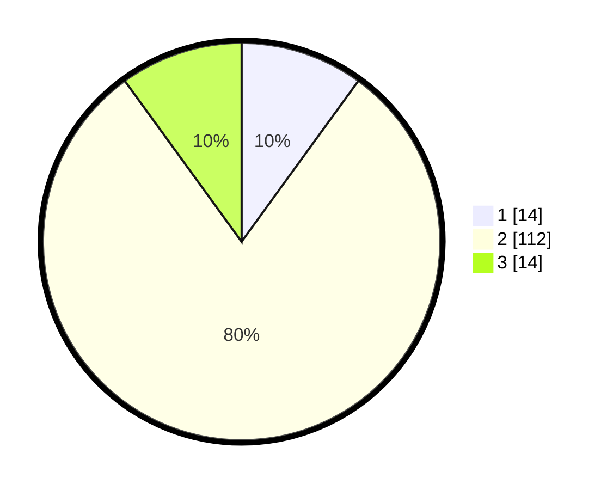

# Hasil

## Grafik

## Tabel

| No. | Nama Paslon    | Suara | Suara (raw) | Persentase |
|:--- |:-------------- | -----:| -----------:| ----------:|
| 1   | ANIES MUHAIMIN | 14    | [14][p-1]   | 10,00      |
| 2   | PRABOWO GIBRAN | 112   | [112][p-2]  | 80,00      |
| 3   | GANJAR MAHFUD  | 14    | [14][p-3]   | 10,00      |

[p-1]: https://github.com/gigit-pemilu/pemilu-2024-35-jawa-timur/blob/main/pilpres/hitung-suara/sub/35-jawa-timur/sub/10-banyuwangi/sub/20-sempu/sub/2004-temuguruh/sub/016-tps/sub/paslon-1.txt
[p-2]: https://github.com/gigit-pemilu/pemilu-2024-35-jawa-timur/blob/main/pilpres/hitung-suara/sub/35-jawa-timur/sub/10-banyuwangi/sub/20-sempu/sub/2004-temuguruh/sub/016-tps/sub/paslon-2.txt
[p-3]: https://github.com/gigit-pemilu/pemilu-2024-35-jawa-timur/blob/main/pilpres/hitung-suara/sub/35-jawa-timur/sub/10-banyuwangi/sub/20-sempu/sub/2004-temuguruh/sub/016-tps/sub/paslon-3.txt

## Foto C Plano

https://sirekap-obj-formc.kpu.go.id/1dbc/pemilu/ppwp/35/10/20/20/04/3510202004016-20240214-200655--d39370d6-a549-467d-b234-fb610b4a2d5a.jpg

https://sirekap-obj-formc.kpu.go.id/1dbc/pemilu/ppwp/35/10/20/20/04/3510202004016-20240214-200702--fa5eb68a-6106-425e-9007-823e57fa55d4.jpg

https://sirekap-obj-formc.kpu.go.id/1dbc/pemilu/ppwp/35/10/20/20/04/3510202004016-20240214-200522--dabfe2b0-72fe-4cf9-9e54-31a7f77d65f4.jpg

## Metadata

| Key        | Value               |
| ---------- | ------------------- |
| Time Stamp | 2024-02-24 22:31:28 |

