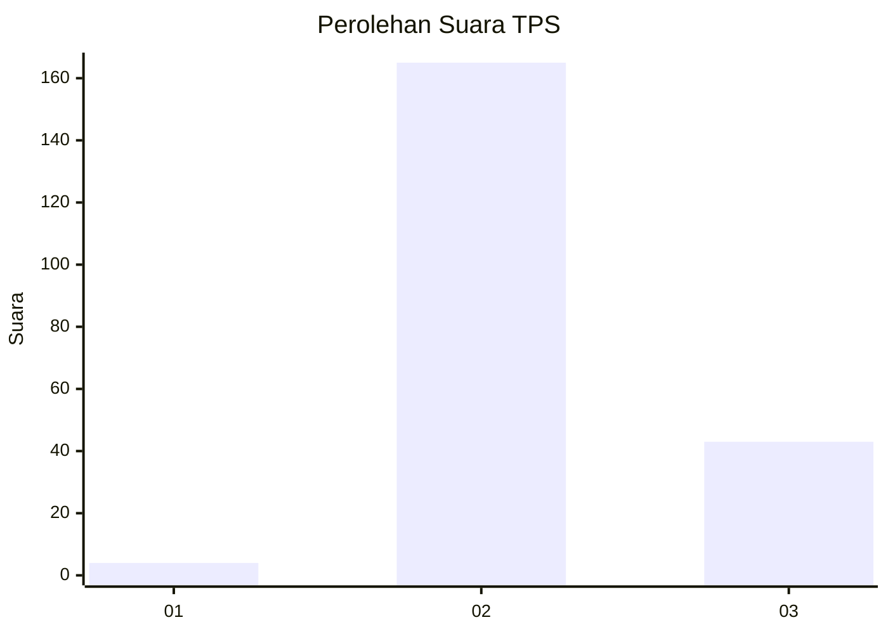

# Hasil

## Grafik

## Tabel

| No. | Nama Paslon    | Suara | Suara (raw) | Persentase |
|:--- |:-------------- | -----:| -----------:| ----------:|
| 1   | ANIES MUHAIMIN | 4     | [4][p-1]    | 1,89       |
| 2   | PRABOWO GIBRAN | 165   | [165][p-2]  | 77,83      |
| 3   | GANJAR MAHFUD  | 43    | [43][p-3]   | 20,28      |

[p-1]: https://github.com/gigit-pemilu/pemilu-2024/blob/main/pilpres/hitung-suara/sub/35-jawa-timur/sub/10-banyuwangi/sub/20-sempu/sub/2005-gendoh/sub/001-tps/sub/paslon-1.txt
[p-2]: https://github.com/gigit-pemilu/pemilu-2024/blob/main/pilpres/hitung-suara/sub/35-jawa-timur/sub/10-banyuwangi/sub/20-sempu/sub/2005-gendoh/sub/001-tps/sub/paslon-2.txt
[p-3]: https://github.com/gigit-pemilu/pemilu-2024/blob/main/pilpres/hitung-suara/sub/35-jawa-timur/sub/10-banyuwangi/sub/20-sempu/sub/2005-gendoh/sub/001-tps/sub/paslon-3.txt

## Foto C Plano

https://sirekap-obj-formc.kpu.go.id/1a39/pemilu/ppwp/35/10/20/20/05/3510202005001-20240214-233241--820001fb-7560-4387-8f4d-6cb7b00a5535.jpg

https://sirekap-obj-formc.kpu.go.id/1a39/pemilu/ppwp/35/10/20/20/05/3510202005001-20240214-233316--85b54292-028d-477f-9f81-f1bc9ffc71e0.jpg

https://sirekap-obj-formc.kpu.go.id/1a39/pemilu/ppwp/35/10/20/20/05/3510202005001-20240214-233418--cb1fb0f5-2233-474a-9a19-75c2b8bf8959.jpg

## Metadata

| Key        | Value               |
| ---------- | ------------------- |
| Time Stamp | 2024-02-21 15:00:00 |

