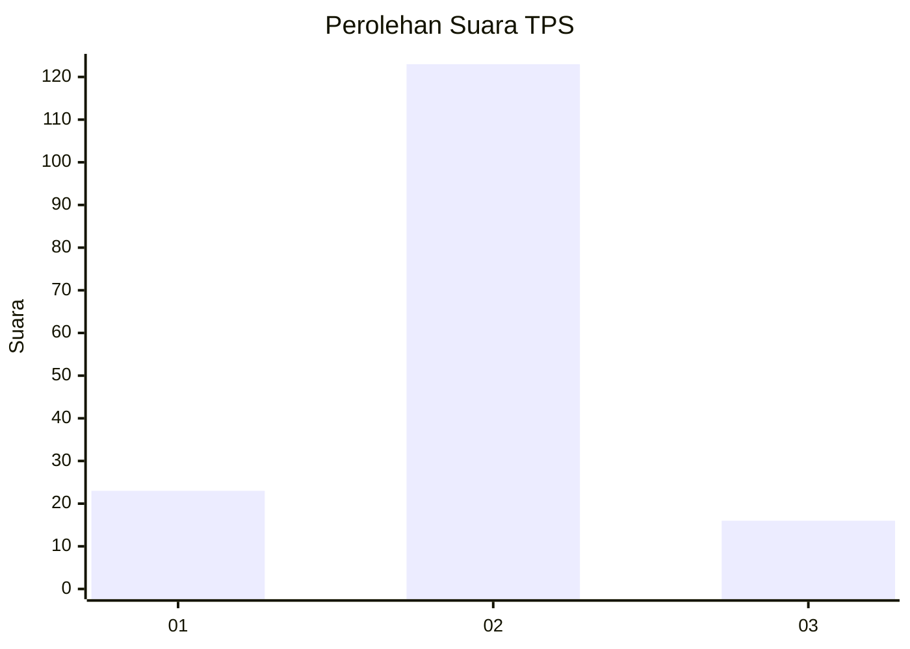
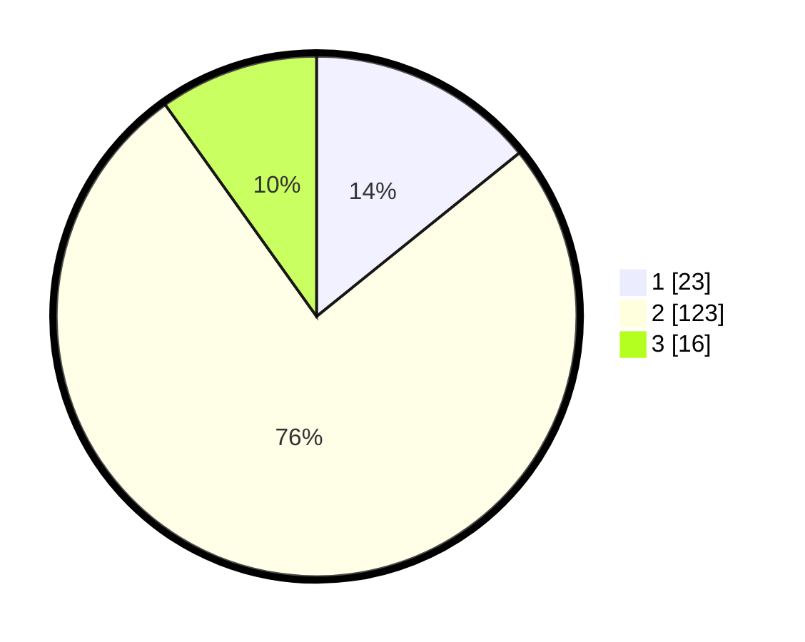

# Hasil

## Grafik

## Tabel

| No. | Nama Paslon    | Suara | Suara (raw) | Persentase |
|:--- |:-------------- | -----:| -----------:| ----------:|
| 1   | ANIES MUHAIMIN | 23    | [23][p-1]   | 14,20      |
| 2   | PRABOWO GIBRAN | 123   | [123][p-2]  | 75,93      |
| 3   | GANJAR MAHFUD  | 16    | [16][p-3]   | 9,88       |

[p-1]: https://github.com/gigit-pemilu/pemilu-2024/blob/main/pilpres/hitung-suara/sub/35-jawa-timur/sub/10-banyuwangi/sub/21-kalipuro/sub/1001-kalipuro/sub/003-tps/sub/paslon-1.txt
[p-2]: https://github.com/gigit-pemilu/pemilu-2024/blob/main/pilpres/hitung-suara/sub/35-jawa-timur/sub/10-banyuwangi/sub/21-kalipuro/sub/1001-kalipuro/sub/003-tps/sub/paslon-2.txt
[p-3]: https://github.com/gigit-pemilu/pemilu-2024/blob/main/pilpres/hitung-suara/sub/35-jawa-timur/sub/10-banyuwangi/sub/21-kalipuro/sub/1001-kalipuro/sub/003-tps/sub/paslon-3.txt

## Foto C Plano

https://sirekap-obj-formc.kpu.go.id/91b0/pemilu/ppwp/35/10/21/10/01/3510211001003-20240215-015348--b01803b9-a213-4f88-a9ee-e2c26d4cef25.jpg

https://sirekap-obj-formc.kpu.go.id/91b0/pemilu/ppwp/35/10/21/10/01/3510211001003-20240215-015548--7b24ec49-c2a2-44fe-b0a7-21e8781964f7.jpg

https://sirekap-obj-formc.kpu.go.id/91b0/pemilu/ppwp/35/10/21/10/01/3510211001003-20240215-015637--b43734c4-7715-46f5-be5a-e42ce20b7cce.jpg

## Metadata

| Key        | Value               |
| ---------- | ------------------- |
| Time Stamp | 2024-02-25 16:00:00 |

