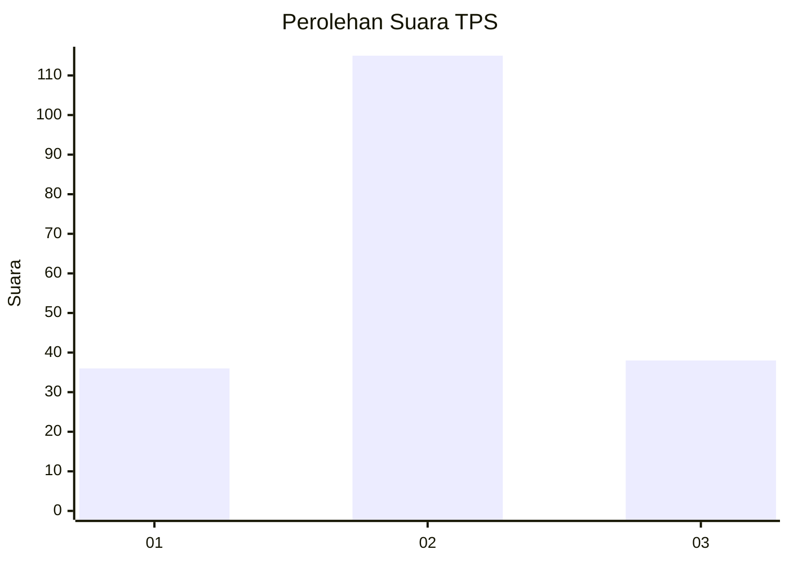
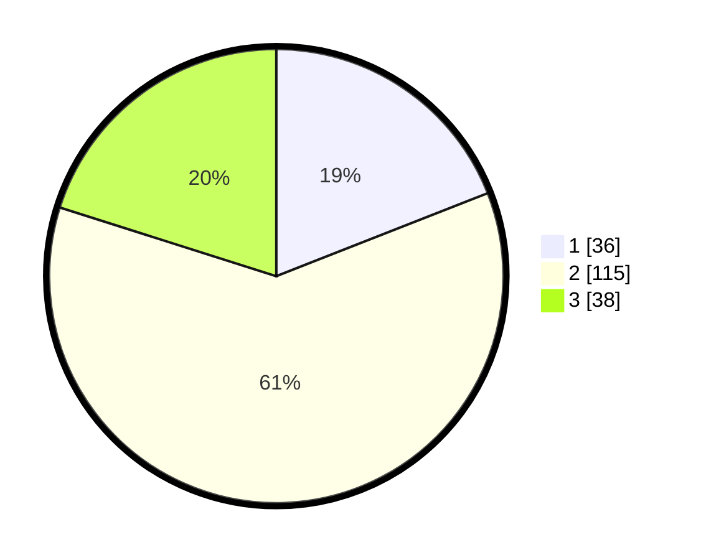

# Hasil

## Grafik

## Tabel

| No. | Nama Paslon    | Suara | Suara (raw) | Persentase |
|:--- |:-------------- | -----:| -----------:| ----------:|
| 1   | ANIES MUHAIMIN | 36    | [36][p-1]   | 19,05      |
| 2   | PRABOWO GIBRAN | 115   | [115][p-2]  | 60,85      |
| 3   | GANJAR MAHFUD  | 38    | [38][p-3]   | 20,11      |

[p-1]: https://github.com/gigit-pemilu/pemilu-2024/blob/main/pilpres/hitung-suara/sub/35-jawa-timur/sub/10-banyuwangi/sub/21-kalipuro/sub/1001-kalipuro/sub/004-tps/sub/paslon-1.txt
[p-2]: https://github.com/gigit-pemilu/pemilu-2024/blob/main/pilpres/hitung-suara/sub/35-jawa-timur/sub/10-banyuwangi/sub/21-kalipuro/sub/1001-kalipuro/sub/004-tps/sub/paslon-2.txt
[p-3]: https://github.com/gigit-pemilu/pemilu-2024/blob/main/pilpres/hitung-suara/sub/35-jawa-timur/sub/10-banyuwangi/sub/21-kalipuro/sub/1001-kalipuro/sub/004-tps/sub/paslon-3.txt

## Foto C Plano

https://sirekap-obj-formc.kpu.go.id/2e78/pemilu/ppwp/35/10/21/10/01/3510211001004-20240217-172129--493ef0f1-83e1-46e8-bf02-bf2292240793.jpg

https://sirekap-obj-formc.kpu.go.id/2e78/pemilu/ppwp/35/10/21/10/01/3510211001004-20240217-164946--b7341bac-9fa3-4346-a677-cd1ca525d74c.jpg

https://sirekap-obj-formc.kpu.go.id/2e78/pemilu/ppwp/35/10/21/10/01/3510211001004-20240217-165103--df22a847-86ed-4f5f-8913-79f2933be31e.jpg

## Metadata

| Key        | Value               |
| ---------- | ------------------- |
| Time Stamp | 2024-02-24 22:31:28 |

