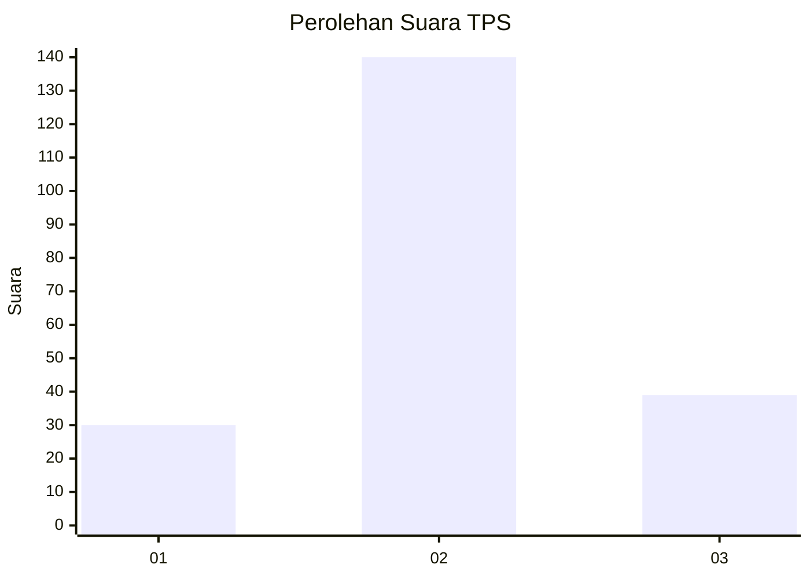
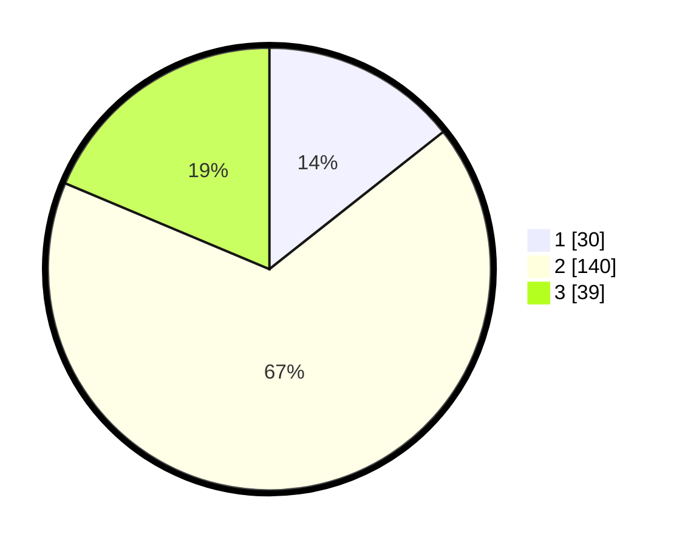

# Hasil

## Grafik

## Tabel

| No. | Nama Paslon    | Suara | Suara (raw) | Persentase |
|:--- |:-------------- | -----:| -----------:| ----------:|
| 1   | ANIES MUHAIMIN | 30    | [30][p-1]   | 14,35      |
| 2   | PRABOWO GIBRAN | 140   | [140][p-2]  | 66,99      |
| 3   | GANJAR MAHFUD  | 39    | [39][p-3]   | 18,66      |

[p-1]: https://github.com/gigit-pemilu/pemilu-2024-35-jawa-timur/blob/main/pilpres/hitung-suara/sub/35-jawa-timur/sub/10-banyuwangi/sub/21-kalipuro/sub/1001-kalipuro/sub/005-tps/sub/paslon-1.txt
[p-2]: https://github.com/gigit-pemilu/pemilu-2024-35-jawa-timur/blob/main/pilpres/hitung-suara/sub/35-jawa-timur/sub/10-banyuwangi/sub/21-kalipuro/sub/1001-kalipuro/sub/005-tps/sub/paslon-2.txt
[p-3]: https://github.com/gigit-pemilu/pemilu-2024-35-jawa-timur/blob/main/pilpres/hitung-suara/sub/35-jawa-timur/sub/10-banyuwangi/sub/21-kalipuro/sub/1001-kalipuro/sub/005-tps/sub/paslon-3.txt

## Foto C Plano

https://sirekap-obj-formc.kpu.go.id/c42c/pemilu/ppwp/35/10/21/10/01/3510211001005-20240215-025500--48d67b9e-0f5c-42f1-b8cf-ee177874a8bd.jpg

https://sirekap-obj-formc.kpu.go.id/c42c/pemilu/ppwp/35/10/21/10/01/3510211001005-20240215-023523--5cc0eb15-e1fe-4786-91ae-fe0e4e4df338.jpg

https://sirekap-obj-formc.kpu.go.id/c42c/pemilu/ppwp/35/10/21/10/01/3510211001005-20240215-025933--fa975cdf-a706-44a4-911f-e4144a09c19e.jpg

## Metadata

| Key        | Value               |
| ---------- | ------------------- |
| Time Stamp | 2024-02-17 13:37:34 |

