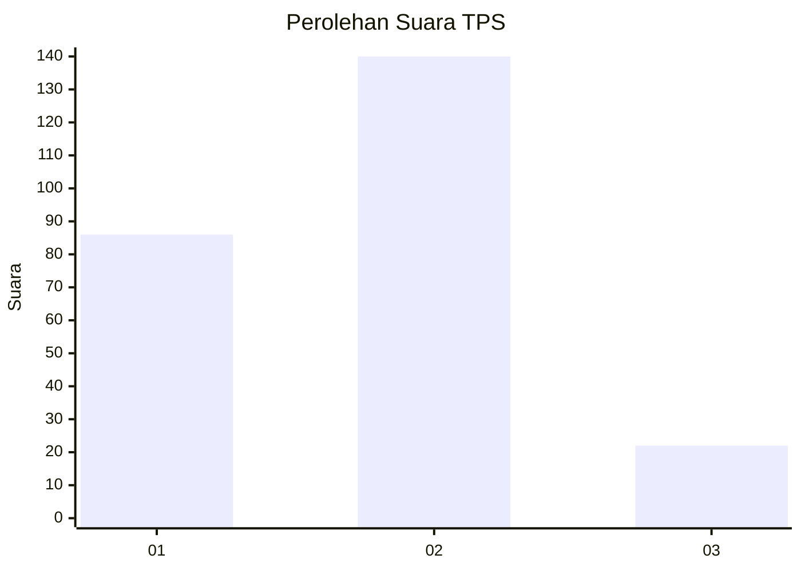
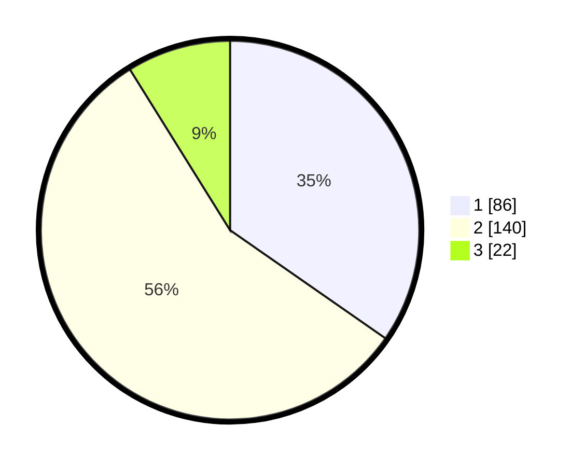

# Hasil

## Grafik

## Tabel

| No. | Nama Paslon    | Suara | Suara (raw) | Persentase |
|:--- |:-------------- | -----:| -----------:| ----------:|
| 1   | ANIES MUHAIMIN | 86    | [86][p-1]   | 34,68      |
| 2   | PRABOWO GIBRAN | 140   | [140][p-2]  | 56,45      |
| 3   | GANJAR MAHFUD  | 22    | [22][p-3]   | 8,87       |

[p-1]: https://github.com/gigit-pemilu/pemilu-2024/blob/main/pilpres/hitung-suara/sub/35-jawa-timur/sub/10-banyuwangi/sub/21-kalipuro/sub/1001-kalipuro/sub/018-tps/sub/paslon-1.txt
[p-2]: https://github.com/gigit-pemilu/pemilu-2024/blob/main/pilpres/hitung-suara/sub/35-jawa-timur/sub/10-banyuwangi/sub/21-kalipuro/sub/1001-kalipuro/sub/018-tps/sub/paslon-2.txt
[p-3]: https://github.com/gigit-pemilu/pemilu-2024/blob/main/pilpres/hitung-suara/sub/35-jawa-timur/sub/10-banyuwangi/sub/21-kalipuro/sub/1001-kalipuro/sub/018-tps/sub/paslon-3.txt

## Foto C Plano

https://sirekap-obj-formc.kpu.go.id/07b3/pemilu/ppwp/35/10/21/10/01/3510211001018-20240215-015052--824274bc-041b-41b2-a26f-257cf287089b.jpg

https://sirekap-obj-formc.kpu.go.id/07b3/pemilu/ppwp/35/10/21/10/01/3510211001018-20240215-040837--5433a4cf-5c8b-48cc-b206-b2959bf5167e.jpg

https://sirekap-obj-formc.kpu.go.id/07b3/pemilu/ppwp/35/10/21/10/01/3510211001018-20240215-015333--62732076-1900-47d2-a3d9-ac0d6c390e1a.jpg

## Metadata

| Key        | Value               |
| ---------- | ------------------- |
| Time Stamp | 2024-02-24 22:31:28 |

