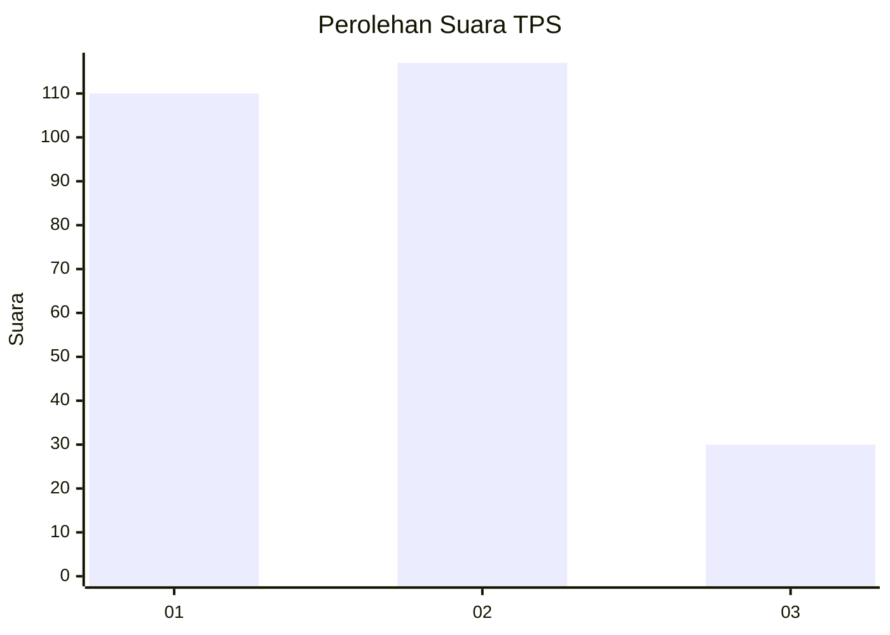
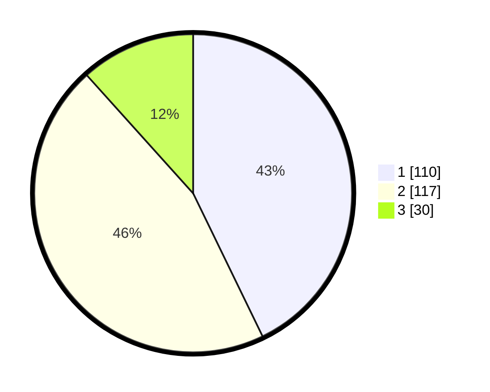

# Hasil

## Grafik

## Tabel

| No. | Nama Paslon    | Suara | Suara (raw) | Persentase |
|:--- |:-------------- | -----:| -----------:| ----------:|
| 1   | ANIES MUHAIMIN | 110   | [110][p-1]  | 42,80      |
| 2   | PRABOWO GIBRAN | 117   | [117][p-2]  | 45,53      |
| 3   | GANJAR MAHFUD  | 30    | [30][p-3]   | 11,67      |

[p-1]: https://github.com/gigit-pemilu/pemilu-2024/blob/main/pilpres/hitung-suara/sub/35-jawa-timur/sub/10-banyuwangi/sub/21-kalipuro/sub/1001-kalipuro/sub/024-tps/sub/paslon-1.txt
[p-2]: https://github.com/gigit-pemilu/pemilu-2024/blob/main/pilpres/hitung-suara/sub/35-jawa-timur/sub/10-banyuwangi/sub/21-kalipuro/sub/1001-kalipuro/sub/024-tps/sub/paslon-2.txt
[p-3]: https://github.com/gigit-pemilu/pemilu-2024/blob/main/pilpres/hitung-suara/sub/35-jawa-timur/sub/10-banyuwangi/sub/21-kalipuro/sub/1001-kalipuro/sub/024-tps/sub/paslon-3.txt

## Foto C Plano

https://sirekap-obj-formc.kpu.go.id/2561/pemilu/ppwp/35/10/21/10/01/3510211001024-20240217-165717--b854a917-847c-417b-ac0c-5832be9c90eb.jpg

https://sirekap-obj-formc.kpu.go.id/2561/pemilu/ppwp/35/10/21/10/01/3510211001024-20240217-170513--2fdfa6f3-ab0d-43c5-a882-e774e9c48f38.jpg

https://sirekap-obj-formc.kpu.go.id/2561/pemilu/ppwp/35/10/21/10/01/3510211001024-20240217-170645--eeb30d41-eb00-41ed-8efd-ddcf1ecddc02.jpg

## Metadata

| Key        | Value               |
| ---------- | ------------------- |
| Time Stamp | 2024-02-24 22:31:28 |

