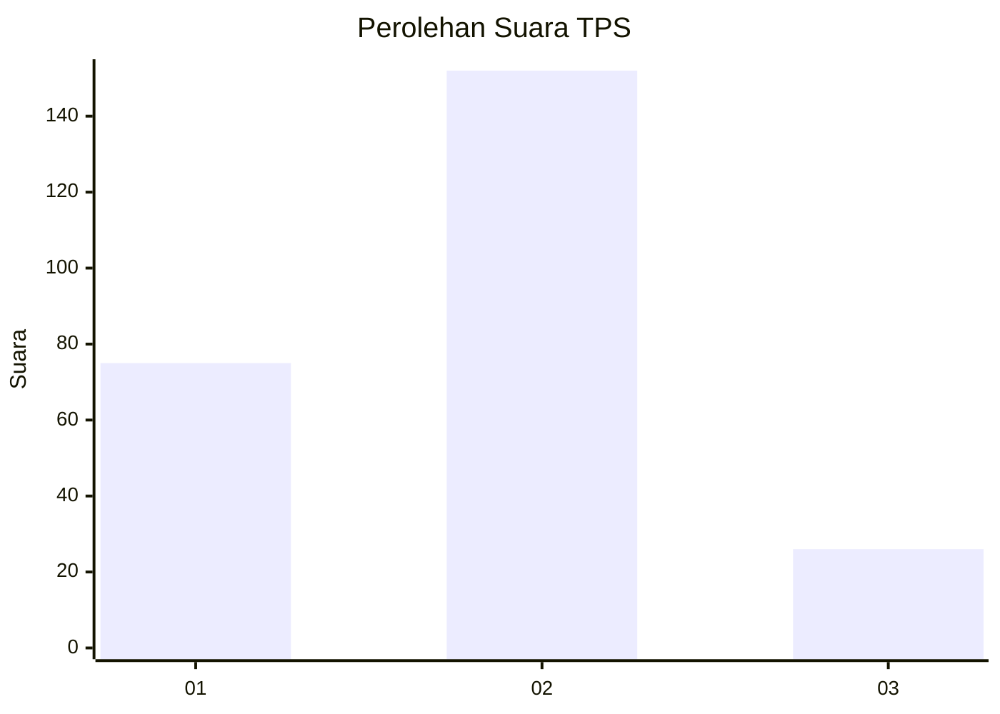
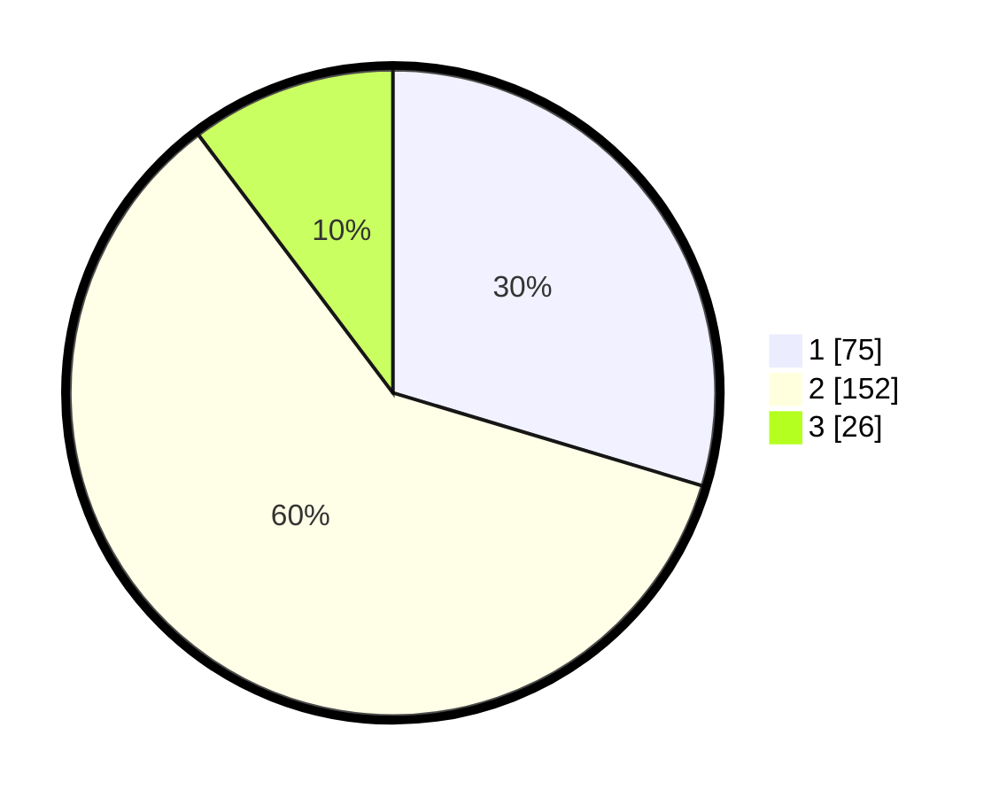

# Hasil

## Grafik

## Tabel

| No. | Nama Paslon    | Suara | Suara (raw) | Persentase |
|:--- |:-------------- | -----:| -----------:| ----------:|
| 1   | ANIES MUHAIMIN | 75    | [75][p-1]   | 29,64      |
| 2   | PRABOWO GIBRAN | 152   | [152][p-2]  | 60,08      |
| 3   | GANJAR MAHFUD  | 26    | [26][p-3]   | 10,28      |

[p-1]: https://github.com/gigit-pemilu/pemilu-2024-35-jawa-timur/blob/main/pilpres/hitung-suara/sub/35-jawa-timur/sub/10-banyuwangi/sub/21-kalipuro/sub/1001-kalipuro/sub/026-tps/sub/paslon-1.txt
[p-2]: https://github.com/gigit-pemilu/pemilu-2024-35-jawa-timur/blob/main/pilpres/hitung-suara/sub/35-jawa-timur/sub/10-banyuwangi/sub/21-kalipuro/sub/1001-kalipuro/sub/026-tps/sub/paslon-2.txt
[p-3]: https://github.com/gigit-pemilu/pemilu-2024-35-jawa-timur/blob/main/pilpres/hitung-suara/sub/35-jawa-timur/sub/10-banyuwangi/sub/21-kalipuro/sub/1001-kalipuro/sub/026-tps/sub/paslon-3.txt

## Foto C Plano

https://sirekap-obj-formc.kpu.go.id/aa2c/pemilu/ppwp/35/10/21/10/01/3510211001026-20240217-165926--289b9ce0-be17-44ef-994c-3af5d5d293ae.jpg

https://sirekap-obj-formc.kpu.go.id/aa2c/pemilu/ppwp/35/10/21/10/01/3510211001026-20240217-170021--c6041c5a-d8e4-4967-9491-bd41da4ab1c6.jpg

https://sirekap-obj-formc.kpu.go.id/aa2c/pemilu/ppwp/35/10/21/10/01/3510211001026-20240217-170103--38cb834b-2645-45bf-ae5f-9a31ee92ad84.jpg

## Metadata

| Key        | Value               |
| ---------- | ------------------- |
| Time Stamp | 2024-02-24 22:31:28 |

