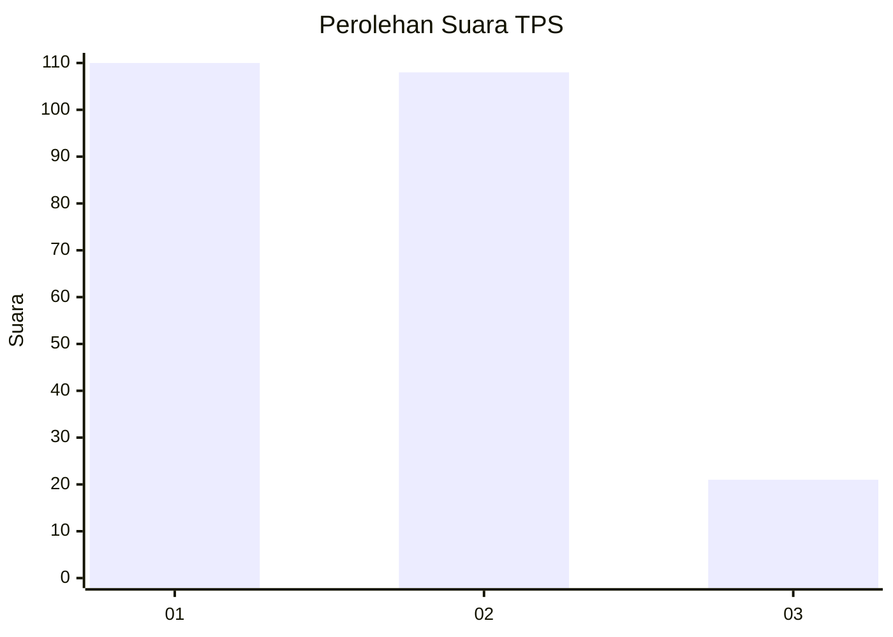
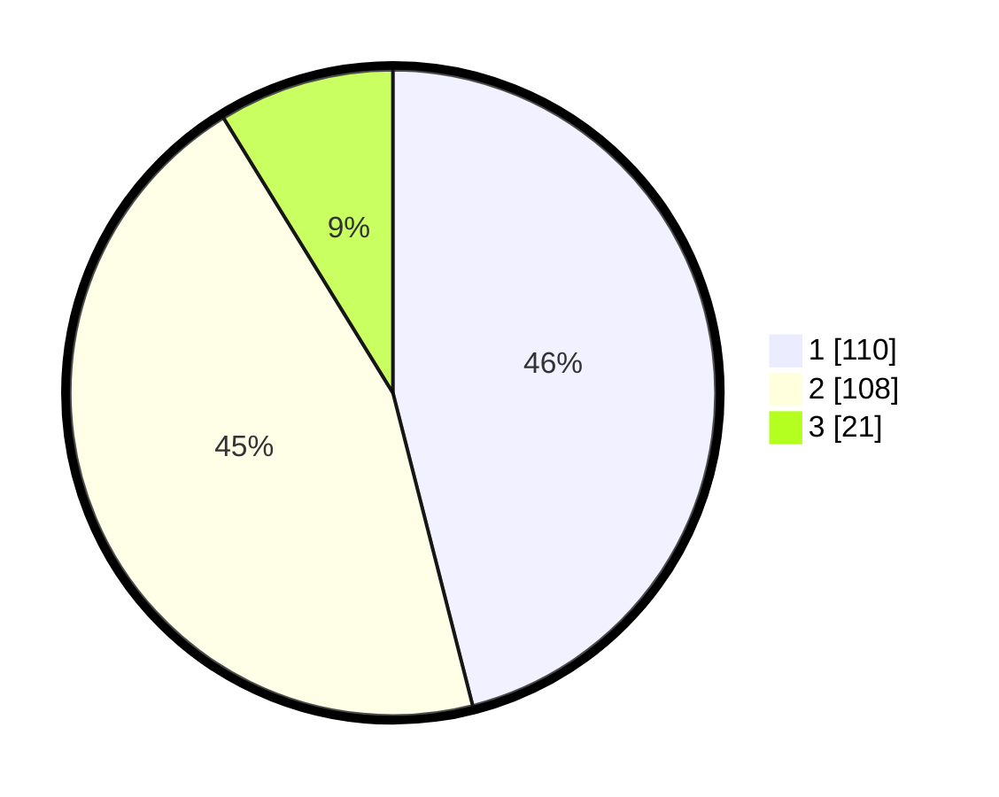

# Hasil

## Grafik

## Tabel

| No. | Nama Paslon    | Suara | Suara (raw) | Persentase |
|:--- |:-------------- | -----:| -----------:| ----------:|
| 1   | ANIES MUHAIMIN | 110   | [110][p-1]  | 46,03      |
| 2   | PRABOWO GIBRAN | 108   | [108][p-2]  | 45,19      |
| 3   | GANJAR MAHFUD  | 21    | [21][p-3]   | 8,79       |

[p-1]: https://github.com/gigit-pemilu/pemilu-2024/blob/main/pilpres/hitung-suara/sub/35-jawa-timur/sub/10-banyuwangi/sub/21-kalipuro/sub/1001-kalipuro/sub/031-tps/sub/paslon-1.txt
[p-2]: https://github.com/gigit-pemilu/pemilu-2024/blob/main/pilpres/hitung-suara/sub/35-jawa-timur/sub/10-banyuwangi/sub/21-kalipuro/sub/1001-kalipuro/sub/031-tps/sub/paslon-2.txt
[p-3]: https://github.com/gigit-pemilu/pemilu-2024/blob/main/pilpres/hitung-suara/sub/35-jawa-timur/sub/10-banyuwangi/sub/21-kalipuro/sub/1001-kalipuro/sub/031-tps/sub/paslon-3.txt

## Foto C Plano

https://sirekap-obj-formc.kpu.go.id/4213/pemilu/ppwp/35/10/21/10/01/3510211001031-20240217-152605--91a0ccb8-a164-4e87-9bab-6865ee7f7842.jpg

https://sirekap-obj-formc.kpu.go.id/4213/pemilu/ppwp/35/10/21/10/01/3510211001031-20240217-155941--39661fd3-94e5-4c32-b15a-34bc95cfecea.jpg

https://sirekap-obj-formc.kpu.go.id/4213/pemilu/ppwp/35/10/21/10/01/3510211001031-20240217-152906--ec89d3e8-e3f3-478d-a8ea-e4b12c89a2f8.jpg

## Metadata

| Key        | Value               |
| ---------- | ------------------- |
| Time Stamp | 2024-02-24 22:31:28 |

