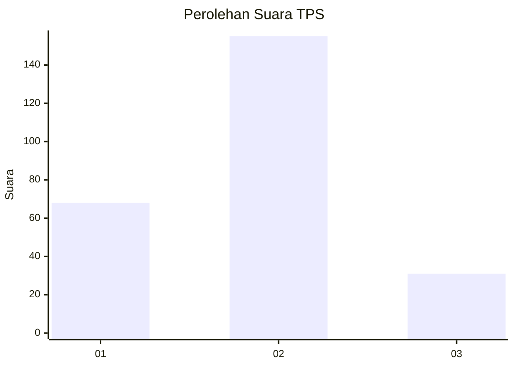
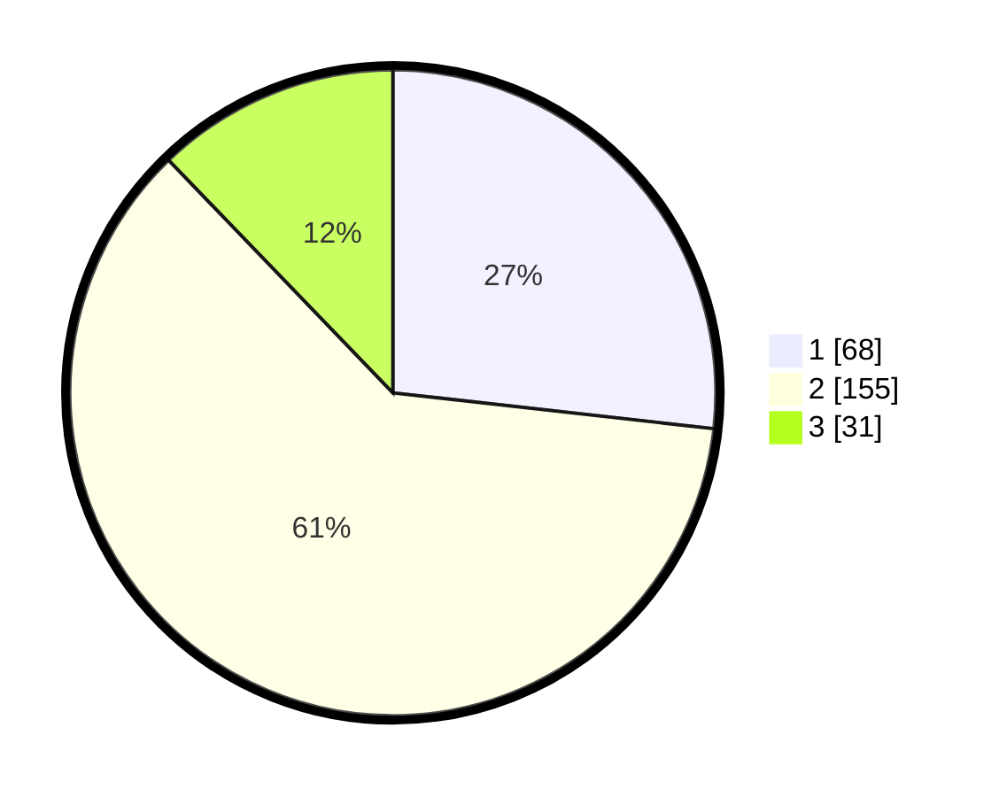

# Hasil

## Grafik

## Tabel

| No. | Nama Paslon    | Suara | Suara (raw) | Persentase |
|:--- |:-------------- | -----:| -----------:| ----------:|
| 1   | ANIES MUHAIMIN | 68    | [68][p-1]   | 26,77      |
| 2   | PRABOWO GIBRAN | 155   | [155][p-2]  | 61,02      |
| 3   | GANJAR MAHFUD  | 31    | [31][p-3]   | 12,20      |

[p-1]: https://github.com/gigit-pemilu/pemilu-2024-35-jawa-timur/blob/main/pilpres/hitung-suara/sub/35-jawa-timur/sub/10-banyuwangi/sub/21-kalipuro/sub/1001-kalipuro/sub/035-tps/sub/paslon-1.txt
[p-2]: https://github.com/gigit-pemilu/pemilu-2024-35-jawa-timur/blob/main/pilpres/hitung-suara/sub/35-jawa-timur/sub/10-banyuwangi/sub/21-kalipuro/sub/1001-kalipuro/sub/035-tps/sub/paslon-2.txt
[p-3]: https://github.com/gigit-pemilu/pemilu-2024-35-jawa-timur/blob/main/pilpres/hitung-suara/sub/35-jawa-timur/sub/10-banyuwangi/sub/21-kalipuro/sub/1001-kalipuro/sub/035-tps/sub/paslon-3.txt

## Foto C Plano

https://sirekap-obj-formc.kpu.go.id/2746/pemilu/ppwp/35/10/21/10/01/3510211001035-20240214-232238--1d1cc6b0-17e9-47a0-b8be-cd36246d5e0c.jpg

https://sirekap-obj-formc.kpu.go.id/2746/pemilu/ppwp/35/10/21/10/01/3510211001035-20240214-232416--decb7ce2-0459-47bf-a2aa-16b76b91e238.jpg

https://sirekap-obj-formc.kpu.go.id/2746/pemilu/ppwp/35/10/21/10/01/3510211001035-20240214-232736--5294feff-0f3b-4890-b035-126d67acdf63.jpg

## Metadata

| Key        | Value               |
| ---------- | ------------------- |
| Time Stamp | 2024-02-24 22:31:28 |

