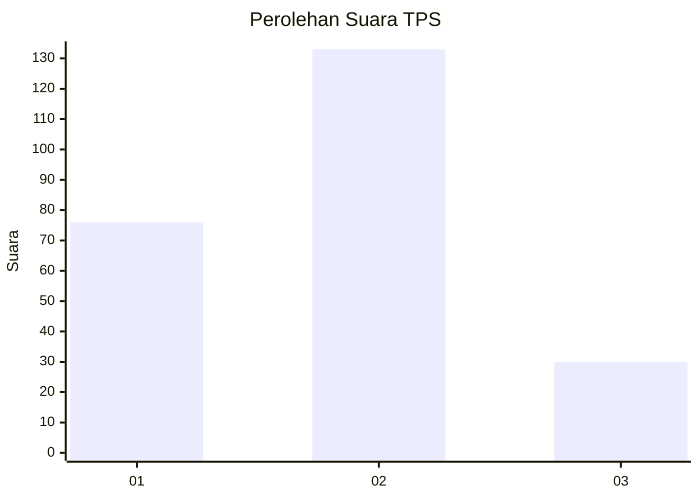
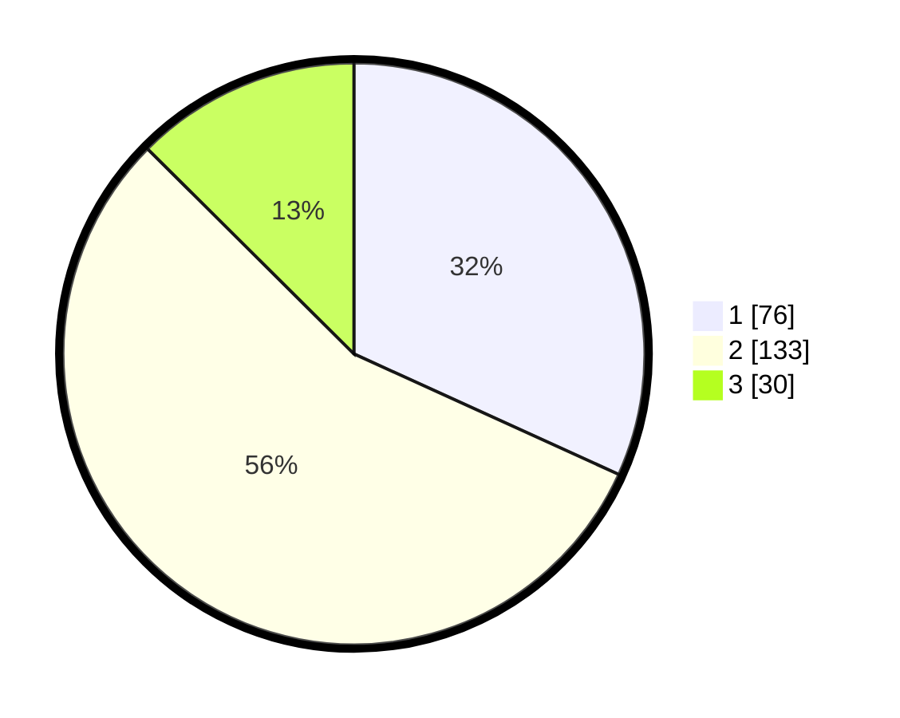

# Hasil

## Grafik

## Tabel

| No. | Nama Paslon    | Suara | Suara (raw) | Persentase |
|:--- |:-------------- | -----:| -----------:| ----------:|
| 1   | ANIES MUHAIMIN | 76    | [76][p-1]   | 31,80      |
| 2   | PRABOWO GIBRAN | 133   | [133][p-2]  | 55,65      |
| 3   | GANJAR MAHFUD  | 30    | [30][p-3]   | 12,55      |

[p-1]: https://github.com/gigit-pemilu/pemilu-2024/blob/main/pilpres/hitung-suara/sub/35-jawa-timur/sub/10-banyuwangi/sub/21-kalipuro/sub/1001-kalipuro/sub/038-tps/sub/paslon-1.txt
[p-2]: https://github.com/gigit-pemilu/pemilu-2024/blob/main/pilpres/hitung-suara/sub/35-jawa-timur/sub/10-banyuwangi/sub/21-kalipuro/sub/1001-kalipuro/sub/038-tps/sub/paslon-2.txt
[p-3]: https://github.com/gigit-pemilu/pemilu-2024/blob/main/pilpres/hitung-suara/sub/35-jawa-timur/sub/10-banyuwangi/sub/21-kalipuro/sub/1001-kalipuro/sub/038-tps/sub/paslon-3.txt

## Foto C Plano

https://sirekap-obj-formc.kpu.go.id/1061/pemilu/ppwp/35/10/21/10/01/3510211001038-20240214-205911--7d0aa501-c495-4931-bd27-4f8f6af15674.jpg

https://sirekap-obj-formc.kpu.go.id/1061/pemilu/ppwp/35/10/21/10/01/3510211001038-20240214-205645--feab91b0-deb2-4af0-a0ac-dc1a1d065345.jpg

https://sirekap-obj-formc.kpu.go.id/1061/pemilu/ppwp/35/10/21/10/01/3510211001038-20240214-205402--38ec38ba-96cc-4f46-a711-5a59e3d88945.jpg

## Metadata

| Key        | Value               |
| ---------- | ------------------- |
| Time Stamp | 2024-02-17 13:37:34 |

