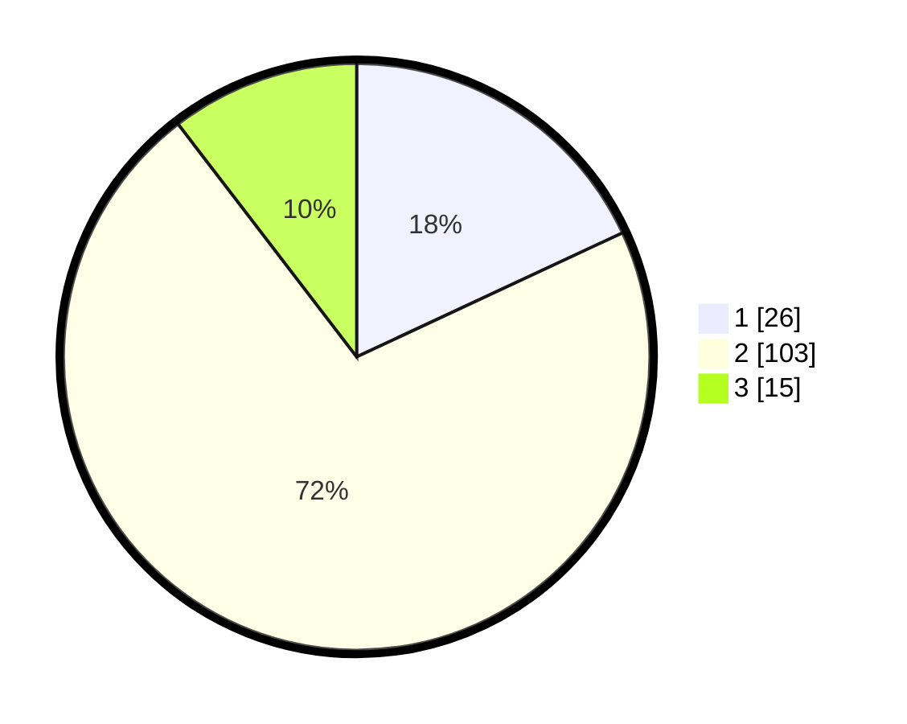

# Hasil

## Grafik

## Tabel

| No. | Nama Paslon    | Suara | Suara (raw) | Persentase |
|:--- |:-------------- | -----:| -----------:| ----------:|
| 1   | ANIES MUHAIMIN | 26    | [26][p-1]   | 18,06      |
| 2   | PRABOWO GIBRAN | 103   | [103][p-2]  | 71,53      |
| 3   | GANJAR MAHFUD  | 15    | [15][p-3]   | 10,42      |

[p-1]: https://github.com/gigit-pemilu/pemilu-2024-35-jawa-timur/blob/main/pilpres/hitung-suara/sub/35-jawa-timur/sub/10-banyuwangi/sub/21-kalipuro/sub/1002-klatak/sub/034-tps/sub/paslon-1.txt
[p-2]: https://github.com/gigit-pemilu/pemilu-2024-35-jawa-timur/blob/main/pilpres/hitung-suara/sub/35-jawa-timur/sub/10-banyuwangi/sub/21-kalipuro/sub/1002-klatak/sub/034-tps/sub/paslon-2.txt
[p-3]: https://github.com/gigit-pemilu/pemilu-2024-35-jawa-timur/blob/main/pilpres/hitung-suara/sub/35-jawa-timur/sub/10-banyuwangi/sub/21-kalipuro/sub/1002-klatak/sub/034-tps/sub/paslon-3.txt

## Foto C Plano

https://sirekap-obj-formc.kpu.go.id/baf5/pemilu/ppwp/35/10/21/10/02/3510211002034-20240214-221713--1d218533-d391-4afd-9898-745031ee4560.jpg

https://sirekap-obj-formc.kpu.go.id/baf5/pemilu/ppwp/35/10/21/10/02/3510211002034-20240214-202247--76481241-a794-4a8b-bab4-20158e0fefcb.jpg

https://sirekap-obj-formc.kpu.go.id/baf5/pemilu/ppwp/35/10/21/10/02/3510211002034-20240214-220922--6422a97c-c7e0-47c2-abd5-233f0bb266dd.jpg

## Metadata

| Key        | Value               |
| ---------- | ------------------- |
| Time Stamp | 2024-02-24 22:31:28 |

