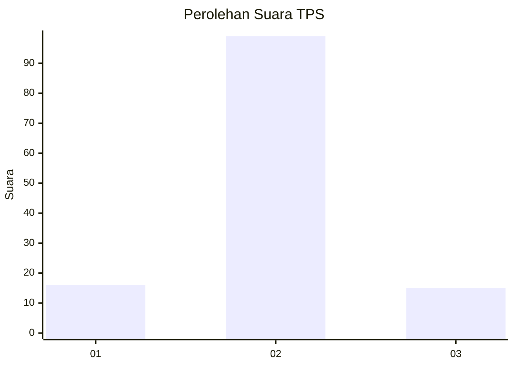
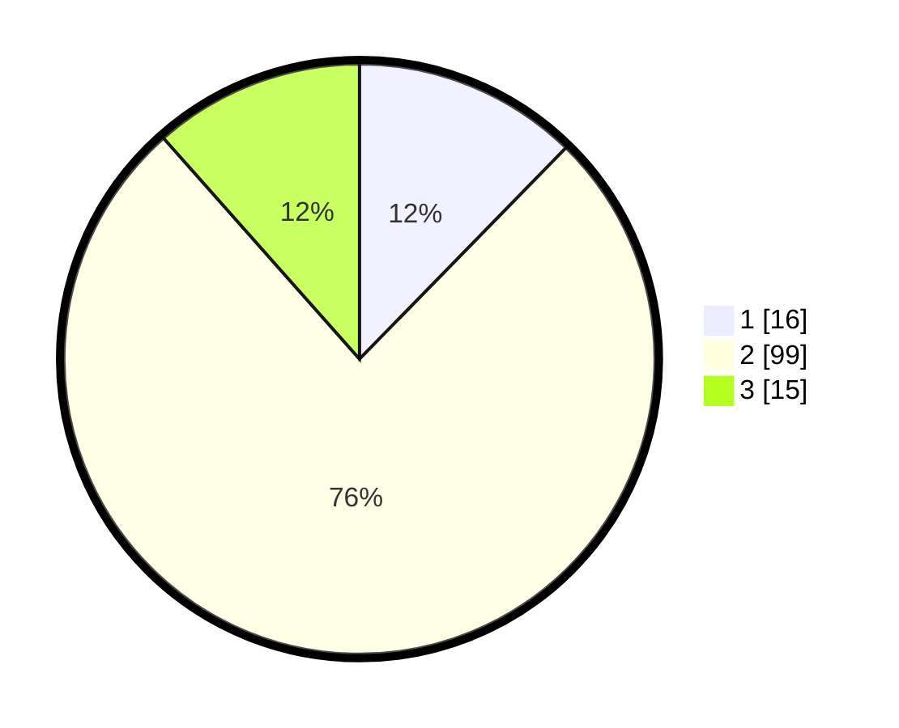

# Hasil

## Grafik

## Tabel

| No. | Nama Paslon    | Suara | Suara (raw) | Persentase |
|:--- |:-------------- | -----:| -----------:| ----------:|
| 1   | ANIES MUHAIMIN | 16    | [16][p-1]   | 12,31      |
| 2   | PRABOWO GIBRAN | 99    | [99][p-2]   | 76,15      |
| 3   | GANJAR MAHFUD  | 15    | [15][p-3]   | 11,54      |

[p-1]: https://github.com/gigit-pemilu/pemilu-2024/blob/main/pilpres/hitung-suara/sub/35-jawa-timur/sub/10-banyuwangi/sub/21-kalipuro/sub/1006-gombengsari/sub/001-tps/sub/paslon-1.txt
[p-2]: https://github.com/gigit-pemilu/pemilu-2024/blob/main/pilpres/hitung-suara/sub/35-jawa-timur/sub/10-banyuwangi/sub/21-kalipuro/sub/1006-gombengsari/sub/001-tps/sub/paslon-2.txt
[p-3]: https://github.com/gigit-pemilu/pemilu-2024/blob/main/pilpres/hitung-suara/sub/35-jawa-timur/sub/10-banyuwangi/sub/21-kalipuro/sub/1006-gombengsari/sub/001-tps/sub/paslon-3.txt

## Foto C Plano

https://sirekap-obj-formc.kpu.go.id/31fd/pemilu/ppwp/35/10/21/10/06/3510211006001-20240215-013613--54b7ad10-bc7a-48b3-a53f-dc3fc810b026.jpg

https://sirekap-obj-formc.kpu.go.id/31fd/pemilu/ppwp/35/10/21/10/06/3510211006001-20240215-043923--51f06fb8-6f7e-461e-9fe4-a58fd2d621a7.jpg

## Metadata

| Key        | Value               |
| ---------- | ------------------- |
| Time Stamp | 2024-02-25 11:00:00 |

