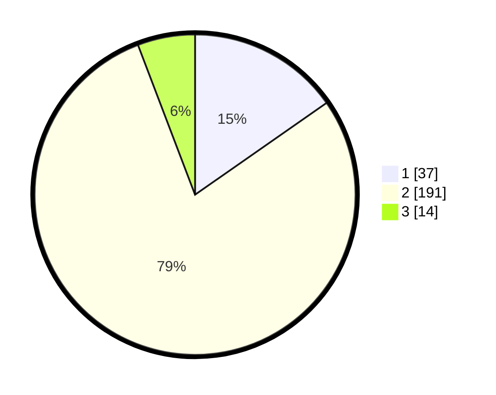

# Hasil

## Grafik

## Tabel

| No. | Nama Paslon    | Suara | Suara (raw) | Persentase |
|:--- |:-------------- | -----:| -----------:| ----------:|
| 1   | ANIES MUHAIMIN | 37    | [37][p-1]   | 15,29      |
| 2   | PRABOWO GIBRAN | 191   | [191][p-2]  | 78,93      |
| 3   | GANJAR MAHFUD  | 14    | [14][p-3]   | 5,79       |

[p-1]: https://github.com/gigit-pemilu/pemilu-2024/blob/main/pilpres/hitung-suara/sub/35-jawa-timur/sub/10-banyuwangi/sub/21-kalipuro/sub/1006-gombengsari/sub/007-tps/sub/paslon-1.txt
[p-2]: https://github.com/gigit-pemilu/pemilu-2024/blob/main/pilpres/hitung-suara/sub/35-jawa-timur/sub/10-banyuwangi/sub/21-kalipuro/sub/1006-gombengsari/sub/007-tps/sub/paslon-2.txt
[p-3]: https://github.com/gigit-pemilu/pemilu-2024/blob/main/pilpres/hitung-suara/sub/35-jawa-timur/sub/10-banyuwangi/sub/21-kalipuro/sub/1006-gombengsari/sub/007-tps/sub/paslon-3.txt

## Foto C Plano

https://sirekap-obj-formc.kpu.go.id/2233/pemilu/ppwp/35/10/21/10/06/3510211006007-20240215-013611--911b30c0-cb2d-4935-8699-9d85c607f597.jpg

https://sirekap-obj-formc.kpu.go.id/2233/pemilu/ppwp/35/10/21/10/06/3510211006007-20240215-013710--73197028-a67f-41a1-aaf0-99f5392c3d73.jpg

https://sirekap-obj-formc.kpu.go.id/2233/pemilu/ppwp/35/10/21/10/06/3510211006007-20240215-013814--af2cad90-cceb-4d13-b075-5fd550af7c59.jpg

## Metadata

| Key        | Value               |
| ---------- | ------------------- |
| Time Stamp | 2024-02-19 14:00:00 |

