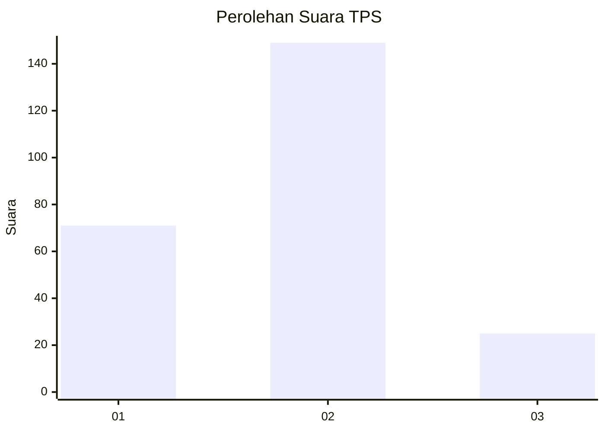
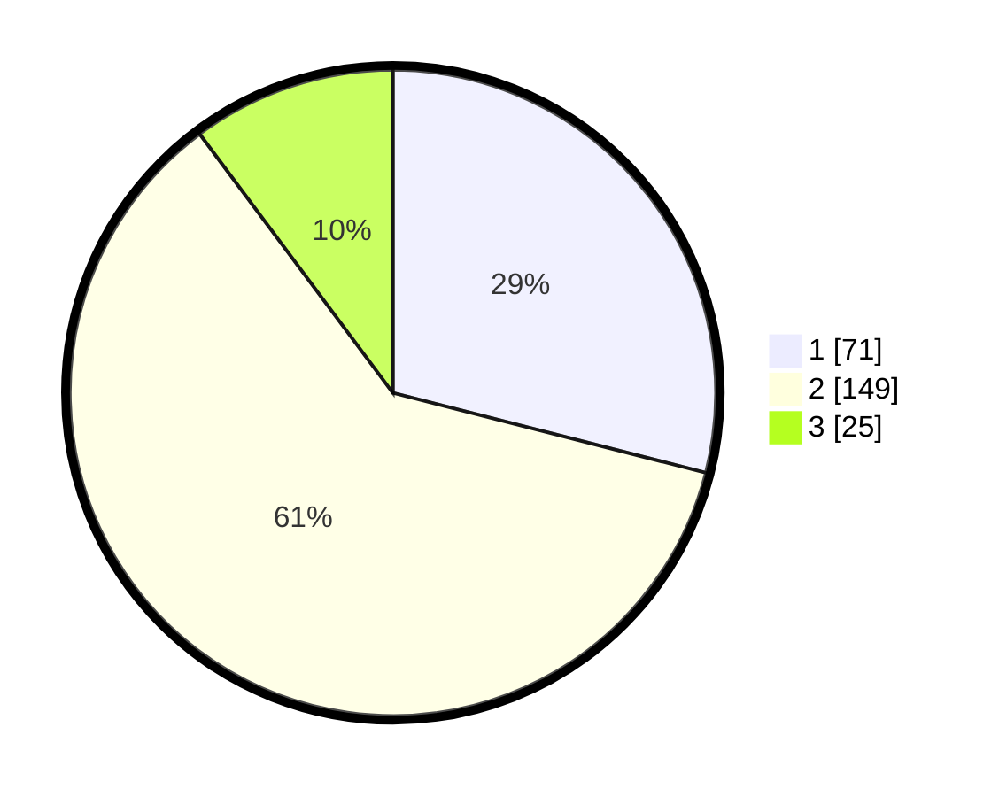

# Hasil

## Grafik

## Tabel

| No. | Nama Paslon    | Suara | Suara (raw) | Persentase |
|:--- |:-------------- | -----:| -----------:| ----------:|
| 1   | ANIES MUHAIMIN | 71    | [71][p-1]   | 28,98      |
| 2   | PRABOWO GIBRAN | 149   | [149][p-2]  | 60,82      |
| 3   | GANJAR MAHFUD  | 25    | [25][p-3]   | 10,20      |

[p-1]: https://github.com/gigit-pemilu/pemilu-2024/blob/main/pilpres/hitung-suara/sub/35-jawa-timur/sub/10-banyuwangi/sub/21-kalipuro/sub/1006-gombengsari/sub/008-tps/sub/paslon-1.txt
[p-2]: https://github.com/gigit-pemilu/pemilu-2024/blob/main/pilpres/hitung-suara/sub/35-jawa-timur/sub/10-banyuwangi/sub/21-kalipuro/sub/1006-gombengsari/sub/008-tps/sub/paslon-2.txt
[p-3]: https://github.com/gigit-pemilu/pemilu-2024/blob/main/pilpres/hitung-suara/sub/35-jawa-timur/sub/10-banyuwangi/sub/21-kalipuro/sub/1006-gombengsari/sub/008-tps/sub/paslon-3.txt

## Foto C Plano

https://sirekap-obj-formc.kpu.go.id/dcd9/pemilu/ppwp/35/10/21/10/06/3510211006008-20240215-050408--628c0d47-e86c-4244-ac18-e2997623326f.jpg

https://sirekap-obj-formc.kpu.go.id/dcd9/pemilu/ppwp/35/10/21/10/06/3510211006008-20240215-050452--299742bf-0a7d-4197-a5c7-814c412d2bc9.jpg

https://sirekap-obj-formc.kpu.go.id/dcd9/pemilu/ppwp/35/10/21/10/06/3510211006008-20240215-050541--5f5234c7-a246-435e-810c-57f61fe21bab.jpg

## Metadata

| Key        | Value               |
| ---------- | ------------------- |
| Time Stamp | 2024-02-19 14:00:00 |

