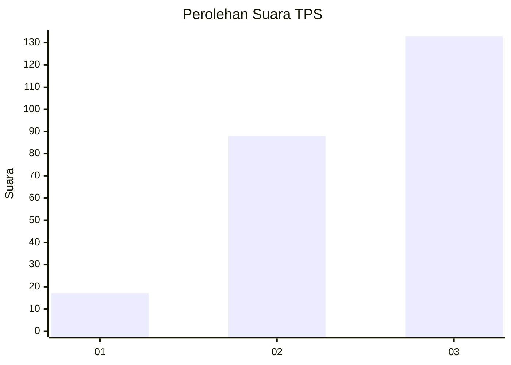
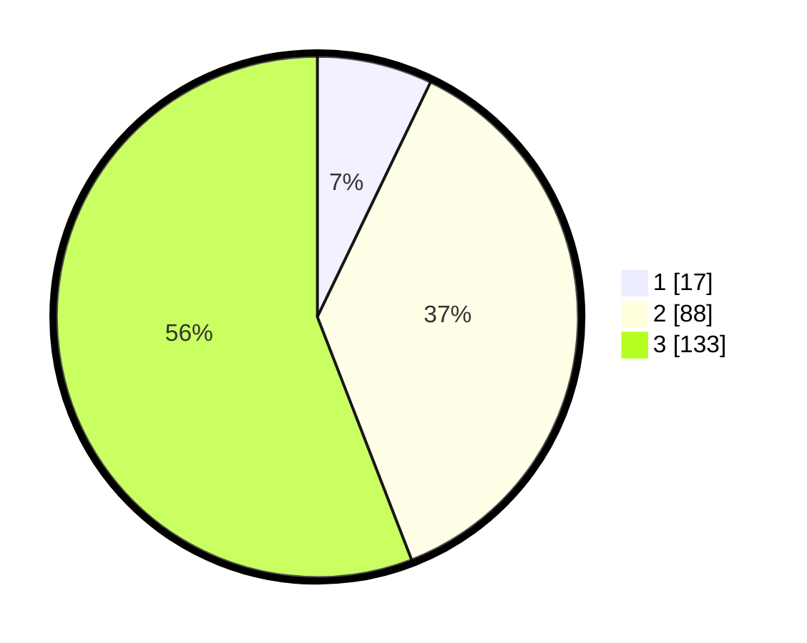

# Hasil

## Grafik

## Tabel

| No. | Nama Paslon    | Suara | Suara (raw) | Persentase |
|:--- |:-------------- | -----:| -----------:| ----------:|
| 1   | ANIES MUHAIMIN | 17    | [17][p-1]   | 7,14       |
| 2   | PRABOWO GIBRAN | 88    | [88][p-2]   | 36,97      |
| 3   | GANJAR MAHFUD  | 133   | [133][p-3]  | 55,88      |

[p-1]: https://github.com/gigit-pemilu/pemilu-2024/blob/main/pilpres/hitung-suara/sub/35-jawa-timur/sub/10-banyuwangi/sub/21-kalipuro/sub/1006-gombengsari/sub/012-tps/sub/paslon-1.txt
[p-2]: https://github.com/gigit-pemilu/pemilu-2024/blob/main/pilpres/hitung-suara/sub/35-jawa-timur/sub/10-banyuwangi/sub/21-kalipuro/sub/1006-gombengsari/sub/012-tps/sub/paslon-2.txt
[p-3]: https://github.com/gigit-pemilu/pemilu-2024/blob/main/pilpres/hitung-suara/sub/35-jawa-timur/sub/10-banyuwangi/sub/21-kalipuro/sub/1006-gombengsari/sub/012-tps/sub/paslon-3.txt

## Foto C Plano

https://sirekap-obj-formc.kpu.go.id/f019/pemilu/ppwp/35/10/21/10/06/3510211006012-20240216-091105--a4a3e1ee-ed89-4f5c-9461-e8a306c8d341.jpg

https://sirekap-obj-formc.kpu.go.id/f019/pemilu/ppwp/35/10/21/10/06/3510211006012-20240219-200218--f1a91120-0ae2-489a-8641-d3b93d0b8284.jpg

https://sirekap-obj-formc.kpu.go.id/f019/pemilu/ppwp/35/10/21/10/06/3510211006012-20240216-091301--bcce3bd8-20c9-47fe-97f3-fdb98cc2ba91.jpg

## Metadata

| Key        | Value               |
| ---------- | ------------------- |
| Time Stamp | 2024-02-24 22:31:28 |

