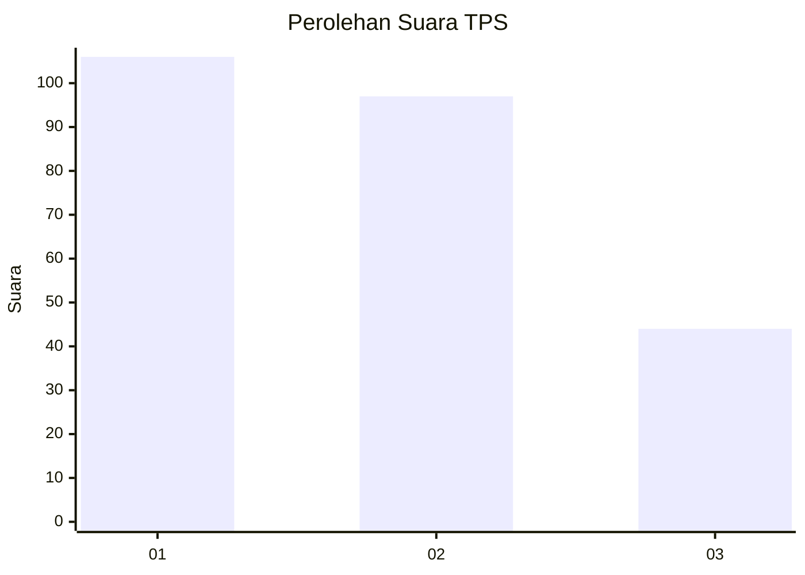
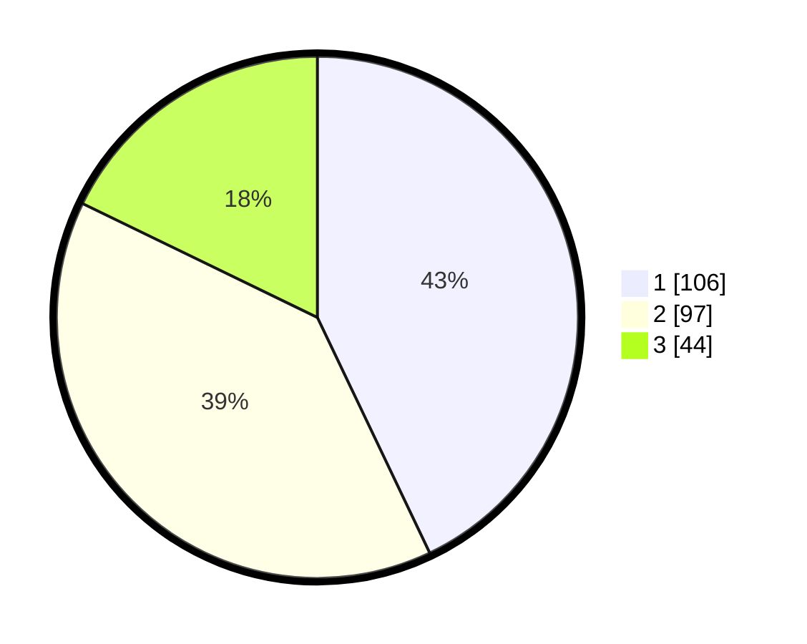

# Hasil

## Grafik

## Tabel

| No. | Nama Paslon    | Suara | Suara (raw) | Persentase |
|:--- |:-------------- | -----:| -----------:| ----------:|
| 1   | ANIES MUHAIMIN | 106   | [106][p-1]  | 42,91      |
| 2   | PRABOWO GIBRAN | 97    | [97][p-2]   | 39,27      |
| 3   | GANJAR MAHFUD  | 44    | [44][p-3]   | 17,81      |

[p-1]: https://github.com/gigit-pemilu/pemilu-2024-35-jawa-timur/blob/main/pilpres/hitung-suara/sub/35-jawa-timur/sub/10-banyuwangi/sub/21-kalipuro/sub/1007-bulusan/sub/017-tps/sub/paslon-1.txt
[p-2]: https://github.com/gigit-pemilu/pemilu-2024-35-jawa-timur/blob/main/pilpres/hitung-suara/sub/35-jawa-timur/sub/10-banyuwangi/sub/21-kalipuro/sub/1007-bulusan/sub/017-tps/sub/paslon-2.txt
[p-3]: https://github.com/gigit-pemilu/pemilu-2024-35-jawa-timur/blob/main/pilpres/hitung-suara/sub/35-jawa-timur/sub/10-banyuwangi/sub/21-kalipuro/sub/1007-bulusan/sub/017-tps/sub/paslon-3.txt

## Foto C Plano

https://sirekap-obj-formc.kpu.go.id/cd16/pemilu/ppwp/35/10/21/10/07/3510211007017-20240215-012827--e54f49b1-ddbd-4716-9f9d-a5c430009952.jpg

https://sirekap-obj-formc.kpu.go.id/cd16/pemilu/ppwp/35/10/21/10/07/3510211007017-20240217-140812--c487be1c-1eb9-4231-8d93-5be3370b059c.jpg

https://sirekap-obj-formc.kpu.go.id/cd16/pemilu/ppwp/35/10/21/10/07/3510211007017-20240217-141253--a4ea1108-89c4-4220-ac71-abc18771695d.jpg

## Metadata

| Key        | Value               |
| ---------- | ------------------- |
| Time Stamp | 2024-02-17 14:45:18 |

