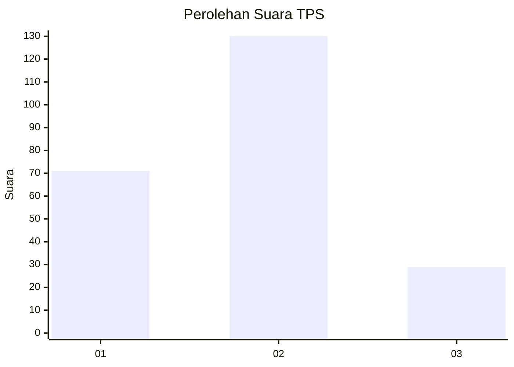
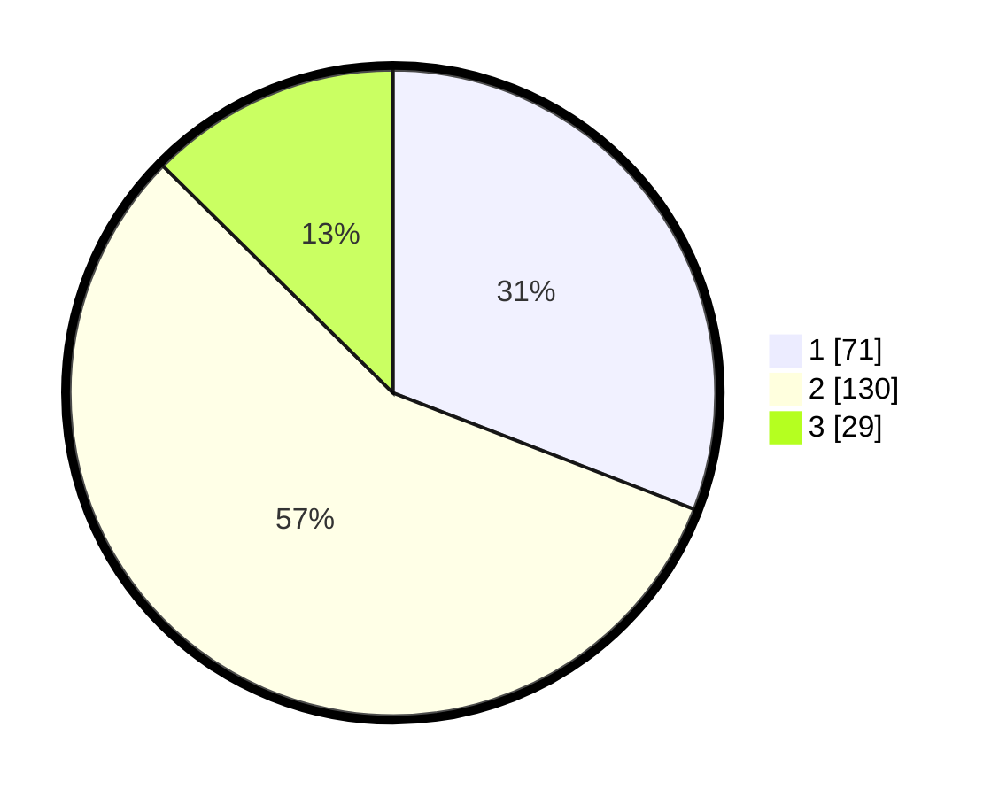

# Hasil

## Grafik

## Tabel

| No. | Nama Paslon    | Suara | Suara (raw) | Persentase |
|:--- |:-------------- | -----:| -----------:| ----------:|
| 1   | ANIES MUHAIMIN | 71    | [71][p-1]   | 30,87      |
| 2   | PRABOWO GIBRAN | 130   | [130][p-2]  | 56,52      |
| 3   | GANJAR MAHFUD  | 29    | [29][p-3]   | 12,61      |

[p-1]: https://github.com/gigit-pemilu/pemilu-2024-35-jawa-timur/blob/main/pilpres/hitung-suara/sub/35-jawa-timur/sub/10-banyuwangi/sub/21-kalipuro/sub/1007-bulusan/sub/018-tps/sub/paslon-1.txt
[p-2]: https://github.com/gigit-pemilu/pemilu-2024-35-jawa-timur/blob/main/pilpres/hitung-suara/sub/35-jawa-timur/sub/10-banyuwangi/sub/21-kalipuro/sub/1007-bulusan/sub/018-tps/sub/paslon-2.txt
[p-3]: https://github.com/gigit-pemilu/pemilu-2024-35-jawa-timur/blob/main/pilpres/hitung-suara/sub/35-jawa-timur/sub/10-banyuwangi/sub/21-kalipuro/sub/1007-bulusan/sub/018-tps/sub/paslon-3.txt

## Foto C Plano

https://sirekap-obj-formc.kpu.go.id/e721/pemilu/ppwp/35/10/21/10/07/3510211007018-20240215-045000--8bc039e5-9f74-4620-913b-1b1b22e4dafb.jpg

https://sirekap-obj-formc.kpu.go.id/e721/pemilu/ppwp/35/10/21/10/07/3510211007018-20240215-045137--0eacfd66-f4ac-423f-a6b0-d3aa1f3badf0.jpg

https://sirekap-obj-formc.kpu.go.id/e721/pemilu/ppwp/35/10/21/10/07/3510211007018-20240215-045229--362ec730-a0a9-4f10-b52b-92af59487d27.jpg

## Metadata

| Key        | Value               |
| ---------- | ------------------- |
| Time Stamp | 2024-02-25 11:00:00 |

