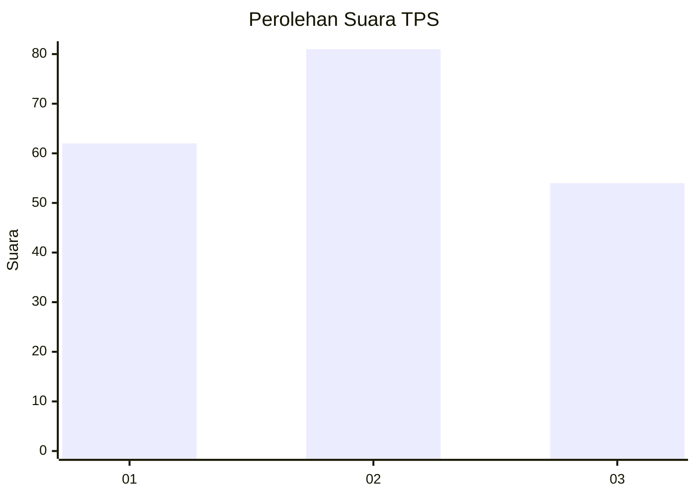
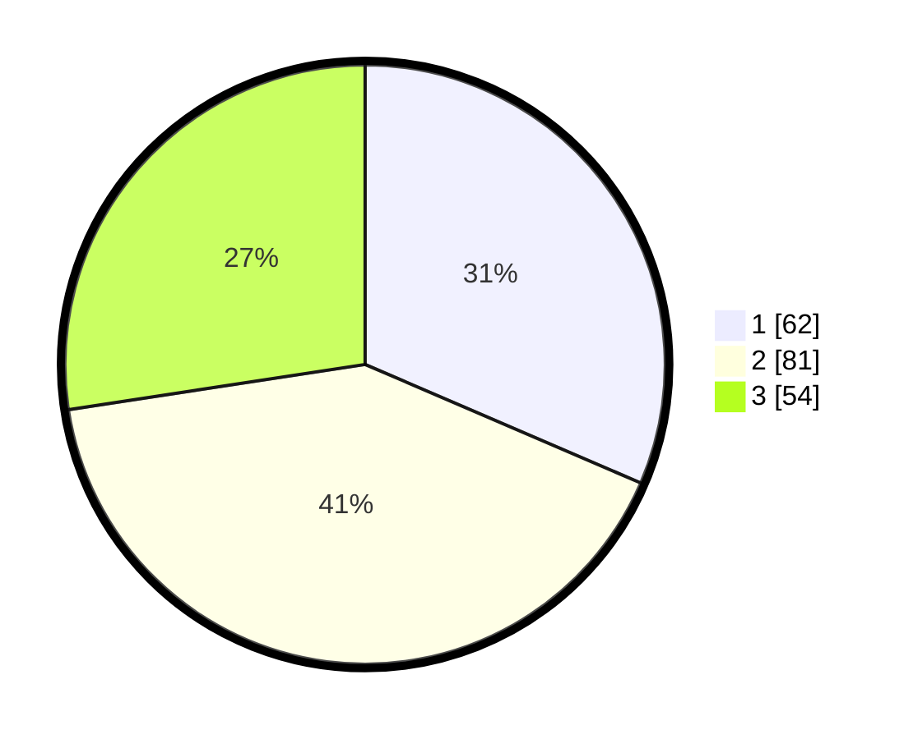

# Hasil

## Grafik

## Tabel

| No. | Nama Paslon    | Suara | Suara (raw) | Persentase |
|:--- |:-------------- | -----:| -----------:| ----------:|
| 1   | ANIES MUHAIMIN | 62    | [62][p-1]   | 31,47      |
| 2   | PRABOWO GIBRAN | 81    | [81][p-2]   | 41,12      |
| 3   | GANJAR MAHFUD  | 54    | [54][p-3]   | 27,41      |

[p-1]: https://github.com/gigit-pemilu/pemilu-2024/blob/main/pilpres/hitung-suara/sub/35-jawa-timur/sub/10-banyuwangi/sub/21-kalipuro/sub/2003-ketapang/sub/007-tps/sub/paslon-1.txt
[p-2]: https://github.com/gigit-pemilu/pemilu-2024/blob/main/pilpres/hitung-suara/sub/35-jawa-timur/sub/10-banyuwangi/sub/21-kalipuro/sub/2003-ketapang/sub/007-tps/sub/paslon-2.txt
[p-3]: https://github.com/gigit-pemilu/pemilu-2024/blob/main/pilpres/hitung-suara/sub/35-jawa-timur/sub/10-banyuwangi/sub/21-kalipuro/sub/2003-ketapang/sub/007-tps/sub/paslon-3.txt

## Foto C Plano

https://sirekap-obj-formc.kpu.go.id/5dd3/pemilu/ppwp/35/10/21/20/03/3510212003007-20240215-022124--c59b02cd-f1ff-4ff6-8c3c-7c2a23595d62.jpg

https://sirekap-obj-formc.kpu.go.id/5dd3/pemilu/ppwp/35/10/21/20/03/3510212003007-20240215-023432--3efe0301-2b10-440a-9c22-8e0b6d5f152a.jpg

https://sirekap-obj-formc.kpu.go.id/5dd3/pemilu/ppwp/35/10/21/20/03/3510212003007-20240215-023520--e1e6e051-398d-4be5-ad96-f7ed78581be3.jpg

## Metadata

| Key        | Value               |
| ---------- | ------------------- |
| Time Stamp | 2024-02-24 22:31:28 |

