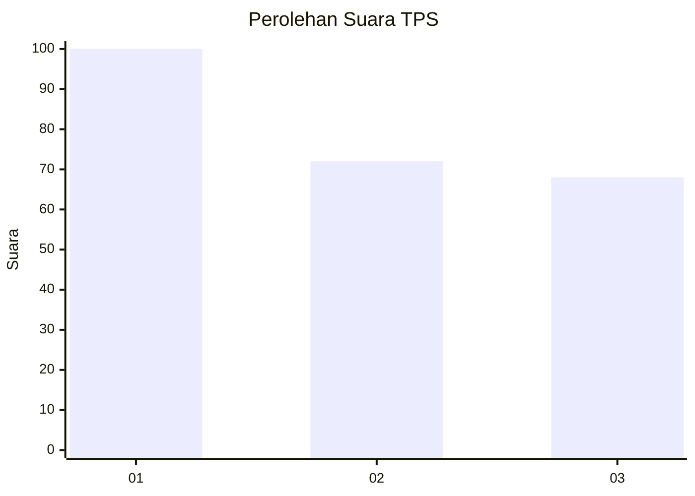
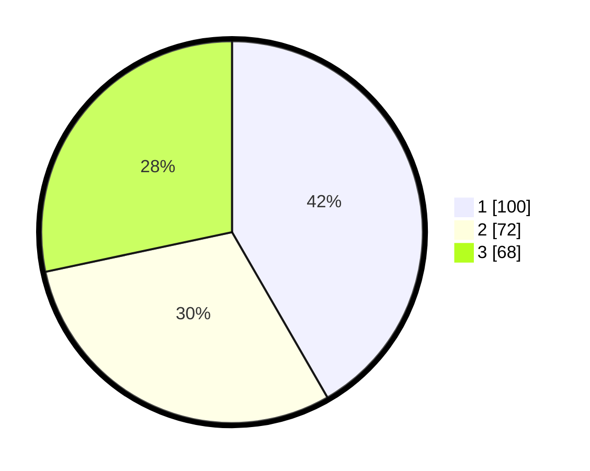

# Hasil

## Grafik

## Tabel

| No. | Nama Paslon    | Suara | Suara (raw) | Persentase |
|:--- |:-------------- | -----:| -----------:| ----------:|
| 1   | ANIES MUHAIMIN | 100   | [100][p-1]  | 41,67      |
| 2   | PRABOWO GIBRAN | 72    | [72][p-2]   | 30,00      |
| 3   | GANJAR MAHFUD  | 68    | [68][p-3]   | 28,33      |

[p-1]: https://github.com/gigit-pemilu/pemilu-2024-35-jawa-timur/blob/main/pilpres/hitung-suara/sub/35-jawa-timur/sub/10-banyuwangi/sub/21-kalipuro/sub/2003-ketapang/sub/024-tps/sub/paslon-1.txt
[p-2]: https://github.com/gigit-pemilu/pemilu-2024-35-jawa-timur/blob/main/pilpres/hitung-suara/sub/35-jawa-timur/sub/10-banyuwangi/sub/21-kalipuro/sub/2003-ketapang/sub/024-tps/sub/paslon-2.txt
[p-3]: https://github.com/gigit-pemilu/pemilu-2024-35-jawa-timur/blob/main/pilpres/hitung-suara/sub/35-jawa-timur/sub/10-banyuwangi/sub/21-kalipuro/sub/2003-ketapang/sub/024-tps/sub/paslon-3.txt

## Foto C Plano

https://sirekap-obj-formc.kpu.go.id/52f5/pemilu/ppwp/35/10/21/20/03/3510212003024-20240214-221251--a44256d3-7dae-4c70-9b90-997a36360a90.jpg

https://sirekap-obj-formc.kpu.go.id/52f5/pemilu/ppwp/35/10/21/20/03/3510212003024-20240214-221407--42d1e34c-e055-4621-8a9d-8ac27c0564b5.jpg

https://sirekap-obj-formc.kpu.go.id/52f5/pemilu/ppwp/35/10/21/20/03/3510212003024-20240214-221505--8279a559-d90d-445e-9e23-660bbebf643c.jpg

## Metadata

| Key        | Value               |
| ---------- | ------------------- |
| Time Stamp | 2024-02-24 22:31:28 |

