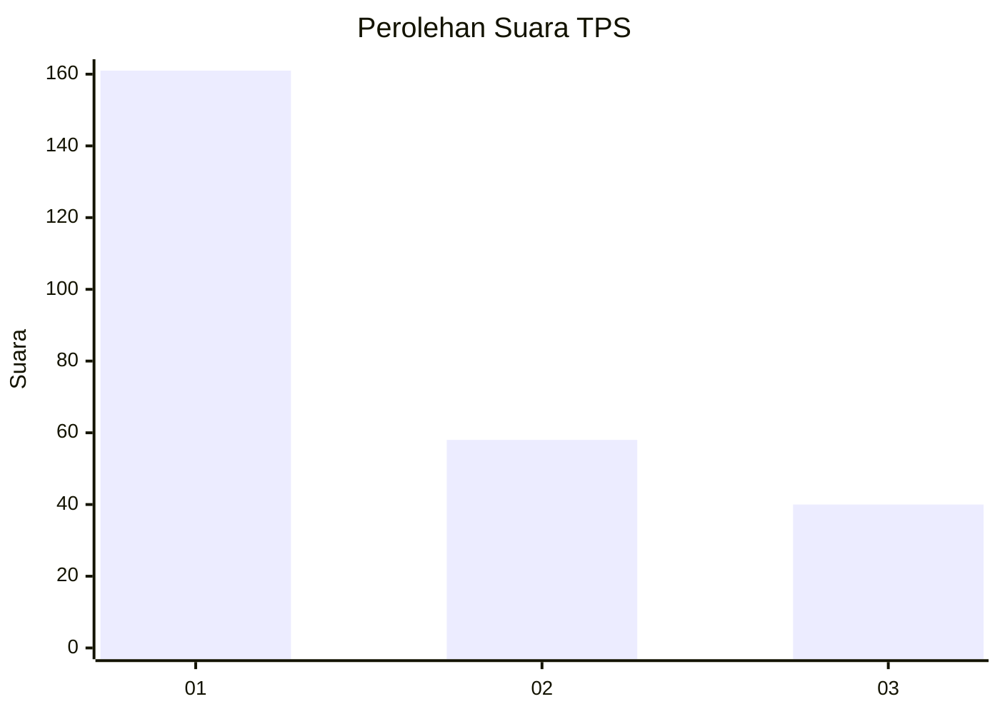
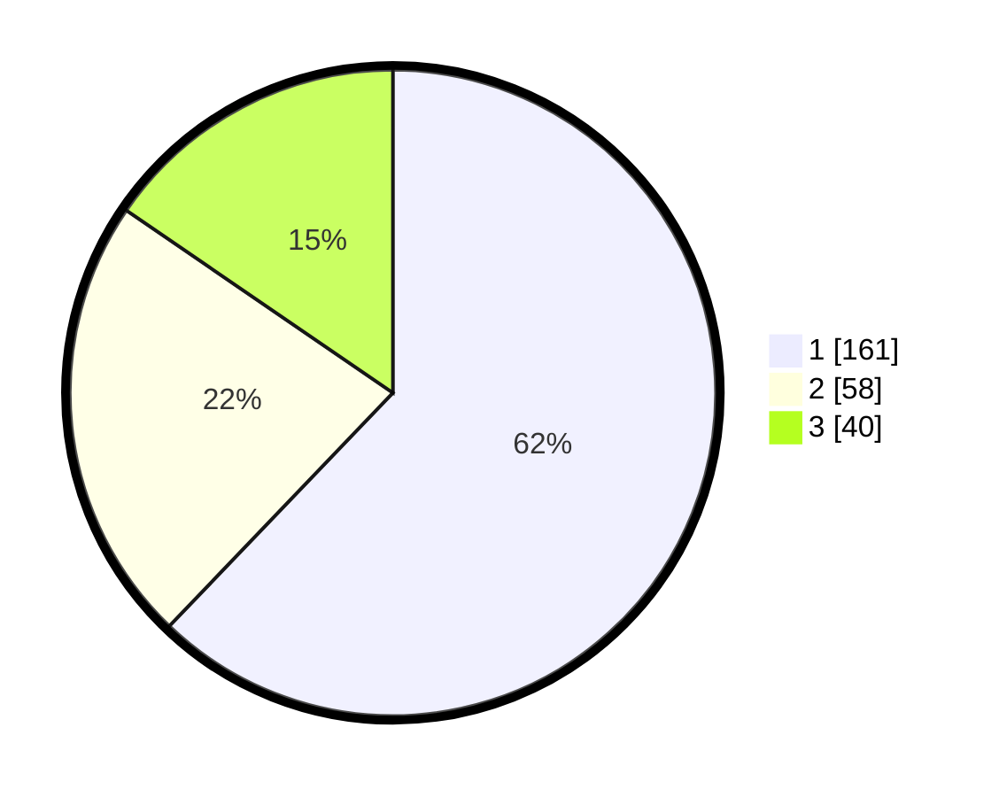

# Hasil

## Grafik

## Tabel

| No. | Nama Paslon    | Suara | Suara (raw) | Persentase |
|:--- |:-------------- | -----:| -----------:| ----------:|
| 1   | ANIES MUHAIMIN | 161   | [161][p-1]  | 62,16      |
| 2   | PRABOWO GIBRAN | 58    | [58][p-2]   | 22,39      |
| 3   | GANJAR MAHFUD  | 40    | [40][p-3]   | 15,44      |

[p-1]: https://github.com/gigit-pemilu/pemilu-2024-35-jawa-timur/blob/main/pilpres/hitung-suara/sub/35-jawa-timur/sub/10-banyuwangi/sub/21-kalipuro/sub/2003-ketapang/sub/025-tps/sub/paslon-1.txt
[p-2]: https://github.com/gigit-pemilu/pemilu-2024-35-jawa-timur/blob/main/pilpres/hitung-suara/sub/35-jawa-timur/sub/10-banyuwangi/sub/21-kalipuro/sub/2003-ketapang/sub/025-tps/sub/paslon-2.txt
[p-3]: https://github.com/gigit-pemilu/pemilu-2024-35-jawa-timur/blob/main/pilpres/hitung-suara/sub/35-jawa-timur/sub/10-banyuwangi/sub/21-kalipuro/sub/2003-ketapang/sub/025-tps/sub/paslon-3.txt

## Foto C Plano

https://sirekap-obj-formc.kpu.go.id/5d30/pemilu/ppwp/35/10/21/20/03/3510212003025-20240214-192052--cda2da41-9ab7-4339-8c33-497d2d2d458e.jpg

https://sirekap-obj-formc.kpu.go.id/5d30/pemilu/ppwp/35/10/21/20/03/3510212003025-20240214-193608--b14f9d91-f819-44f4-9440-11f1d8b92605.jpg

https://sirekap-obj-formc.kpu.go.id/5d30/pemilu/ppwp/35/10/21/20/03/3510212003025-20240214-193403--1adf4b5a-0c0c-4af1-8eb7-88090aa5a62f.jpg

## Metadata

| Key        | Value               |
| ---------- | ------------------- |
| Time Stamp | 2024-02-24 22:31:28 |

