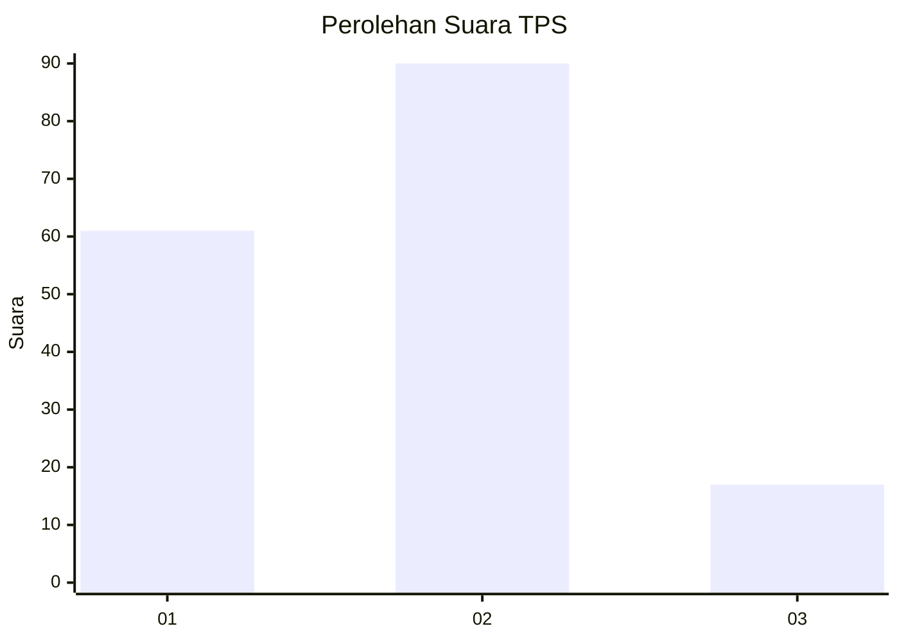
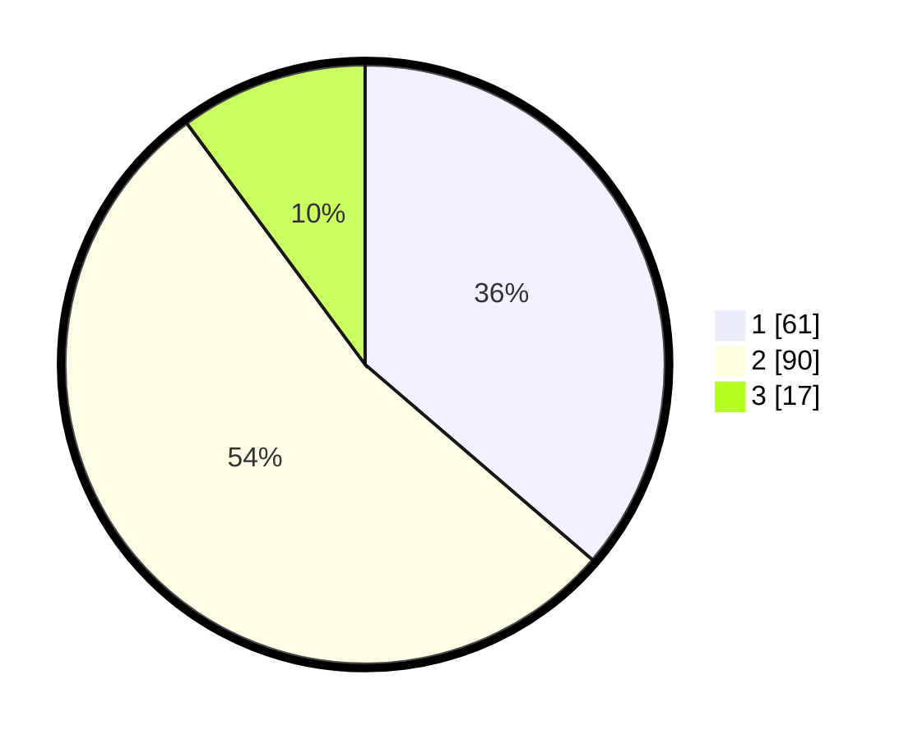

# Hasil

## Grafik

## Tabel

| No. | Nama Paslon    | Suara | Suara (raw) | Persentase |
|:--- |:-------------- | -----:| -----------:| ----------:|
| 1   | ANIES MUHAIMIN | 61    | [61][p-1]   | 36,31      |
| 2   | PRABOWO GIBRAN | 90    | [90][p-2]   | 53,57      |
| 3   | GANJAR MAHFUD  | 17    | [17][p-3]   | 10,12      |

[p-1]: https://github.com/gigit-pemilu/pemilu-2024/blob/main/pilpres/hitung-suara/sub/35-jawa-timur/sub/10-banyuwangi/sub/21-kalipuro/sub/2003-ketapang/sub/052-tps/sub/paslon-1.txt
[p-2]: https://github.com/gigit-pemilu/pemilu-2024/blob/main/pilpres/hitung-suara/sub/35-jawa-timur/sub/10-banyuwangi/sub/21-kalipuro/sub/2003-ketapang/sub/052-tps/sub/paslon-2.txt
[p-3]: https://github.com/gigit-pemilu/pemilu-2024/blob/main/pilpres/hitung-suara/sub/35-jawa-timur/sub/10-banyuwangi/sub/21-kalipuro/sub/2003-ketapang/sub/052-tps/sub/paslon-3.txt

## Foto C Plano

https://sirekap-obj-formc.kpu.go.id/65c0/pemilu/ppwp/35/10/21/20/03/3510212003052-20240214-214752--d8dc3e4e-8d39-4f14-be02-7443e230ab7f.jpg

https://sirekap-obj-formc.kpu.go.id/65c0/pemilu/ppwp/35/10/21/20/03/3510212003052-20240214-214945--11f71f8f-a601-4e54-8de0-4f8494edfe5b.jpg

https://sirekap-obj-formc.kpu.go.id/65c0/pemilu/ppwp/35/10/21/20/03/3510212003052-20240214-215128--f94876a3-1995-42d9-8b4b-1893d6092661.jpg

## Metadata

| Key        | Value               |
| ---------- | ------------------- |
| Time Stamp | 2024-02-24 22:31:28 |

