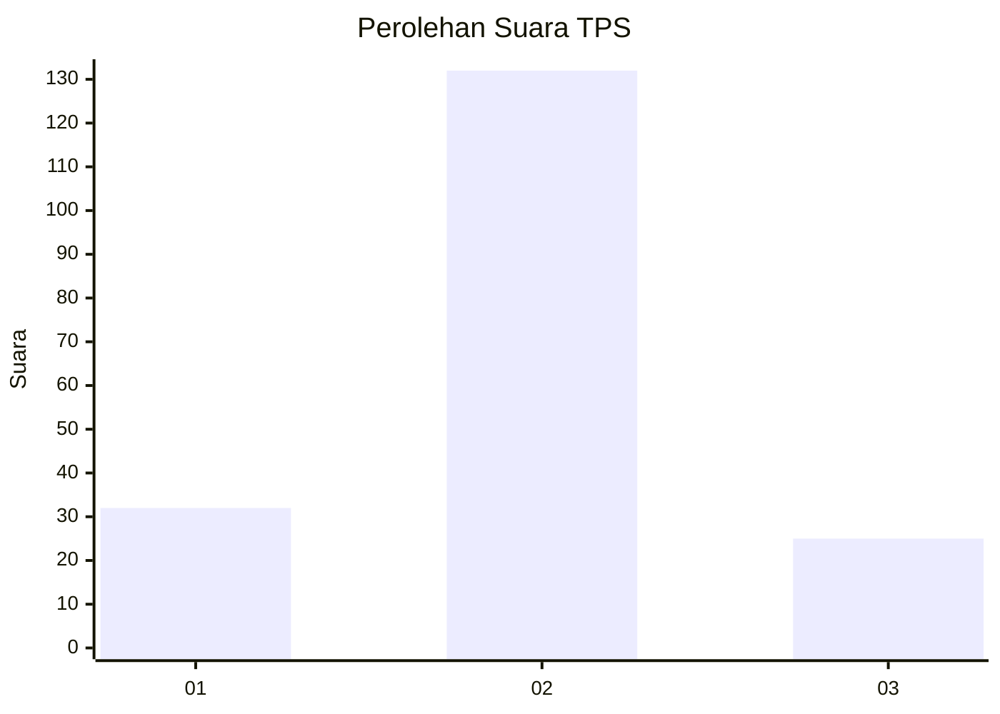
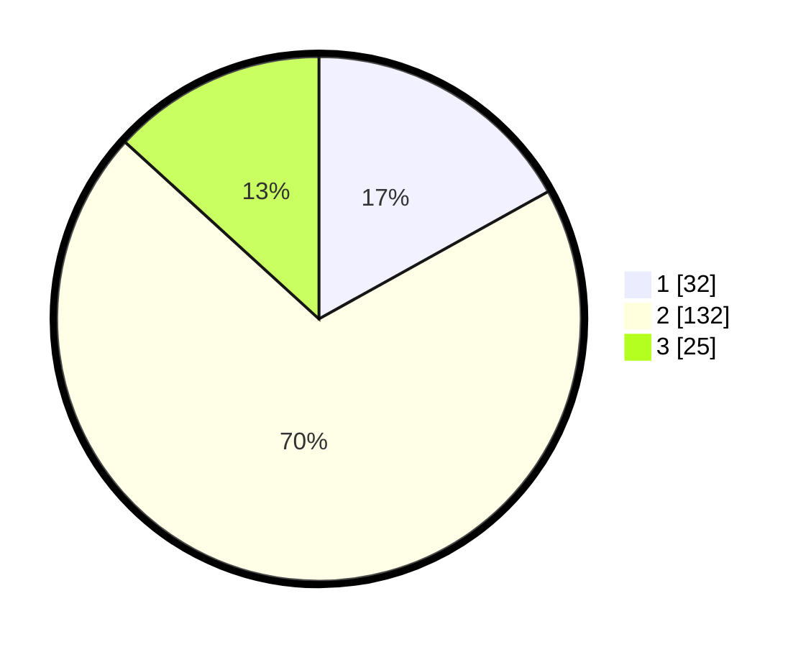

# Hasil

## Grafik

## Tabel

| No. | Nama Paslon    | Suara | Suara (raw) | Persentase |
|:--- |:-------------- | -----:| -----------:| ----------:|
| 1   | ANIES MUHAIMIN | 32    | [32][p-1]   | 16,93      |
| 2   | PRABOWO GIBRAN | 132   | [132][p-2]  | 69,84      |
| 3   | GANJAR MAHFUD  | 25    | [25][p-3]   | 13,23      |

[p-1]: https://github.com/gigit-pemilu/pemilu-2024-35-jawa-timur/blob/main/pilpres/hitung-suara/sub/35-jawa-timur/sub/10-banyuwangi/sub/21-kalipuro/sub/2004-pesucen/sub/003-tps/sub/paslon-1.txt
[p-2]: https://github.com/gigit-pemilu/pemilu-2024-35-jawa-timur/blob/main/pilpres/hitung-suara/sub/35-jawa-timur/sub/10-banyuwangi/sub/21-kalipuro/sub/2004-pesucen/sub/003-tps/sub/paslon-2.txt
[p-3]: https://github.com/gigit-pemilu/pemilu-2024-35-jawa-timur/blob/main/pilpres/hitung-suara/sub/35-jawa-timur/sub/10-banyuwangi/sub/21-kalipuro/sub/2004-pesucen/sub/003-tps/sub/paslon-3.txt

## Foto C Plano

https://sirekap-obj-formc.kpu.go.id/9d6d/pemilu/ppwp/35/10/21/20/04/3510212004003-20240215-063455--7b03cafb-63a6-4463-9086-30abd0763057.jpg

https://sirekap-obj-formc.kpu.go.id/9d6d/pemilu/ppwp/35/10/21/20/04/3510212004003-20240215-063542--60694aaf-11b3-4e32-96fa-e87c5a5aff91.jpg

https://sirekap-obj-formc.kpu.go.id/9d6d/pemilu/ppwp/35/10/21/20/04/3510212004003-20240215-063432--f73926f5-e9ee-4fb2-bccc-0ab86b5169d2.jpg

## Metadata

| Key        | Value               |
| ---------- | ------------------- |
| Time Stamp | 2024-02-24 22:31:28 |

