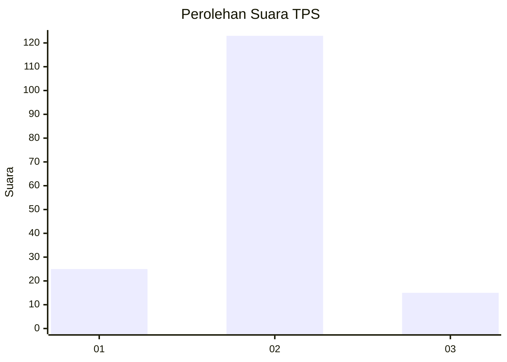
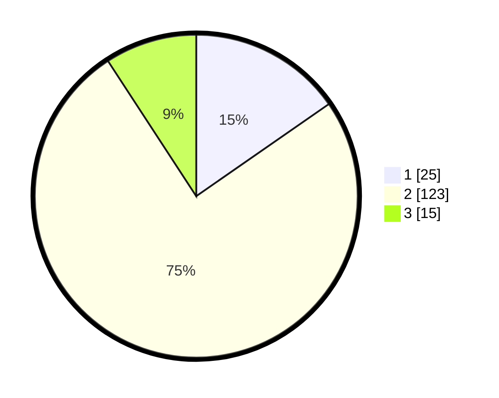

# Hasil

## Grafik

## Tabel

| No. | Nama Paslon    | Suara | Suara (raw) | Persentase |
|:--- |:-------------- | -----:| -----------:| ----------:|
| 1   | ANIES MUHAIMIN | 25    | [25][p-1]   | 15,34      |
| 2   | PRABOWO GIBRAN | 123   | [123][p-2]  | 75,46      |
| 3   | GANJAR MAHFUD  | 15    | [15][p-3]   | 9,20       |

[p-1]: https://github.com/gigit-pemilu/pemilu-2024-35-jawa-timur/blob/main/pilpres/hitung-suara/sub/35-jawa-timur/sub/10-banyuwangi/sub/21-kalipuro/sub/2004-pesucen/sub/004-tps/sub/paslon-1.txt
[p-2]: https://github.com/gigit-pemilu/pemilu-2024-35-jawa-timur/blob/main/pilpres/hitung-suara/sub/35-jawa-timur/sub/10-banyuwangi/sub/21-kalipuro/sub/2004-pesucen/sub/004-tps/sub/paslon-2.txt
[p-3]: https://github.com/gigit-pemilu/pemilu-2024-35-jawa-timur/blob/main/pilpres/hitung-suara/sub/35-jawa-timur/sub/10-banyuwangi/sub/21-kalipuro/sub/2004-pesucen/sub/004-tps/sub/paslon-3.txt

## Foto C Plano

https://sirekap-obj-formc.kpu.go.id/c4a4/pemilu/ppwp/35/10/21/20/04/3510212004004-20240218-153345--83158bb3-218c-497a-a5c4-2519c3cfd59a.jpg

https://sirekap-obj-formc.kpu.go.id/c4a4/pemilu/ppwp/35/10/21/20/04/3510212004004-20240218-153425--bd535d69-8c49-4fb4-a341-8879bdc7bb77.jpg

https://sirekap-obj-formc.kpu.go.id/c4a4/pemilu/ppwp/35/10/21/20/04/3510212004004-20240218-153456--95c7c1c9-aad3-4528-aa83-ab03a5dfefca.jpg

## Metadata

| Key        | Value               |
| ---------- | ------------------- |
| Time Stamp | 2024-02-24 22:31:28 |

