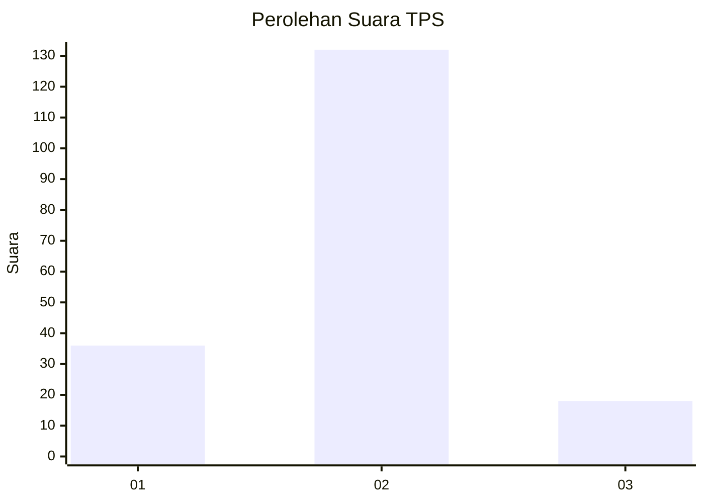
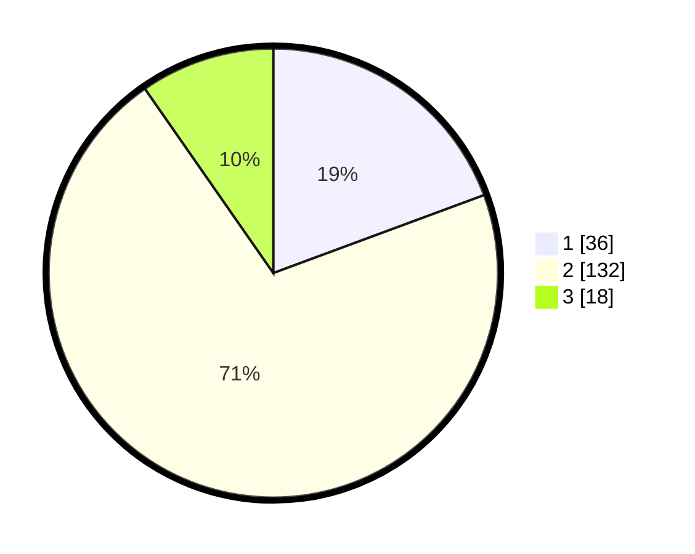

# Hasil

## Grafik

## Tabel

| No. | Nama Paslon    | Suara | Suara (raw) | Persentase |
|:--- |:-------------- | -----:| -----------:| ----------:|
| 1   | ANIES MUHAIMIN | 36    | [36][p-1]   | 19,35      |
| 2   | PRABOWO GIBRAN | 132   | [132][p-2]  | 70,97      |
| 3   | GANJAR MAHFUD  | 18    | [18][p-3]   | 9,68       |

[p-1]: https://github.com/gigit-pemilu/pemilu-2024/blob/main/pilpres/hitung-suara/sub/35-jawa-timur/sub/10-banyuwangi/sub/21-kalipuro/sub/2004-pesucen/sub/006-tps/sub/paslon-1.txt
[p-2]: https://github.com/gigit-pemilu/pemilu-2024/blob/main/pilpres/hitung-suara/sub/35-jawa-timur/sub/10-banyuwangi/sub/21-kalipuro/sub/2004-pesucen/sub/006-tps/sub/paslon-2.txt
[p-3]: https://github.com/gigit-pemilu/pemilu-2024/blob/main/pilpres/hitung-suara/sub/35-jawa-timur/sub/10-banyuwangi/sub/21-kalipuro/sub/2004-pesucen/sub/006-tps/sub/paslon-3.txt

## Foto C Plano

https://sirekap-obj-formc.kpu.go.id/3e48/pemilu/ppwp/35/10/21/20/04/3510212004006-20240215-024643--c9bdb00e-9153-46c5-b0d9-efead43316fd.jpg

https://sirekap-obj-formc.kpu.go.id/3e48/pemilu/ppwp/35/10/21/20/04/3510212004006-20240215-024818--6fefb9d8-0f91-4313-aaa1-74dd73eaca2d.jpg

https://sirekap-obj-formc.kpu.go.id/3e48/pemilu/ppwp/35/10/21/20/04/3510212004006-20240215-025054--4c726c53-9720-4a65-8878-9557f66ceb60.jpg

## Metadata

| Key        | Value               |
| ---------- | ------------------- |
| Time Stamp | 2024-02-24 22:31:28 |

