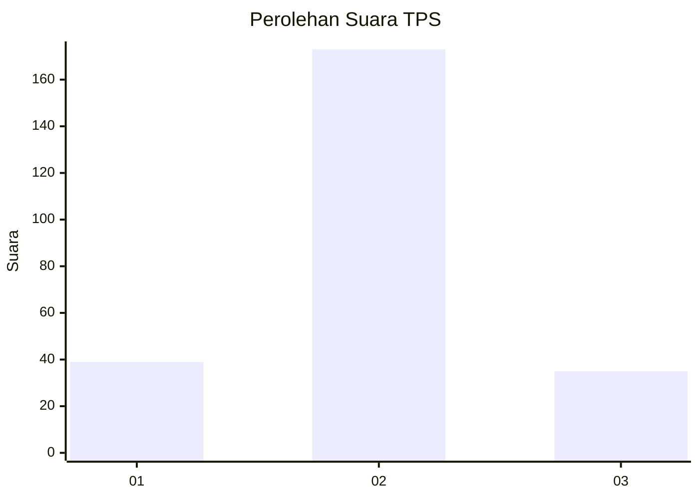

# Hasil

## Grafik

## Tabel

| No. | Nama Paslon    | Suara | Suara (raw) | Persentase |
|:--- |:-------------- | -----:| -----------:| ----------:|
| 1   | ANIES MUHAIMIN | 39    | [39][p-1]   | 15,79      |
| 2   | PRABOWO GIBRAN | 173   | [173][p-2]  | 70,04      |
| 3   | GANJAR MAHFUD  | 35    | [35][p-3]   | 14,17      |

[p-1]: https://github.com/gigit-pemilu/pemilu-2024/blob/main/pilpres/hitung-suara/sub/35-jawa-timur/sub/10-banyuwangi/sub/21-kalipuro/sub/2004-pesucen/sub/009-tps/sub/paslon-1.txt
[p-2]: https://github.com/gigit-pemilu/pemilu-2024/blob/main/pilpres/hitung-suara/sub/35-jawa-timur/sub/10-banyuwangi/sub/21-kalipuro/sub/2004-pesucen/sub/009-tps/sub/paslon-2.txt
[p-3]: https://github.com/gigit-pemilu/pemilu-2024/blob/main/pilpres/hitung-suara/sub/35-jawa-timur/sub/10-banyuwangi/sub/21-kalipuro/sub/2004-pesucen/sub/009-tps/sub/paslon-3.txt

## Foto C Plano

https://sirekap-obj-formc.kpu.go.id/3d7c/pemilu/ppwp/35/10/21/20/04/3510212004009-20240215-015136--af60b7fe-ecb4-4a17-8bcf-ec64f17bc88b.jpg

https://sirekap-obj-formc.kpu.go.id/3d7c/pemilu/ppwp/35/10/21/20/04/3510212004009-20240215-015336--e76d0764-1479-40b4-a100-ce6d402ed48a.jpg

https://sirekap-obj-formc.kpu.go.id/3d7c/pemilu/ppwp/35/10/21/20/04/3510212004009-20240215-015618--2dbd7e4e-22d9-465f-bf95-361c43045b7a.jpg

## Metadata

| Key        | Value               |
| ---------- | ------------------- |
| Time Stamp | 2024-02-25 16:00:00 |

