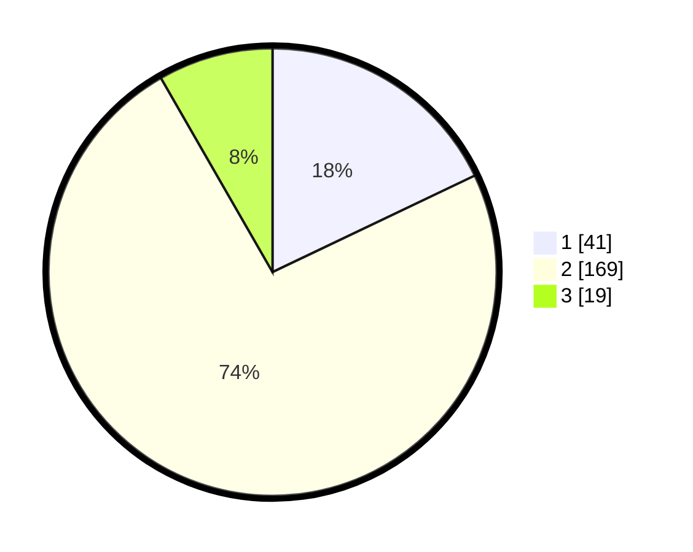

# Hasil

## Grafik

## Tabel

| No. | Nama Paslon    | Suara | Suara (raw) | Persentase |
|:--- |:-------------- | -----:| -----------:| ----------:|
| 1   | ANIES MUHAIMIN | 41    | [41][p-1]   | 17,90      |
| 2   | PRABOWO GIBRAN | 169   | [169][p-2]  | 73,80      |
| 3   | GANJAR MAHFUD  | 19    | [19][p-3]   | 8,30       |

[p-1]: https://github.com/gigit-pemilu/pemilu-2024/blob/main/pilpres/hitung-suara/sub/35-jawa-timur/sub/10-banyuwangi/sub/21-kalipuro/sub/2004-pesucen/sub/011-tps/sub/paslon-1.txt
[p-2]: https://github.com/gigit-pemilu/pemilu-2024/blob/main/pilpres/hitung-suara/sub/35-jawa-timur/sub/10-banyuwangi/sub/21-kalipuro/sub/2004-pesucen/sub/011-tps/sub/paslon-2.txt
[p-3]: https://github.com/gigit-pemilu/pemilu-2024/blob/main/pilpres/hitung-suara/sub/35-jawa-timur/sub/10-banyuwangi/sub/21-kalipuro/sub/2004-pesucen/sub/011-tps/sub/paslon-3.txt

## Foto C Plano

https://sirekap-obj-formc.kpu.go.id/93c4/pemilu/ppwp/35/10/21/20/04/3510212004011-20240218-152742--4c6dae3c-1f04-4d5b-8648-5d5099ce104a.jpg

https://sirekap-obj-formc.kpu.go.id/93c4/pemilu/ppwp/35/10/21/20/04/3510212004011-20240218-152811--f9088111-93fd-4e1c-98fd-0685947efbbe.jpg

https://sirekap-obj-formc.kpu.go.id/93c4/pemilu/ppwp/35/10/21/20/04/3510212004011-20240218-153040--53ee0132-d8f9-43a0-9aff-50030fbec4af.jpg

## Metadata

| Key        | Value               |
| ---------- | ------------------- |
| Time Stamp | 2024-02-25 12:00:00 |

