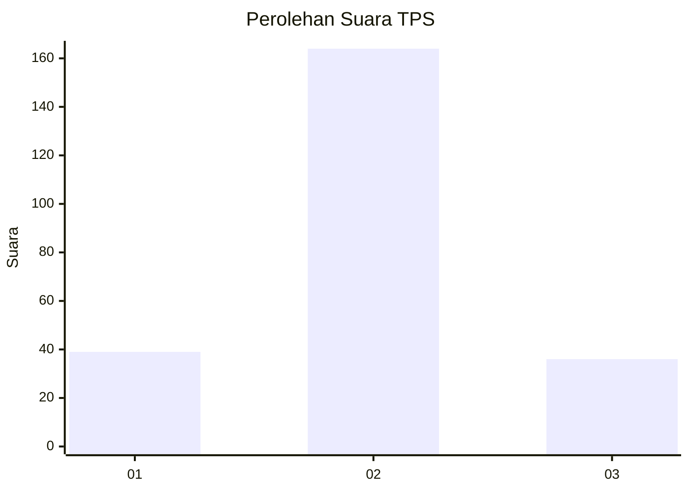

# Hasil

## Grafik

## Tabel

| No. | Nama Paslon    | Suara | Suara (raw) | Persentase |
|:--- |:-------------- | -----:| -----------:| ----------:|
| 1   | ANIES MUHAIMIN | 39    | [39][p-1]   | 16,32      |
| 2   | PRABOWO GIBRAN | 164   | [164][p-2]  | 68,62      |
| 3   | GANJAR MAHFUD  | 36    | [36][p-3]   | 15,06      |

[p-1]: https://github.com/gigit-pemilu/pemilu-2024/blob/main/pilpres/hitung-suara/sub/35-jawa-timur/sub/10-banyuwangi/sub/21-kalipuro/sub/2005-kelir/sub/012-tps/sub/paslon-1.txt
[p-2]: https://github.com/gigit-pemilu/pemilu-2024/blob/main/pilpres/hitung-suara/sub/35-jawa-timur/sub/10-banyuwangi/sub/21-kalipuro/sub/2005-kelir/sub/012-tps/sub/paslon-2.txt
[p-3]: https://github.com/gigit-pemilu/pemilu-2024/blob/main/pilpres/hitung-suara/sub/35-jawa-timur/sub/10-banyuwangi/sub/21-kalipuro/sub/2005-kelir/sub/012-tps/sub/paslon-3.txt

## Foto C Plano

https://sirekap-obj-formc.kpu.go.id/82e6/pemilu/ppwp/35/10/21/20/05/3510212005012-20240218-155414--796bf220-466c-4874-9f7c-959af6190938.jpg

https://sirekap-obj-formc.kpu.go.id/82e6/pemilu/ppwp/35/10/21/20/05/3510212005012-20240218-155505--b7d78b28-4abb-439d-8dbb-d4e180cef5bf.jpg

https://sirekap-obj-formc.kpu.go.id/82e6/pemilu/ppwp/35/10/21/20/05/3510212005012-20240218-155606--32b4bb8e-68cd-400a-bcfb-2c584750d7bc.jpg

## Metadata

| Key        | Value               |
| ---------- | ------------------- |
| Time Stamp | 2024-02-24 22:31:28 |

