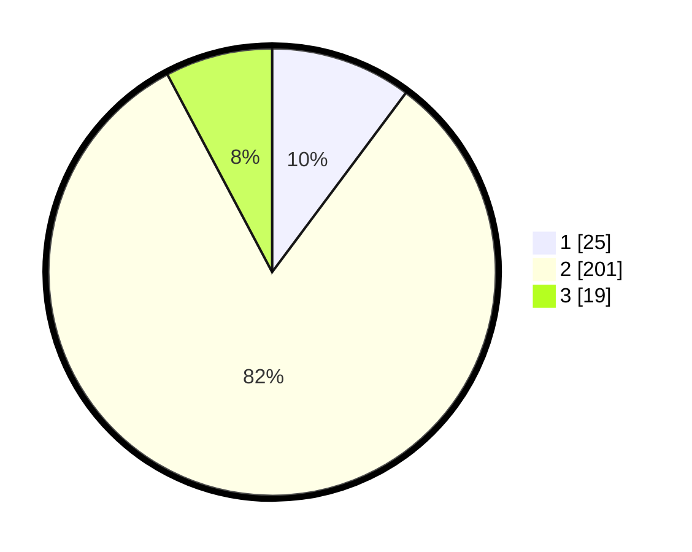

# Hasil

## Grafik

## Tabel

| No. | Nama Paslon    | Suara | Suara (raw) | Persentase |
|:--- |:-------------- | -----:| -----------:| ----------:|
| 1   | ANIES MUHAIMIN | 25    | [25][p-1]   | 10,20      |
| 2   | PRABOWO GIBRAN | 201   | [201][p-2]  | 82,04      |
| 3   | GANJAR MAHFUD  | 19    | [19][p-3]   | 7,76       |

[p-1]: https://github.com/gigit-pemilu/pemilu-2024-35-jawa-timur/blob/main/pilpres/hitung-suara/sub/35-jawa-timur/sub/10-banyuwangi/sub/21-kalipuro/sub/2009-bulusari/sub/004-tps/sub/paslon-1.txt
[p-2]: https://github.com/gigit-pemilu/pemilu-2024-35-jawa-timur/blob/main/pilpres/hitung-suara/sub/35-jawa-timur/sub/10-banyuwangi/sub/21-kalipuro/sub/2009-bulusari/sub/004-tps/sub/paslon-2.txt
[p-3]: https://github.com/gigit-pemilu/pemilu-2024-35-jawa-timur/blob/main/pilpres/hitung-suara/sub/35-jawa-timur/sub/10-banyuwangi/sub/21-kalipuro/sub/2009-bulusari/sub/004-tps/sub/paslon-3.txt

## Foto C Plano

https://sirekap-obj-formc.kpu.go.id/564f/pemilu/ppwp/35/10/21/20/09/3510212009004-20240215-023113--4b3c7ec1-68c6-496a-bc2d-7121d4a396a5.jpg

https://sirekap-obj-formc.kpu.go.id/564f/pemilu/ppwp/35/10/21/20/09/3510212009004-20240215-023119--a0e28956-78b3-4f05-9287-d413ef8b16e5.jpg

https://sirekap-obj-formc.kpu.go.id/564f/pemilu/ppwp/35/10/21/20/09/3510212009004-20240215-023124--f9236e41-1fe1-48a6-bbdf-f6195a760915.jpg

## Metadata

| Key        | Value               |
| ---------- | ------------------- |
| Time Stamp | 2024-02-25 16:00:00 |

