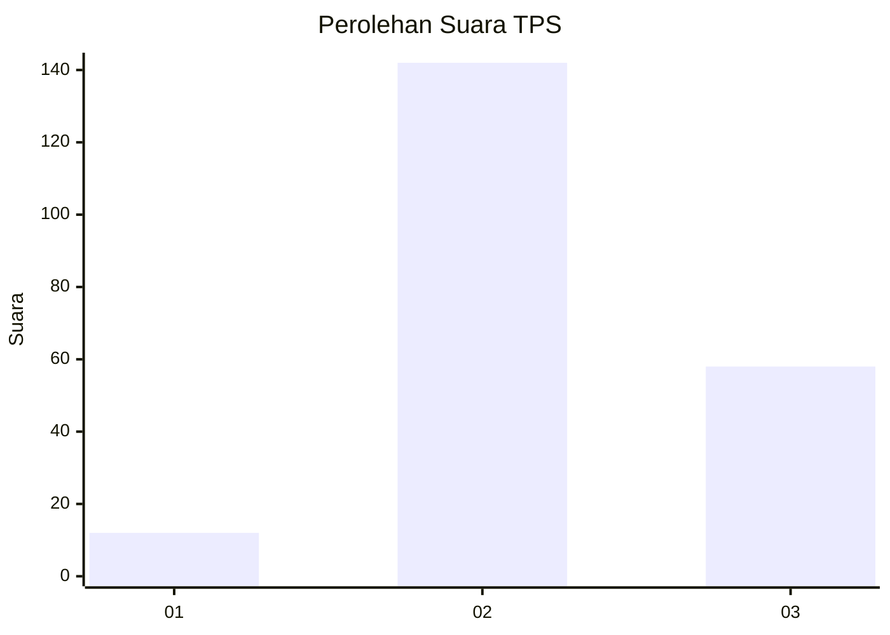

# Hasil

## Grafik

## Tabel

| No. | Nama Paslon    | Suara | Suara (raw) | Persentase |
|:--- |:-------------- | -----:| -----------:| ----------:|
| 1   | ANIES MUHAIMIN | 12    | [12][p-1]   | 5,66       |
| 2   | PRABOWO GIBRAN | 142   | [142][p-2]  | 66,98      |
| 3   | GANJAR MAHFUD  | 58    | [58][p-3]   | 27,36      |

[p-1]: https://github.com/gigit-pemilu/pemilu-2024-35-jawa-timur/blob/main/pilpres/hitung-suara/sub/35-jawa-timur/sub/10-banyuwangi/sub/22-siliragung/sub/2001-buluagung/sub/001-tps/sub/paslon-1.txt
[p-2]: https://github.com/gigit-pemilu/pemilu-2024-35-jawa-timur/blob/main/pilpres/hitung-suara/sub/35-jawa-timur/sub/10-banyuwangi/sub/22-siliragung/sub/2001-buluagung/sub/001-tps/sub/paslon-2.txt
[p-3]: https://github.com/gigit-pemilu/pemilu-2024-35-jawa-timur/blob/main/pilpres/hitung-suara/sub/35-jawa-timur/sub/10-banyuwangi/sub/22-siliragung/sub/2001-buluagung/sub/001-tps/sub/paslon-3.txt

## Foto C Plano

https://sirekap-obj-formc.kpu.go.id/38ee/pemilu/ppwp/35/10/22/20/01/3510222001001-20240214-230950--9e6fed11-afb5-4524-b302-6343ef61639f.jpg

https://sirekap-obj-formc.kpu.go.id/38ee/pemilu/ppwp/35/10/22/20/01/3510222001001-20240221-105725--701c4ebf-f84a-467a-9682-2a3f860b25e1.jpg

https://sirekap-obj-formc.kpu.go.id/38ee/pemilu/ppwp/35/10/22/20/01/3510222001001-20240214-231150--2db6a714-0f58-4f90-b4b3-8b4d16fd6884.jpg

## Metadata

| Key        | Value               |
| ---------- | ------------------- |
| Time Stamp | 2024-02-24 22:31:28 |

## DATA PEMILIH TETAP

Jumlah pemilih dalam DPT: **222**.
 * L: **138**.
 * P: **846**.

## DATA PENGGUNA HAK PILIH

Jumlah pengguna hak pilih dalam DPT: **209**.
 * L: **106**.
 * P: **103**.

Jumlah pengguna hak pilih dalam DPTb: **887**.
 * L: **881**.
 * P: **388**.

Jumlah pengguna hak pilih dalam DPK: **885**.
 * L: **882**.
 * P: **884**.

Jumlah pengguna hak pilih: **215**.
 * L: **708**.
 * P: **107**.

## JUMLAH SUARA SAH DAN TIDAK SAH

JUMLAH SELURUH SUARA SAH: **212**.

JUMLAH SUARA TIDAK SAH: **3**.

JUMLAH SELURUH SUARA SAH DAN SUARA TIDAK SAH: **215**.

