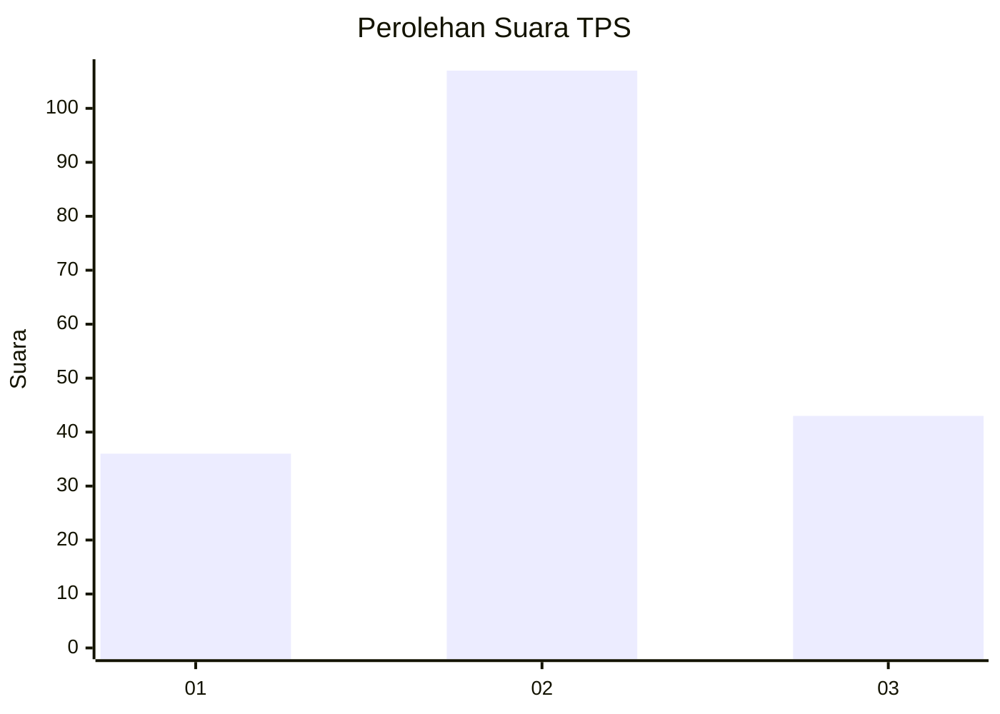
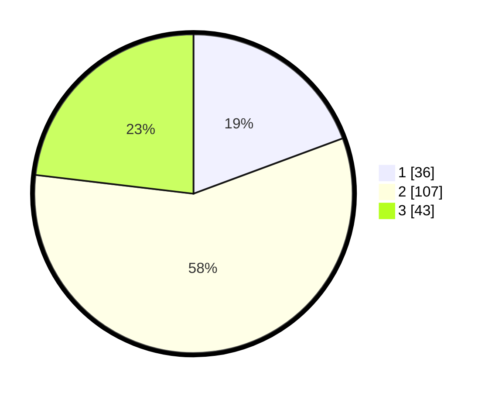

# Hasil

## Grafik

## Tabel

| No. | Nama Paslon    | Suara | Suara (raw) | Persentase |
|:--- |:-------------- | -----:| -----------:| ----------:|
| 1   | ANIES MUHAIMIN | 36    | [36][p-1]   | 19,35      |
| 2   | PRABOWO GIBRAN | 107   | [107][p-2]  | 57,53      |
| 3   | GANJAR MAHFUD  | 43    | [43][p-3]   | 23,12      |

[p-1]: https://github.com/gigit-pemilu/pemilu-2024/blob/main/pilpres/hitung-suara/sub/35-jawa-timur/sub/10-banyuwangi/sub/22-siliragung/sub/2002-siliragung/sub/004-tps/sub/paslon-1.txt
[p-2]: https://github.com/gigit-pemilu/pemilu-2024/blob/main/pilpres/hitung-suara/sub/35-jawa-timur/sub/10-banyuwangi/sub/22-siliragung/sub/2002-siliragung/sub/004-tps/sub/paslon-2.txt
[p-3]: https://github.com/gigit-pemilu/pemilu-2024/blob/main/pilpres/hitung-suara/sub/35-jawa-timur/sub/10-banyuwangi/sub/22-siliragung/sub/2002-siliragung/sub/004-tps/sub/paslon-3.txt

## Foto C Plano

https://sirekap-obj-formc.kpu.go.id/28ef/pemilu/ppwp/35/10/22/20/02/3510222002004-20240215-000935--2ab06661-6deb-4481-80de-29bdcb76b755.jpg

https://sirekap-obj-formc.kpu.go.id/28ef/pemilu/ppwp/35/10/22/20/02/3510222002004-20240215-001739--bc77d89b-1172-4750-b77a-f24b91dd82cb.jpg

https://sirekap-obj-formc.kpu.go.id/28ef/pemilu/ppwp/35/10/22/20/02/3510222002004-20240215-002400--dfef7730-f725-476b-aecc-134f9939ccfc.jpg

## Metadata

| Key        | Value               |
| ---------- | ------------------- |
| Time Stamp | 2024-02-25 13:00:00 |

