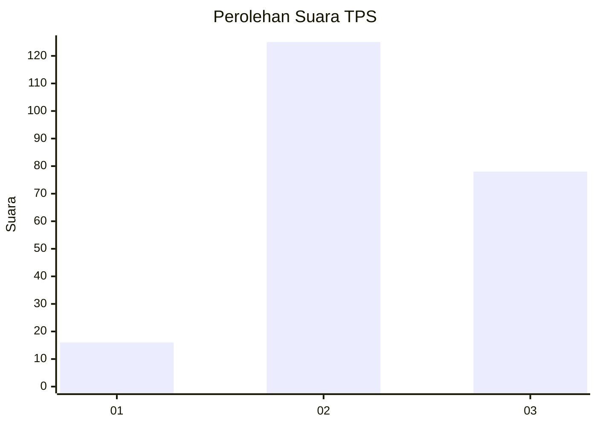
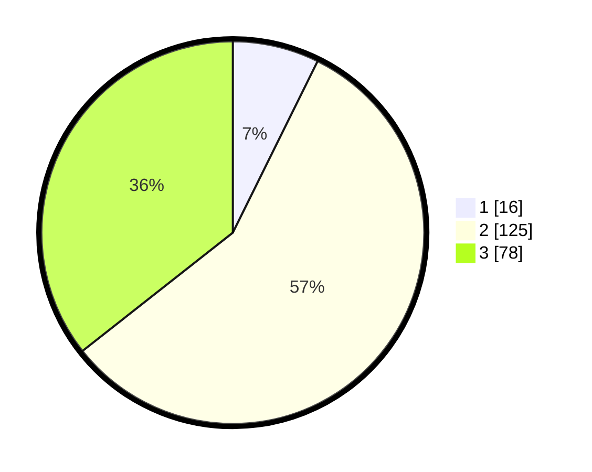

# Hasil

## Grafik

## Tabel

| No. | Nama Paslon    | Suara | Suara (raw) | Persentase |
|:--- |:-------------- | -----:| -----------:| ----------:|
| 1   | ANIES MUHAIMIN | 16    | [16][p-1]   | 7,31       |
| 2   | PRABOWO GIBRAN | 125   | [125][p-2]  | 57,08      |
| 3   | GANJAR MAHFUD  | 78    | [78][p-3]   | 35,62      |

[p-1]: https://github.com/gigit-pemilu/pemilu-2024/blob/main/pilpres/hitung-suara/sub/35-jawa-timur/sub/10-banyuwangi/sub/22-siliragung/sub/2005-barurejo/sub/007-tps/sub/paslon-1.txt
[p-2]: https://github.com/gigit-pemilu/pemilu-2024/blob/main/pilpres/hitung-suara/sub/35-jawa-timur/sub/10-banyuwangi/sub/22-siliragung/sub/2005-barurejo/sub/007-tps/sub/paslon-2.txt
[p-3]: https://github.com/gigit-pemilu/pemilu-2024/blob/main/pilpres/hitung-suara/sub/35-jawa-timur/sub/10-banyuwangi/sub/22-siliragung/sub/2005-barurejo/sub/007-tps/sub/paslon-3.txt

## Foto C Plano

https://sirekap-obj-formc.kpu.go.id/d275/pemilu/ppwp/35/10/22/20/05/3510222005007-20240219-121606--a88b2284-f586-41fa-b3f2-35f0ab17ad93.jpg

https://sirekap-obj-formc.kpu.go.id/d275/pemilu/ppwp/35/10/22/20/05/3510222005007-20240221-134337--b0bbd319-5767-4c8d-a249-aec4d808df96.jpg

https://sirekap-obj-formc.kpu.go.id/d275/pemilu/ppwp/35/10/22/20/05/3510222005007-20240219-121806--4952089e-a18e-46a4-aa11-411f1ffee932.jpg

## Metadata

| Key        | Value               |
| ---------- | ------------------- |
| Time Stamp | 2024-02-21 14:00:00 |

