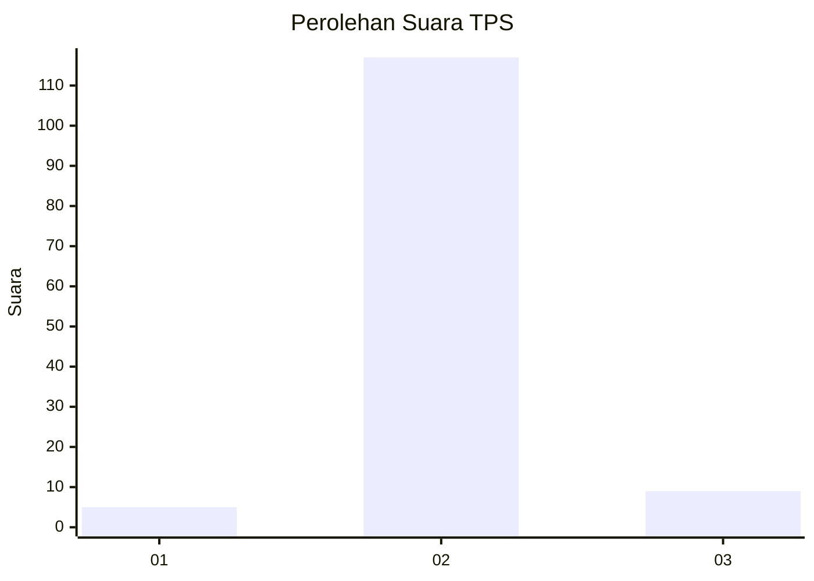
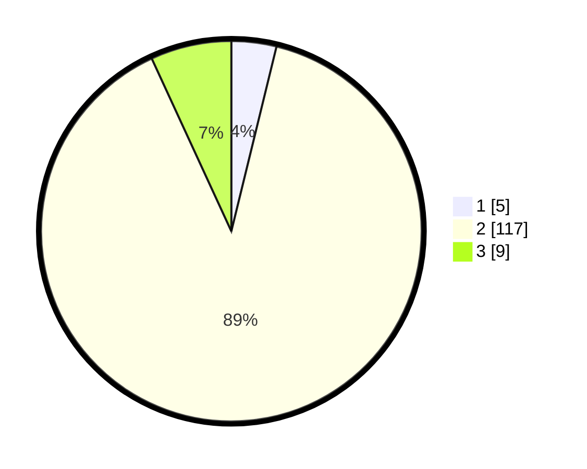

# Hasil

## Grafik

## Tabel

| No. | Nama Paslon    | Suara | Suara (raw) | Persentase |
|:--- |:-------------- | -----:| -----------:| ----------:|
| 1   | ANIES MUHAIMIN | 5     | [5][p-1]    | 3,82       |
| 2   | PRABOWO GIBRAN | 117   | [117][p-2]  | 89,31      |
| 3   | GANJAR MAHFUD  | 9     | [9][p-3]    | 6,87       |

[p-1]: https://github.com/gigit-pemilu/pemilu-2024/blob/main/pilpres/hitung-suara/sub/35-jawa-timur/sub/10-banyuwangi/sub/22-siliragung/sub/2005-barurejo/sub/044-tps/sub/paslon-1.txt
[p-2]: https://github.com/gigit-pemilu/pemilu-2024/blob/main/pilpres/hitung-suara/sub/35-jawa-timur/sub/10-banyuwangi/sub/22-siliragung/sub/2005-barurejo/sub/044-tps/sub/paslon-2.txt
[p-3]: https://github.com/gigit-pemilu/pemilu-2024/blob/main/pilpres/hitung-suara/sub/35-jawa-timur/sub/10-banyuwangi/sub/22-siliragung/sub/2005-barurejo/sub/044-tps/sub/paslon-3.txt

## Foto C Plano

https://sirekap-obj-formc.kpu.go.id/3223/pemilu/ppwp/35/10/22/20/05/3510222005044-20240221-144644--21628843-ca70-46a8-b239-18c0a3e129e9.jpg

https://sirekap-obj-formc.kpu.go.id/3223/pemilu/ppwp/35/10/22/20/05/3510222005044-20240221-144853--000ae4dd-b5a5-4820-9c4c-26f4cd84e58a.jpg

https://sirekap-obj-formc.kpu.go.id/3223/pemilu/ppwp/35/10/22/20/05/3510222005044-20240221-145413--e3b980cb-fb1d-4be2-95bf-52a63648fa08.jpg

## Metadata

| Key        | Value               |
| ---------- | ------------------- |
| Time Stamp | 2024-02-21 15:00:00 |

## DATA PEMILIH TETAP

Jumlah pemilih dalam DPT: **157**.
 * L: **86**.
 * P: **71**.

## DATA PENGGUNA HAK PILIH

Jumlah pengguna hak pilih dalam DPT: **132**.
 * L: **74**.
 * P: **58**.

Jumlah pengguna hak pilih dalam DPTb: **8**.
 * L: **870**.
 * P: **40**.

Jumlah pengguna hak pilih dalam DPK: **0**.
 * L: **0**.
 * P: **0**.

Jumlah pengguna hak pilih: **132**.
 * L: **74**.
 * P: **58**.

## JUMLAH SUARA SAH DAN TIDAK SAH

JUMLAH SELURUH SUARA SAH: **131**.

JUMLAH SUARA TIDAK SAH: **1**.

JUMLAH SELURUH SUARA SAH DAN SUARA TIDAK SAH: **132**.

