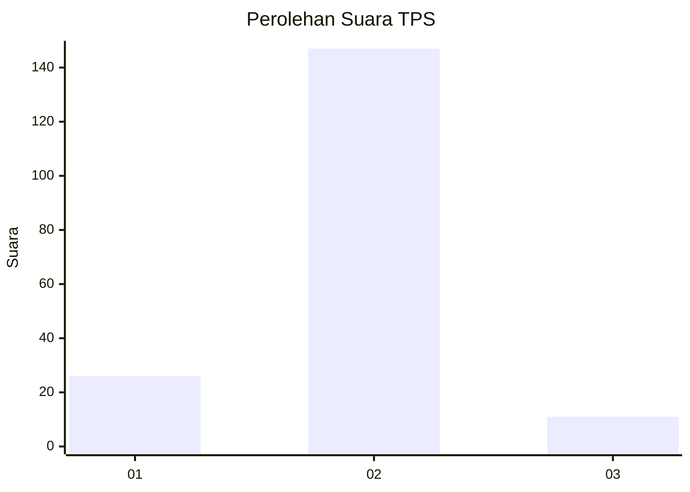
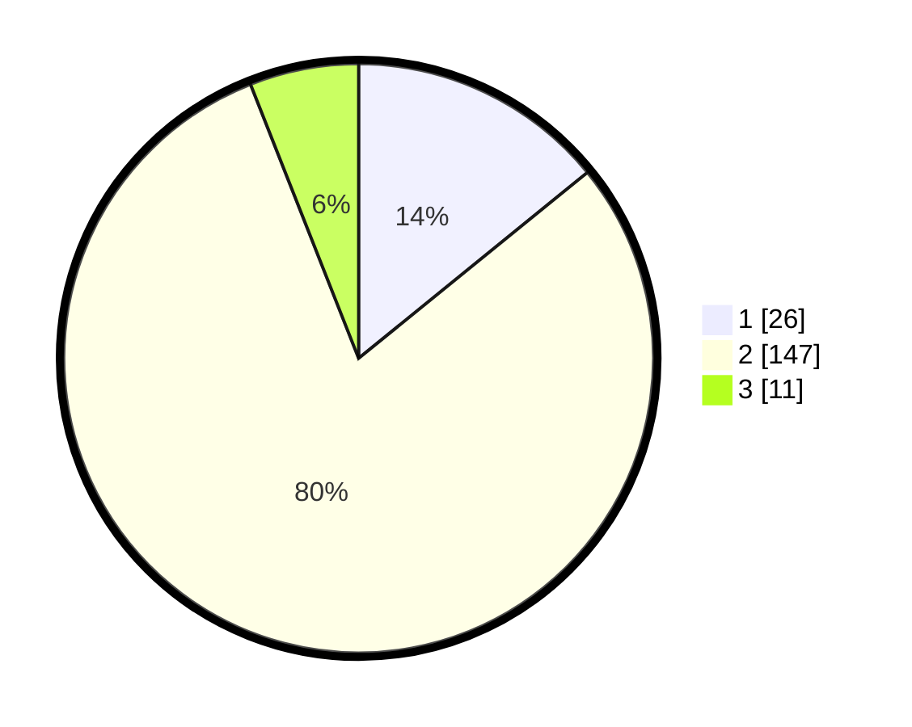

# Hasil

## Grafik

## Tabel

| No. | Nama Paslon    | Suara | Suara (raw) | Persentase |
|:--- |:-------------- | -----:| -----------:| ----------:|
| 1   | ANIES MUHAIMIN | 26    | [26][p-1]   | 14,13      |
| 2   | PRABOWO GIBRAN | 147   | [147][p-2]  | 79,89      |
| 3   | GANJAR MAHFUD  | 11    | [11][p-3]   | 5,98       |

[p-1]: https://github.com/gigit-pemilu/pemilu-2024/blob/main/pilpres/hitung-suara/sub/35-jawa-timur/sub/10-banyuwangi/sub/23-tegalsari/sub/2001-tegalsari/sub/035-tps/sub/paslon-1.txt
[p-2]: https://github.com/gigit-pemilu/pemilu-2024/blob/main/pilpres/hitung-suara/sub/35-jawa-timur/sub/10-banyuwangi/sub/23-tegalsari/sub/2001-tegalsari/sub/035-tps/sub/paslon-2.txt
[p-3]: https://github.com/gigit-pemilu/pemilu-2024/blob/main/pilpres/hitung-suara/sub/35-jawa-timur/sub/10-banyuwangi/sub/23-tegalsari/sub/2001-tegalsari/sub/035-tps/sub/paslon-3.txt

## Foto C Plano

https://sirekap-obj-formc.kpu.go.id/ee2f/pemilu/ppwp/35/10/23/20/01/3510232001035-20240217-111844--a5eec13c-e53b-4a70-8738-6364e074c923.jpg

https://sirekap-obj-formc.kpu.go.id/ee2f/pemilu/ppwp/35/10/23/20/01/3510232001035-20240217-112304--a4c17b93-a4c2-4246-a064-d6c5155580c1.jpg

https://sirekap-obj-formc.kpu.go.id/ee2f/pemilu/ppwp/35/10/23/20/01/3510232001035-20240217-112037--7836bb41-ef0f-4031-8ba3-e029a03dba41.jpg

## Metadata

| Key        | Value               |
| ---------- | ------------------- |
| Time Stamp | 2024-02-24 22:31:28 |

