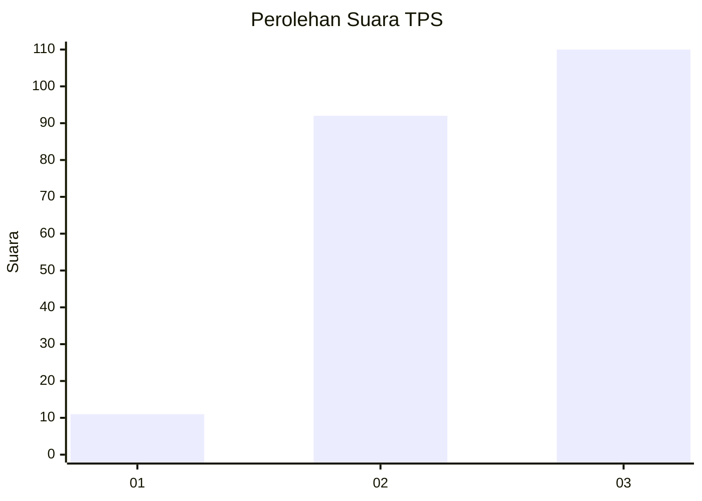
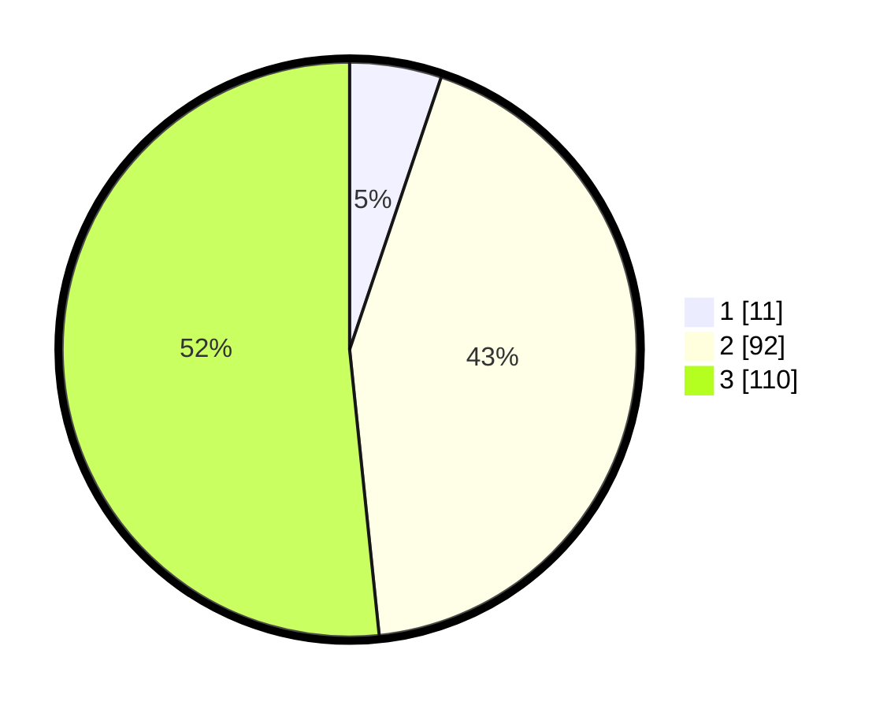

# Hasil

## Grafik

## Tabel

| No. | Nama Paslon    | Suara | Suara (raw) | Persentase |
|:--- |:-------------- | -----:| -----------:| ----------:|
| 1   | ANIES MUHAIMIN | 11    | [11][p-1]   | 5,16       |
| 2   | PRABOWO GIBRAN | 92    | [92][p-2]   | 43,19      |
| 3   | GANJAR MAHFUD  | 110   | [110][p-3]  | 51,64      |

[p-1]: https://github.com/gigit-pemilu/pemilu-2024-35-jawa-timur/blob/main/pilpres/hitung-suara/sub/35-jawa-timur/sub/10-banyuwangi/sub/23-tegalsari/sub/2002-karangdoro/sub/005-tps/sub/paslon-1.txt
[p-2]: https://github.com/gigit-pemilu/pemilu-2024-35-jawa-timur/blob/main/pilpres/hitung-suara/sub/35-jawa-timur/sub/10-banyuwangi/sub/23-tegalsari/sub/2002-karangdoro/sub/005-tps/sub/paslon-2.txt
[p-3]: https://github.com/gigit-pemilu/pemilu-2024-35-jawa-timur/blob/main/pilpres/hitung-suara/sub/35-jawa-timur/sub/10-banyuwangi/sub/23-tegalsari/sub/2002-karangdoro/sub/005-tps/sub/paslon-3.txt

## Foto C Plano

https://sirekap-obj-formc.kpu.go.id/8546/pemilu/ppwp/35/10/23/20/02/3510232002005-20240217-175435--3dd99c5a-1a43-48a5-a5f3-edbab5cde439.jpg

https://sirekap-obj-formc.kpu.go.id/8546/pemilu/ppwp/35/10/23/20/02/3510232002005-20240217-175109--772e1787-ee9e-44ee-bb0d-50e78049aac2.jpg

https://sirekap-obj-formc.kpu.go.id/8546/pemilu/ppwp/35/10/23/20/02/3510232002005-20240217-174258--d82c87fb-c2aa-4b05-b92a-502dfe0db154.jpg

## Metadata

| Key        | Value               |
| ---------- | ------------------- |
| Time Stamp | 2024-02-25 16:00:00 |

