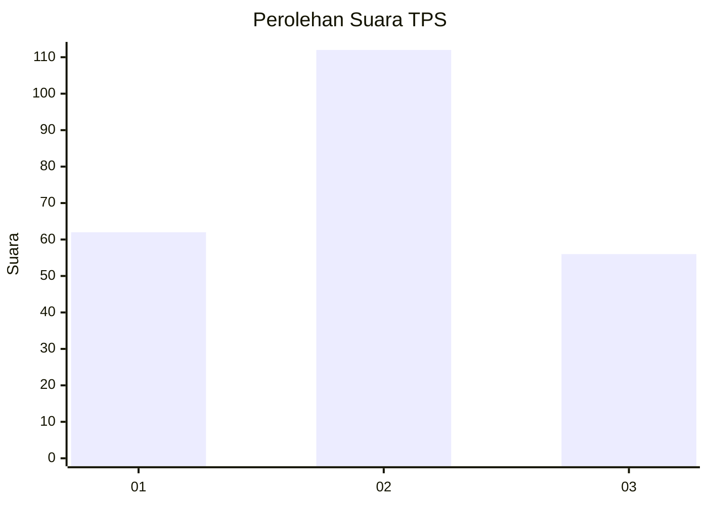
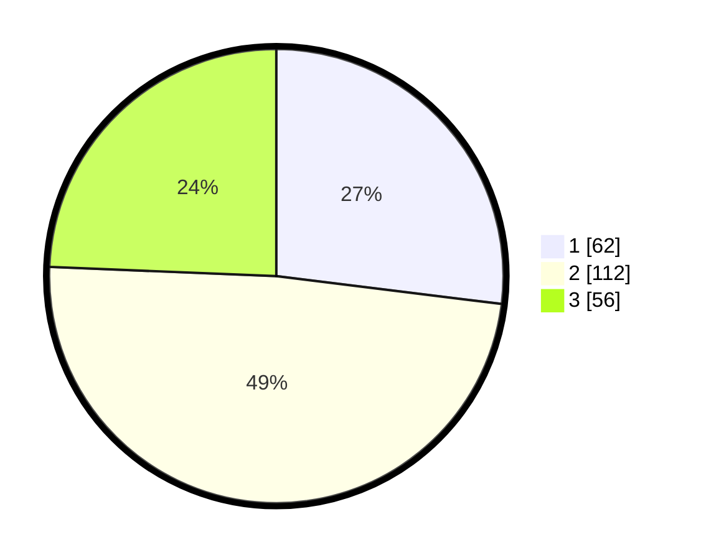

# Hasil

## Grafik

## Tabel

| No. | Nama Paslon    | Suara | Suara (raw) | Persentase |
|:--- |:-------------- | -----:| -----------:| ----------:|
| 1   | ANIES MUHAIMIN | 62    | [62][p-1]   | 26,96      |
| 2   | PRABOWO GIBRAN | 112   | [112][p-2]  | 48,70      |
| 3   | GANJAR MAHFUD  | 56    | [56][p-3]   | 24,35      |

[p-1]: https://github.com/gigit-pemilu/pemilu-2024/blob/main/pilpres/hitung-suara/sub/35-jawa-timur/sub/10-banyuwangi/sub/23-tegalsari/sub/2002-karangdoro/sub/016-tps/sub/paslon-1.txt
[p-2]: https://github.com/gigit-pemilu/pemilu-2024/blob/main/pilpres/hitung-suara/sub/35-jawa-timur/sub/10-banyuwangi/sub/23-tegalsari/sub/2002-karangdoro/sub/016-tps/sub/paslon-2.txt
[p-3]: https://github.com/gigit-pemilu/pemilu-2024/blob/main/pilpres/hitung-suara/sub/35-jawa-timur/sub/10-banyuwangi/sub/23-tegalsari/sub/2002-karangdoro/sub/016-tps/sub/paslon-3.txt

## Foto C Plano

https://sirekap-obj-formc.kpu.go.id/3512/pemilu/ppwp/35/10/23/20/02/3510232002016-20240215-025329--64a2e4bb-978b-4e58-bd8d-4378925c920f.jpg

https://sirekap-obj-formc.kpu.go.id/3512/pemilu/ppwp/35/10/23/20/02/3510232002016-20240215-025600--cab5356a-4020-4148-84ad-7f04629b7993.jpg

https://sirekap-obj-formc.kpu.go.id/3512/pemilu/ppwp/35/10/23/20/02/3510232002016-20240215-025946--b8c4907f-0af1-4342-ba1a-67aef35de35c.jpg

## Metadata

| Key        | Value               |
| ---------- | ------------------- |
| Time Stamp | 2024-02-24 22:31:28 |

